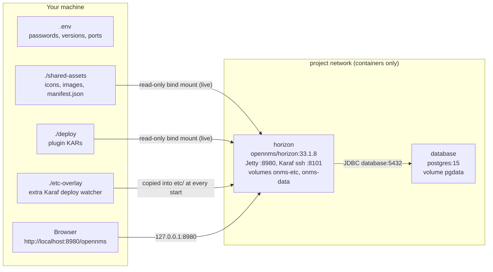

# Part 0 - Install OpenNMS Horizon 33.1.8 and PostgreSQL in containers

This part takes you from a machine with nothing on it to a running OpenNMS Horizon 33.1.8 with
PostgreSQL 15, both in containers, with the lab's host folders already mounted. [Part 6](06-installing-the-plugins.md)
then installs the two demo plugins one at a time, and [Part 7](07-working-with-the-shared-folder.md)
works with the shared folder while everything runs.

The commands use Podman and `podman-compose`, run as your normal user (rootless). With Docker, type
`docker` for `podman` and `docker compose` for `podman-compose`; everything else is the same.
Section 0.12 shows the same installation with plain `podman run` commands, which is the best way to
see what the compose file does.

## 0.1 What you will have at the end



| Port on the host | Container port | What | Reachable from |
|---|---|---|---|
| `127.0.0.1:8980` | horizon `8980` | web UI, REST API, the plugins, the shared folder | this machine only (see 0.11 to open it) |
| `127.0.0.1:8101` | horizon `8101` | Karaf shell over SSH | this machine only |
| none | database `5432` | PostgreSQL | the horizon container only |

## 0.2 Prerequisites

**Hardware.** The OpenNMS documentation's minimum for "just testing" is 2 CPU cores, 4 GB of RAM and
50 GB of disk. This lab gives OpenNMS a 2 GB Java heap (`JAVA_OPTS` in `.env`), so plan for about
4 GB of free memory for both containers together. The Horizon image is a large download.

**Software.**

| Tool | Version | Used for |
|---|---|---|
| Podman | 4.x or 5.x (tested with 4.9.3) | running the containers (Docker Engine 24+ with Compose v2 works too) |
| podman-compose | 1.3 or later (tested with 1.6.0) | `compose.yml`; releases before 1.3 ignore the "start after the database is healthy" rule |
| Python 3, curl, git | any current | the scripts in `scripts/` |
| Node.js, JDK, Maven | 18.18+, 11 or 17, 3.8+ | only for building the plugins (Part 6) |

Install them for your system. Distribution packages of podman-compose are often older than 1.3,
so on Linux it comes from PyPI:

```bash
# Fedora
sudo dnf install -y podman pipx python3 curl git
pipx install podman-compose && pipx ensurepath      # then open a new terminal

# RHEL, Rocky Linux, AlmaLinux 9
sudo dnf install -y podman python3-pip curl git
pip3 install --user podman-compose

# Ubuntu 24.04, Debian 12 (Ubuntu 22.04's Podman 3.4 is too old for this lab: use Docker there)
sudo apt install -y podman pipx python3 curl git
pipx install podman-compose && pipx ensurepath      # then open a new terminal

# macOS (Podman runs in a small Linux VM; give it enough memory)
brew install podman podman-compose
podman machine init --cpus 4 --memory 6144 --disk-size 60
podman machine start
```

On Windows, install Ubuntu in WSL2, enable systemd in it (`[boot] systemd=true` in `/etc/wsl.conf`),
and follow the Ubuntu line inside WSL. Podman runs its container health checks with systemd timers;
without systemd the health status never changes, and steps 3 and 4 wait for ever for a "healthy"
database (see [troubleshooting](09-troubleshooting.md#installing-and-starting)).

Check the result:

```bash
podman --version                                        # podman version 4.x or 5.x
podman-compose --version                                # podman-compose version 1.x
podman info --format '{{.Host.Security.Rootless}}'     # true: containers run as your user
```

## 0.3 Get the lab and choose your passwords

```bash
git clone <url-of-your-copy> opennms-shared-plugin-assets    # or unpack the zip
cd opennms-shared-plugin-assets
cp .env.example .env
chmod 600 .env
${EDITOR:-vi} .env
```

Every command in this guide runs from this folder. In `.env`, set at least the two passwords:

| Variable | Meaning | When it is read |
|---|---|---|
| `POSTGRES_PASSWORD` | password of PostgreSQL's `postgres` superuser; OpenNMS uses it to create its database and for schema upgrades | by the postgres image when the database volume is empty, and by OpenNMS at every start |
| `OPENNMS_DBPASS` | password of the `opennms` database user that OpenNMS creates and then uses at runtime | when OpenNMS creates that user (first start); at every start to connect |
| `OPENNMS_VERSION`, `POSTGRES_VERSION` | image tags: `33.1.8` and `15` | at pull and start |
| `ONMS_HTTP_BIND`, `ONMS_HTTP_PORT` | where the web UI is published: `127.0.0.1:8980` | at start |
| `ONMS_USER`, `ONMS_PASS` | the OpenNMS web login, for the scripts only (compose ignores them) | by `scripts/*` and `tests/e2e` |

Choose the database passwords now. Both are stored inside the database the first time it is
created, so changing them in `.env` later does not change them there (0.11 shows how to change
them properly).

Why PostgreSQL 15: the Horizon 33.1.8 documentation lists PostgreSQL 10.x to 15.x as compatible and
uses 15 in its own container examples. Newer major versions are not in that list for this release.

## 0.4 Step 1 - Pull the images

```bash
podman-compose pull
```

This downloads `docker.io/library/postgres:15` and `docker.io/opennms/horizon:33.1.8`. The full
names (with `docker.io/`) are used everywhere so that Podman never has to ask which registry you mean.

## 0.5 Step 2 - Start PostgreSQL

```bash
podman-compose up -d database
podman-compose ps                                       # wait for "(healthy)" on the database
podman exec onms-shared-assets-db psql -U postgres -tAc 'select version()'
podman exec onms-shared-assets-db psql -U postgres -tAc 'show max_connections'
```

What happened: on its first start the postgres image initialises an empty cluster in the
`pgdata` volume with `POSTGRES_PASSWORD` for the `postgres` user. The health check
(`pg_isready -U postgres`) turns green within seconds. The database has no published port: only
containers on the project network can reach it, as `database:5432`.

`max_connections` should say `100`. OpenNMS needs at least 100: its two connection pools
(`opennms` for normal work, `opennms-admin` for installation and upgrades) have up to 50
connections each. The image's default of 100 is exactly enough for this lab; for more headroom add
`command: ["postgres", "-c", "max_connections=200"]` to the `database` service.

## 0.6 Step 3 - Initialise OpenNMS

```bash
podman-compose run --rm horizon -i
```

`-i` tells the Horizon image's entrypoint to prepare everything and then stop, without starting
OpenNMS. This is the same as the official documentation's `docker-compose run horizon -i`. It
takes a few minutes and prints a lot (the entrypoint traces every command). In order, it:

1. copies the default configuration from `share/etc-pristine` into `etc/`, because the `onms-etc`
   volume is empty;
2. runs `confd`, which writes `etc/opennms-datasources.xml` from the `POSTGRES_*` and `OPENNMS_DB*`
   variables, and `etc/org.apache.karaf.shell.cfg` (Karaf's SSH server on port 8101);
3. copies the overlay folders; this lab mounts only the etc overlay, which adds
   `etc/org.apache.felix.fileinstall-lab.cfg` (the plugin deploy folder, see Part 6);
4. runs the configuration tester (`config-tester -a`) on the files in `etc/`;
5. runs the installer: it connects to `database` as `postgres`, creates the user `opennms` with
   `OPENNMS_DBPASS` and the database `opennms` if they do not exist, brings the schema up to date,
   and finally writes the file `etc/configured`.

`run` also starts the services `horizon` depends on and waits until the database is healthy, so
this step works even if you skipped step 2. When the command returns without an error, the database
is ready. If it fails, the error is right there on your terminal; that is the reason to run this
step on its own. (Skipping it also works: the `-s` in step 4 runs the same preparation before
starting.)

`etc/configured` is a guard. As long as it exists, later starts skip the installer, so a restart
does not touch the database schema. It matters again for upgrades (0.11).

## 0.7 Step 4 - Start OpenNMS

```bash
podman-compose up -d
scripts/wait-for-opennms.sh
```

`up -d` starts the `horizon` service with `-s`: the same preparation as step 3 (the installer is
skipped because of `etc/configured`), then OpenNMS itself. Compose starts it only after the
database is healthy. OpenNMS then starts Jetty on port 8980 and, inside its web application,
Karaf with all the plugins. The first start takes a few minutes.

`scripts/wait-for-opennms.sh` polls the anonymous health endpoint
`/opennms/rest/health/probe` until it answers `Everything is awesome`, and prints every 15 seconds
what it sees: no answer yet, the web application starting, or which health checks are not green.

Where the logs are:

```bash
podman logs --tail 50 onms-shared-assets-horizon                       # the entrypoint's output
podman exec onms-shared-assets-horizon ls /usr/share/opennms/logs      # OpenNMS's own log files
podman exec onms-shared-assets-horizon tail -n 50 /usr/share/opennms/logs/manager.log
podman exec onms-shared-assets-horizon tail -n 50 /usr/share/opennms/logs/karaf.log
```

OpenNMS writes its own logs to files in the container; the container's output mostly shows the
entrypoint. `karaf.log` is the one to watch when you install plugins.

## 0.8 Step 5 - First login

Open <http://localhost:8980/opennms> and log in as `admin` with the password `admin`.

1. OpenNMS asks you to change the default password. Do it now: you could skip it, but OpenNMS
   asks again at every login with `admin` / `admin`, and anyone who can reach the port could log in.
2. You may also be asked whether to share anonymous usage statistics with the OpenNMS project.
   Choose either answer.
3. Put the new password into `.env` as `ONMS_PASS=...`. The scripts in `scripts/` and the browser
   test read it from there.

The Karaf shell uses the same accounts: OpenNMS replaces Karaf's login module with its own user
database and allows only users with the admin role. So `ssh -p 8101 admin@localhost`, or
`scripts/karaf.sh`, takes the password you just set.

The new Vue-based UI, which hosts the UI-extension plugins, is at <http://localhost:8980/opennms/ui/>.

## 0.9 Step 6 - Check the installation

```bash
scripts/lab-status.sh
```

It shows both containers, the health probe, the OpenNMS version (which proves the login in
`.env` works), the shared folder as served by Jetty, the KARs in `./deploy` (none yet) and the
UI extensions OpenNMS has registered (none yet). Then check the parts one by one:

```bash
# 1. The version, over the REST API (needs the login)
curl -s -u "admin:YOUR-PASSWORD" http://localhost:8980/opennms/rest/info; echo
#    -> JSON that includes "displayVersion":"33.1.8"

# 2. The shared folder is served, without a login, with the right headers
scripts/verify-assets.sh

# 3. Karaf created the second deploy folder watcher from etc-overlay/
scripts/karaf.sh 'config:list "(felix.fileinstall.dir=/opt/opennms-lab-deploy)"'
#    -> one configuration, factory PID org.apache.felix.fileinstall, filter .*[.]kar

# 4. No plugin registered yet
curl -s -u "admin:YOUR-PASSWORD" http://localhost:8980/opennms/rest/plugins; echo
#    -> []
```

A few minutes after the first start, OpenNMS also discovers itself: the default discovery
configuration pings `127.0.0.1` and adds it to the requisition `selfmonitor`. The node shows up
in the node list (<http://localhost:8980/opennms/element/nodeList.htm>). Without working ICMP it
never appears; with Podman that is what the `net.ipv4.ping_group_range` line in `compose.yml` is
for (0.12 explains it). Part 6 uses this node: the shared manifest gives it the "monitoring
server" icon.

## 0.10 What is where

| Thing | On the host | In the container | Kept by `podman-compose down` | Kept by `down -v` |
|---|---|---|---|---|
| shared UI assets | `./shared-assets/` | `/usr/share/opennms/jetty-webapps/opennms/assets/shared/` (read-only) | yes | yes |
| plugin KARs you deploy | `./deploy/` | `/opt/opennms-lab-deploy/` (read-only) | yes | yes |
| extra configuration files | `./etc-overlay/` | copied to `/usr/share/opennms/etc/` at every start | yes | yes |
| OpenNMS configuration | volume `onms-shared-assets_onms-etc` | `/usr/share/opennms/etc/` (`/opt/opennms/etc`) | yes | **no** |
| RRD files, reports, MIBs | volume `onms-shared-assets_onms-data` | `/opennms-data/` | yes | **no** |
| the database | volume `onms-shared-assets_pgdata` | `/var/lib/postgresql/data/` (database container) | yes | **no** |
| Karaf's KAR and bundle caches | none | `/usr/share/opennms/data/` | no, rebuilt at the next start | no |
| OpenNMS log files | none | `/usr/share/opennms/logs/` | no | no |

`/opt/opennms` is a symbolic link to `/usr/share/opennms` in the image; both names reach the same
files. Because `data/` is not a volume, a re-created container starts with empty Karaf caches and
installs every KAR it finds in its deploy folders again. Part 6 relies on that.

## 0.11 Day 2: stop, change, upgrade, back up, remove

**Stop and start.** `podman-compose stop` stops both containers and keeps them; `podman-compose start`
starts them again. `podman-compose down` removes the containers but keeps the volumes, and
`podman-compose up -d` creates new ones. `podman-compose restart horizon` restarts only OpenNMS.
The compose file gives OpenNMS 60 seconds to shut down (`stop_grace_period`); a plain
`podman stop` would wait only 10, so prefer the compose commands, or `podman stop -t 60 ...`.

**Change a setting.** Edit `.env` (or `compose.yml`) and run `podman-compose up -d`: the containers
whose settings changed are re-created, the others keep running.

**Open the web UI to your network.** Set `ONMS_HTTP_BIND=0.0.0.0` in `.env` and run
`podman-compose up -d`. Do this only after changing the admin password, and allow port 8980 in your
firewall. OpenNMS's documentation advises against exposing the web UI to the Internet without a VPN
or similar protection. The Karaf port stays on `127.0.0.1`.

**Change a database password.** Change it in the database first, then in `.env`, then re-create
OpenNMS:

```bash
podman exec onms-shared-assets-db psql -U postgres -c "ALTER ROLE opennms WITH PASSWORD 'new-password'"
${EDITOR:-vi} .env                                     # OPENNMS_DBPASS=new-password
podman-compose up -d                                   # confd writes the new password at start
```

(`ALTER ROLE postgres ...` and `POSTGRES_PASSWORD` work the same way.)

**Upgrade OpenNMS.** Back up first (below). Then remove the guard file, so that the next start runs
the installer, switch the version, and start:

```bash
podman exec onms-shared-assets-horizon rm /usr/share/opennms/etc/configured
${EDITOR:-vi} .env                                     # OPENNMS_VERSION=<new version>
podman-compose pull horizon
podman-compose up -d
podman exec -w /usr/share/opennms/bin onms-shared-assets-horizon ./config-diff.sh -d
```

The last command lists your configuration files that differ from the new version's defaults.
Read the release notes of the target version before an upgrade, and rebuild your plugins against
the Integration API version it ships (`OIA_VERSION=... scripts/build-plugins.sh`, see Part 8).

**Back up.**

```bash
podman exec onms-shared-assets-db pg_dump -U postgres -Fc opennms > opennms-db.dump
podman volume export onms-shared-assets_onms-etc > opennms-etc.tar
```

Docker has no `volume export`; there, borrow the postgres image for a `tar`:
`docker run --rm -v onms-shared-assets_onms-etc:/v:ro docker.io/library/postgres:15 tar -C /v -cf - . > opennms-etc.tar`.

The host folders (`shared-assets/`, `deploy/`, `etc-overlay/`, `.env`) are ordinary files: back
them up, or keep them in Git (without `.env`).

**Remove everything.** `podman-compose down -v` deletes the containers **and the volumes**, including
the database. The host folders stay.

## 0.12 The same installation, by hand

`compose.yml` is short, but it hides a few decisions. Here is the same installation with plain
`podman` commands, one resource at a time. Use it to understand the compose file, or where no
compose tool is available. It uses the names compose would use, so the scripts work unchanged. Run
one installation or the other, not both: to switch to `podman-compose` later, remove the two
containers (`podman rm -f onms-shared-assets-horizon onms-shared-assets-db`) and run
`podman-compose up -d`, which continues with the same volumes and data. (Docker Compose refuses
to reuse a network it did not create: remove the network first there.)

```bash
# Values from your .env
PG_PASSWORD='change-me-postgres'
ONMS_DB_PASSWORD='change-me-opennms'

# 1. A network (with DNS between containers) and three volumes
podman network create onms-shared-assets_default
podman volume create onms-shared-assets_pgdata
podman volume create onms-shared-assets_onms-etc
podman volume create onms-shared-assets_onms-data

# 2. PostgreSQL, reachable from the other containers as "database"
podman run -d --name onms-shared-assets-db \
  --network onms-shared-assets_default --network-alias database \
  --restart unless-stopped \
  -e TZ=Europe/Stockholm -e POSTGRES_USER=postgres -e POSTGRES_PASSWORD="$PG_PASSWORD" \
  -v onms-shared-assets_pgdata:/var/lib/postgresql/data \
  --health-cmd 'pg_isready -U postgres' --health-interval 10s --health-timeout 5s --health-retries 12 \
  docker.io/library/postgres:15
until podman exec onms-shared-assets-db pg_isready -U postgres; do sleep 2; done

# 3. Horizon's settings in an env file (literal KEY=VALUE lines), used by both runs below
cat > horizon.env <<EOF
TZ=Europe/Stockholm
POSTGRES_HOST=database
POSTGRES_PORT=5432
POSTGRES_USER=postgres
POSTGRES_PASSWORD=$PG_PASSWORD
OPENNMS_DBNAME=opennms
OPENNMS_DBUSER=opennms
OPENNMS_DBPASS=$ONMS_DB_PASSWORD
JAVA_OPTS=-Xms1g -Xmx2g -XX:MaxMetaspaceSize=512m
EOF
chmod 600 horizon.env

# 4. Initialise the configuration and the database, then exit
podman run --rm --network onms-shared-assets_default --env-file horizon.env \
  -v onms-shared-assets_onms-etc:/opt/opennms/etc \
  -v onms-shared-assets_onms-data:/opennms-data \
  -v "$PWD/etc-overlay:/opt/opennms-etc-overlay:ro,z" \
  docker.io/opennms/horizon:33.1.8 -i

# 5. Start OpenNMS
podman run -d --name onms-shared-assets-horizon \
  --network onms-shared-assets_default --env-file horizon.env \
  --restart unless-stopped --stop-timeout 60 \
  --sysctl net.ipv4.ping_group_range="10001 10001" \
  -p 127.0.0.1:8980:8980 -p 127.0.0.1:8101:8101 \
  -v "$PWD/shared-assets:/usr/share/opennms/jetty-webapps/opennms/assets/shared:ro,z" \
  -v "$PWD/deploy:/opt/opennms-lab-deploy:ro,z" \
  -v "$PWD/etc-overlay:/opt/opennms-etc-overlay:ro,z" \
  -v onms-shared-assets_onms-etc:/opt/opennms/etc \
  -v onms-shared-assets_onms-data:/opennms-data \
  --health-cmd "curl -fsS http://localhost:8980/opennms/rest/health/probe | grep -q 'Everything is awesome'" \
  --health-interval 30s --health-timeout 10s --health-retries 20 --health-start-period 180s \
  docker.io/opennms/horizon:33.1.8 -s
scripts/wait-for-opennms.sh
```

What each part does, and the compose line it corresponds to:

| By hand | In `compose.yml` | Why |
|---|---|---|
| `podman network create` + `--network-alias database` | the project network compose creates; the service name `database` | containers on a user-defined network resolve each other by name; `POSTGRES_HOST=database` relies on it |
| `until ... pg_isready` | `depends_on: condition: service_healthy` | OpenNMS's installer fails if PostgreSQL is not accepting connections yet |
| `--env-file horizon.env` | `environment:` | the image's `confd` turns these variables into `etc/opennms-datasources.xml` at every start |
| `-i`, then `-s` | `podman-compose run --rm horizon -i`, then `command: ["-s"]` | `-s` = prepare (installer only without `etc/configured`) and start |
| `--sysctl net.ipv4.ping_group_range="10001 10001"` | `sysctls:` | OpenNMS runs as user and group 10001 and pings through unprivileged ICMP sockets, which Linux allows only for the groups in this range. Docker already allows all groups; Podman's default allows only group 0 |
| `-p 127.0.0.1:8980:8980` | `ports:` with `ONMS_HTTP_BIND` | the web UI is not exposed to the network until you decide to |
| `-v "$PWD/shared-assets:...:ro,z"` | volume (1) | the shared assets folder, live and read-only ([Part 2](02-where-assets-live.md)) |
| `-v "$PWD/deploy:/opt/opennms-lab-deploy:ro,z"` | volume (2) | the plugin deploy folder ([Part 6](06-installing-the-plugins.md)) |
| `-v "$PWD/etc-overlay:/opt/opennms-etc-overlay:ro,z"` | volume (3) | copied into `etc/` at every start; creates the watcher for (2) |
| `--stop-timeout 60` | `stop_grace_period: 1m` | time for a clean shutdown before `SIGKILL` |
| `--health-cmd ...` | `healthcheck:` | the same probe `scripts/wait-for-opennms.sh` uses |

Bind mounts take absolute paths, hence `$PWD`. `,z` asks Podman to give the host folder an SELinux
label that containers may read; on systems without SELinux it does nothing.

To remove the by-hand installation: `podman rm -f onms-shared-assets-horizon onms-shared-assets-db`,
then `podman volume rm` for the three volumes and `podman network rm onms-shared-assets_default`.

Next: [Part 6 - Installing the plugins one by one](06-installing-the-plugins.md).
