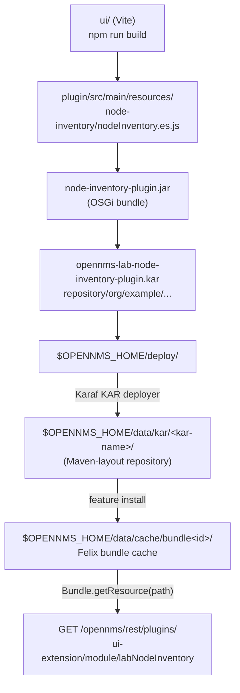

# Part 2 - Where files live in an OpenNMS container

A file can sit in half a dozen places in a running Horizon 33.1.8 container. They differ in who
writes them, when changes become visible, and whether anything serves them over HTTP. This part
walks through all of them, because the choice of the shared folder's location falls out of this
map.

## 2.1 The container's home directory

The official image installs OpenNMS in `/usr/share/opennms`; that is `OPENNMS_HOME`, and the
entrypoint starts Java with `-Dopennms.home=/usr/share/opennms`. For compatibility the image also
creates a symlink `/opt/opennms -> /usr/share/opennms`, which is why most documentation writes
`/opt/opennms/...`. Both names reach the same files. This lab uses the real path in its
bind-mount target so that nothing depends on symlink resolution.

The image runs as the user `opennms`, **uid 10001 and gid 10001** (`USER 10001`; the image
creates that user with its own group 10001). The files under `/usr/share/opennms` belong to uid
10001 and group 0, and the entrypoint sets `umask 002`. Remember the uid: it decides whether
OpenNMS can read the files you put on the host (section 2.6). The group matters for ICMP (Part 0,
section 0.12).

## 2.2 Inside a plugin: from `mvn package` to `Bundle.getResource()`

Follow one file, `node-inventory/nodeInventory.es.js`, from the demo plugin in this repo:



1. **Build.** Vite writes the module straight into `plugin/src/main/resources/<resourceRootPath>/`
   and `maven-bundle-plugin` packs `src/main/resources` into the bundle JAR, next to the blueprint
   file and the class that implements `UIExtension`.
2. **Package.** `karaf-maven-plugin` wraps the bundle and a `features.xml` into a KAR. Inside the
   KAR the bundle sits under `repository/` in Maven layout.
3. **Deploy.** You drop the KAR into a folder Karaf watches: `$OPENNMS_HOME/deploy/`, where the
   image already ships two KARs (the Cortex TSS and VeloCloud plugins, downloaded at image build
   time), or, in this lab, the host folder `./deploy`, which Karaf watches as a second deploy
   folder ([Part 6](06-installing-the-plugins.md)).
4. **Extract.** Karaf's KAR service copies the `repository/` part into `${karaf.data}/kar/<kar-name>/`.
   In OpenNMS, Karaf is started by the web application itself (`WebAppListener` sets
   `karaf.home` to `OPENNMS_HOME` and `karaf.data` to `OPENNMS_HOME/data`), so that is
   `/usr/share/opennms/data/kar/...`.
5. **Install.** Unless the KAR's manifest says `Karaf-Feature-Start: false`, the KAR service then
   installs every feature in it. The OSGi framework keeps its own copy of each installed bundle
   in the bundle cache, `${karaf.data}/cache` (Karaf's default `org.osgi.framework.storage`), i.e.
   `/usr/share/opennms/data/cache/bundle<id>/...`.
6. **Serve.** On each request for the module, `UIExtensionServiceImpl` asks the OSGi framework for
   the bundle that loaded your `UIExtension` class and calls `bundle.getResource(path)` on it.

Two things follow. First, `getExtensionClass()` must return a class **from the plugin's own
bundle**: that class is the only thing OpenNMS uses to find the JAR with your JavaScript. Second,
anything in this chain changes only when you rebuild and redeploy. `/usr/share/opennms/data` is
not a volume in the image, so a recreated container rebuilds the KAR and bundle caches from its
deploy folders at start.

## 2.3 The `opennms` web application directory

`$OPENNMS_HOME/jetty-webapps/opennms/` is an exploded WAR that Jetty serves under the context path
`/opennms`. Among other things it contains:

| Path (under `jetty-webapps/opennms/`) | What it is | URL |
|---|---|---|
| `WEB-INF/` | `web.xml`, Spring and Spring Security config, libraries (never served) | - |
| `assets/` | OpenNMS's own webpack-built JavaScript, CSS and fonts (`core/web-assets`) | `/opennms/assets/...` |
| `ui/` | the Vue single-page app (the `ui` module is unpacked here) | `/opennms/ui/` |
| `images/`, `css/`, `svg/`, `lib/`, `*.jsp` | the classic JSP web UI and its static files | `/opennms/...` |

Every static file in this tree is served by the web application's `DefaultServlet`, after the
servlet filters and Spring Security have had their say ([Part 4](04-how-jetty-serves-them.md)).
The files come from the image, so anything you add here without a mount is lost when the
container is recreated.

## 2.4 Overlay folders: copied once, at start

The entrypoint knows three overlay folders. At every start it copies them with `rsync`:

| Mount your files at | Copied to | When |
|---|---|---|
| `/opt/opennms-overlay/` | `$OPENNMS_HOME/` (any sub-tree, e.g. `deploy/`) | at container start |
| `/opt/opennms-etc-overlay/` | `$OPENNMS_HOME/etc/` | at container start |
| `/opt/opennms-jetty-webinf-overlay/` | `$OPENNMS_HOME/jetty-webapps/opennms/WEB-INF/` | at container start |

Overlays are the right tool for configuration. This lab mounts only the etc overlay, for one
file: `org.apache.felix.fileinstall-lab.cfg`, which makes Karaf watch the plugin deploy folder
([Part 6](06-installing-the-plugins.md)). Overlays are the wrong tool for anything you want to
change while OpenNMS runs: a file added to an overlay after start stays invisible until the next
restart, because what OpenNMS reads is the copy. And `rsync` copies but never deletes: a file you
remove from an overlay stays in its target until the container is re-created (for `etc/`, which is
a volume, until you delete it there).

One trap: never place files for `jetty-webapps/opennms/assets/shared/` in an overlay. The mount
in section 2.6 is read-only, the `rsync` would fail, and the entrypoint exits on that failure.

## 2.5 Volumes

The image declares three volumes: `/opt/opennms/etc`, `/opt/opennms-etc-overlay` and
`/opennms-data` (RRD files, reports, MIBs). The compose file in this repo keeps `etc` and
`/opennms-data` in named volumes and bind-mounts `./etc-overlay` at `/opt/opennms-etc-overlay`.
None of these is served over HTTP. `data/` (Karaf's caches) and `logs/` are not volumes: they live
in the container and are new in every re-created container ([Part 0, section 0.10](00-install-opennms-and-postgresql.md#010-what-is-where)).

## 2.6 The shared folder: one bind mount

For the assets, the lab adds exactly one line to the Horizon service:

```yaml
- ./shared-assets:/usr/share/opennms/jetty-webapps/opennms/assets/shared:ro,z
```

A bind mount is not a copy. The container sees the host directory itself, so a file you write
on the host is the file Jetty opens on the next request. Because the mount target sits inside
the `opennms` web application's `assets/` tree, the files are served at
`/opennms/assets/shared/...` by the same `DefaultServlet` that serves OpenNMS's own JavaScript.

| Where | Written by | Change visible | Served at | Meets the 4 constraints of Part 1? |
|---|---|---|---|---|
| Inside the plugin JAR | Maven build | after redeploy | `/rest/plugins/...` (module and `style.css` only) | no: images come back as `application/javascript` |
| `data/kar/`, `data/cache/` | Karaf | after redeploy | not directly | no |
| Overlay folders | you, then the entrypoint's `rsync` | after restart | where copied | no: not live |
| Lab deploy folder `./deploy` (plugin KARs) | you, on the host | within a second (Karaf installs the KAR) | not served; installs plugins | not for assets: for plugin code ([Part 6](06-installing-the-plugins.md)) |
| Volumes (`etc`, `/opennms-data`) | you / OpenNMS | n/a | not served | no |
| Files baked into `jetty-webapps/opennms/` | image build | after rebuild | `/opennms/...` | no: not live |
| **Bind mount at `jetty-webapps/opennms/assets/shared`** | **you, on the host** | **next request** | **`/opennms/assets/shared/...`** | **yes** |

### Permissions and SELinux

Jetty reads the mounted files as uid 10001, which is not the owner of your files on the host, so
the "other" permission bits apply: files need `644` and directories `755`. With rootless Podman
your host user is mapped to root inside the container, and uid 10001 is still "other", so the
rule is the same. `scripts/assets.py add` writes files with these modes whatever your umask, and
`scripts/assets.py validate` checks them.

On SELinux hosts (Fedora, RHEL, Podman machine VMs) a bind mount needs a label the container may
read. The `z` option asks Podman or Docker to relabel the directory for shared use; on hosts
without SELinux it is ignored.

### Symlinks

Do not put symlinks in the folder that point elsewhere on the host. Jetty 9.4.57 follows symlinks
(its default `SymlinkAllowedResourceAliasChecker`), but inside the container the link target is
looked up in the container's filesystem, where your host path does not exist. In the test harness
a dangling link made Jetty 9.4 fail the request with an empty reply. Copy the file instead.

[Part 3](03-how-plugins-find-assets.md) follows a page load in the browser and shows how the
plugins discover both their own code and the shared files.
