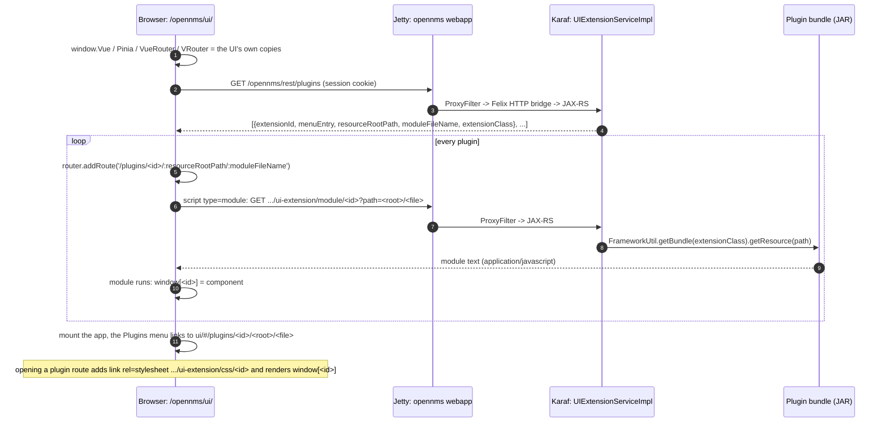

# Part 3 - How plugins are found, and how they find the shared files

"Finding" happens twice. OpenNMS has to find your plugin (its code), and your plugin has to find
the shared files. The first is an OSGi and REST story; the second, with this design, is just a
URL contract plus a small catalog file. Both are traced here in the order they happen.

## 3.1 Registering: a blueprint `<service>`

Each demo plugin declares its extension in `OSGI-INF/blueprint/blueprint.xml`:

```xml
<service interface="org.opennms.integration.api.v1.ui.UIExtension">
    <bean class="org.example.opennms.lab.nodeinventory.NodeInventoryUIExtension">
        <property name="extensionId" value="labNodeInventory"/>
        <property name="menuEntry" value="Shared Assets: Node Inventory"/>
        <property name="resourceRootPath" value="node-inventory"/>
        <property name="moduleFileName" value="nodeInventory.es.js"/>
    </bean>
</service>
```

When the bundle starts, Aries Blueprint creates the bean and publishes it in the OSGi service
registry under the `UIExtension` interface.

## 3.2 Tracking: `UIExtensionRegistryImpl`

OpenNMS's API layer (`features/api-layer`) keeps a `<reference-list>` on that interface. Every
time a `UIExtension` service appears or disappears, blueprint calls `onBind` / `onUnbind` on
`UIExtensionRegistryImpl`, which keeps a `HashMap` keyed by `extensionId`. Two consequences:

* extension ids must be unique across all installed plugins; a second plugin with the same id
  simply replaces the first in the map;
* the registry is live: install or stop a bundle and the list changes without a restart.

## 3.3 Publishing: `/opennms/rest/plugins`

`UIExtensionServiceImpl` is itself an OSGi service, registered with the property
`application-path=/rest`. OpenNMS's OSGi JAX-RS connector (the `com.eclipsesource.jaxrs`
publisher, OpenNMS fork `1.1.0.ONMS`) picks up every service carrying that property and publishes
its JAX-RS resources. Getting an HTTP request from Jetty to that resource takes one more hop,
because Karaf runs *inside* the `opennms` web application:

* the `opennms` web application's `web.xml` contains a `ProxyFilter` mapped to `/*` (merged in
  from the `container/servlet` module at build time);
* for each request the filter asks its handlers whether an OSGi component can serve the path:
  REST endpoints known to the JAX-RS connector, OSGi HTTP-whiteboard servlets, and whiteboard
  resources;
* if one can, the request is dispatched into the Felix HTTP bridge inside Karaf; otherwise it
  continues down the normal filter chain to the web application's own servlets.

OpenNMS's own REST API is not part of this: `/rest/*` and `/api/v2/*` are Apache CXF servlets
inside the web application. The `ProxyFilter` only diverts the paths an OSGi component has
claimed, such as `/rest/plugins`, before CXF ever sees them.

The `ProxyFilter` mapping is merged into the `opennms` web application at the
`<!-- WARMERGE: insert filter-mapping -->` marker, which comes after the `springSecurityFilterChain`
mapping, so Spring Security has already checked the request. For `/rest/**` a `GET` needs one of `ROLE_REST`,
`ROLE_ADMIN`, `ROLE_MOBILE` or `ROLE_USER`: a logged-in user's session cookie is enough.

## 3.4 Loading: what the new UI does at start-up

The new UI (`/opennms/ui/`, Vue 3.3.7 in Horizon 33.1.8) loads plugins before it mounts itself.
From `ui/src/main.ts` and `ui/src/components/Plugin/utils.ts`:



Reading the loader code closely gives the rules every plugin must follow. `scripts/check_plugins.py`
checks all of them except the Vue version after a build:

| Rule | Where it comes from |
|---|---|
| The module must assign the component to `window[extensionId]`. | `externalComponent()` resolves the promise with `window[name]` once the script has loaded. |
| `resourceRootPath` must be a single path segment. | The loader takes the extension id from the second-to-last `/`-separated part of the module URL, and the router uses `:resourceRootPath` as one route parameter. |
| `moduleFileName` must contain `.es` (for example `nodeInventory.es.js`). | The loader parses it with `/^(.*?)\.es/`; without a match it throws and the plugin never loads. |
| Do not bundle Vue; use the host's `window.Vue`. | `main.ts` publishes its own Vue, Pinia and router for plugins. Two Vue copies do not share reactivity. |
| Compile against the host's Vue minor version (3.3.x for 33.1.8). | The compiled render functions call runtime helpers of the host's Vue. |
| Keep the module ASCII-only. | The server turns the bytes into a Java `String` with the JVM default charset. |

## 3.5 Finding the shared files: a URL contract

For the shared files there is no registration at all. The contract between the operator and every
plugin is one URL prefix:

```text
/opennms/assets/shared/<path relative to ./shared-assets on the host>
```

Hard-coding `/opennms` here is no worse than what the host UI does: it compiles
`VITE_BASE_REST_URL=/opennms/rest` into its bundle and creates its router with
`createWebHashHistory('/opennms/ui')`. If you ever run OpenNMS under another context path, the
host UI has to be rebuilt anyway, and the helper takes a `base` option.

### Why a catalog file is needed

A URL is enough when a plugin already knows the file name. It is not enough to *discover* files,
because the web application's `DefaultServlet` runs with `dirAllowed=false`: asking for
`/opennms/assets/shared/icons/` returns `403`, never a listing. So the folder carries its own
catalog, `manifest.json`:

```json
{
  "schemaVersion": 1,
  "revision": 1,
  "icons":  { "router": { "path": "icons/router.svg", "label": "Router" }, "...": {} },
  "images": { "lab-banner": { "path": "branding/lab-banner.png" } },
  "nodeIconRules": [
    { "icon": "router", "match": { "categories": ["Routers"] } },
    { "icon": "sbc",    "match": { "labelPattern": "raspberry|\\bpi\\b" } },
    { "icon": "linux",  "match": { "sysObjectIdPrefixes": [".1.3.6.1.4.1.8072.3.2.10"] } }
  ],
  "defaultIcon": "unknown"
}
```

`manifest.schema.json` documents every field and lets an editor validate the file.

### The helper every plugin bundles

`packages/shared-assets` (`@onms-lab/shared-assets`) is a small, dependency-free TypeScript
library (a few hundred lines, most of them comments) that each plugin compiles in. It does four jobs:

1. **Build URLs.** `assetUrl('icons/router.svg', { revision: 3 })` returns
   `/opennms/assets/shared/icons/router.svg?rev=3`. Each segment is URL-encoded, and `.` / `..`
   segments are rejected so a manifest entry cannot point outside the folder.
2. **Load the catalog once per page.** `loadManifest()` fetches `manifest.json` with
   `cache: 'no-cache'`, which makes the browser revalidate on every page load. Jetty answers `304`
   when nothing changed, so this costs one small round trip. The result is cached on `globalThis`,
   not in a module variable, because each plugin carries its *own* copy of the helper. In the test
   harness both plugins together caused exactly one `manifest.json` request.
3. **Map nodes to icons.** `resolveIconKey(node, manifest)` walks `nodeIconRules` top to bottom and
   returns the first match. Inside a rule every condition present must match (AND); each list is
   an OR. Categories compare case-insensitively, sysObjectID prefixes match on arc boundaries
   (`.1.3.6.1.4.1.9` does not match `.1.3.6.1.4.1.99`), and `labelPattern` is a case-insensitive
   JavaScript regular expression.
4. **Degrade gracefully.** A key missing from the catalog falls back to the convention
   `icons/<key>.svg`; an unreachable manifest yields an empty one; the demo components swap a broken
   image for the default icon once.

This is all a plugin needs (from `plugins/node-inventory/ui/src/NodeInventory.vue`):

```ts
import { EMPTY_MANIFEST, loadManifest, nodeIconUrl } from '@onms-lab/shared-assets'

const manifest = ref(EMPTY_MANIFEST)
onMounted(async () => {
  manifest.value = await loadManifest()   // one request per page, shared with every other plugin
})
// template:   ->  /opennms/assets/shared/icons/router.svg?rev=1
```

## 3.6 What "drop a file and the plugin finds it" means exactly

| You do | Jetty serves it | Plugins pick it up |
|---|---|---|
| copy `icons/new.svg` into `./shared-assets` | on the next request | immediately if the plugin asks for that path (for example by the `icons/<key>.svg` convention); the Icon Catalog's "Probe a path" box shows this |
| `scripts/assets.py add new.svg --key new --category NewThings` | on the next request | on the next page load: the catalog entry and rule are new, and the revision bump changes every URL |
| replace an existing file under the same name | on the next request | browsers that cached the old file keep it for up to one hour (`max-age=3600`), unless the revision is bumped, which `assets.py add` and `assets.py bump` do |
| delete a file | `404` on the next request | the component shows the default icon instead |

A page that is already open keeps the catalog it loaded until it is reloaded, or until a plugin
calls `loadManifest({ force: true })`.

## 3.7 Java code that needs the files

Server-side code in a plugin can read the same folder from disk:
`Paths.get(System.getProperty("opennms.home"), "jetty-webapps", "opennms", "assets", "shared")`.
Prefer URLs whenever the consumer is a browser; the path is an implementation detail of this
deployment.

[Part 4](04-how-jetty-serves-them.md) opens the last black box: what Jetty does between the
request for `/opennms/assets/shared/icons/router.svg` and the bytes arriving in the browser.
