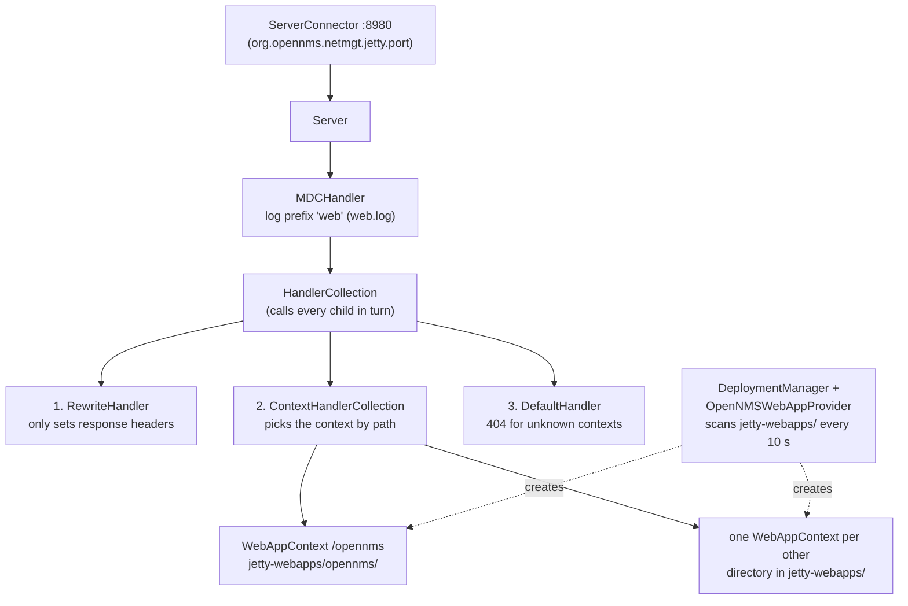

# Part 4 - How Jetty serves the shared folder

This part follows one request, `GET /opennms/assets/shared/icons/router.svg`, through every layer
of the web server in Horizon 33.1.8. Along the way it answers the practical questions: why the
file is readable without logging in, why the browser may keep it for an hour, why a file you
drop in appears at once, and why the same image under `/opennms/images/` would be treated
completely differently.

All code references are to OpenNMS `opennms-33.1.8-1` and Jetty `9.4.57.v20241219`, the version
that release ships. Response headers quoted here were captured in this lab's test harness (see
[reference/verification.md](reference/verification.md)).

## 4.1 Who starts Jetty

Jetty is embedded. It is started by `JettyServer`, an OpenNMS daemon defined in the
`opennms-jetty` module. Its `onInit()` creates an empty `org.eclipse.jetty.server.Server` and
configures it entirely from XML:

* `$OPENNMS_HOME/etc/jetty.xml` if that file exists,
* otherwise the copy inside the JAR, `org/opennms/netmgt/jetty/jetty.xml`, which is also shipped
  as `etc/examples/jetty.xml` for you to copy and customise.

Everything below (connectors, handlers, web applications) comes from that one file.

## 4.2 The handler tree



This is the chain Jetty actually builds from the file. Printing the handlers of a `Server`
configured with OpenNMS's `jetty.xml` in the test harness gives `MDCHandler -> HandlerCollection
[RewriteHandler, ContextHandlerCollection, DefaultHandler]`. (The file also calls `insertHandler`
with a `StatisticsHandler`, but the `<Set name="handler">` that follows replaces it, so it is not in
the request path.)

The `DeploymentManager` turns every directory in `$OPENNMS_HOME/jetty-webapps/` into a web
application whose context path is the directory name (`ROOT` would become `/`). OpenNMS's
`OpenNMSWebAppProvider` adds JSP support and one extra alias check (`ApproveAbsolutePathAliases`,
which tolerates double slashes in paths). The `opennms` directory therefore becomes the `/opennms`
context, and our bind mount appears inside it as the `assets/shared/` sub-directory.

## 4.3 Step 1: the RewriteHandler sets headers

The first child of the `HandlerCollection` is a `RewriteHandler` whose rules never rewrite
anything; they only set response headers and let the request continue:

| Rule | Applies to | Header set |
|---|---|---|
| `HeaderPatternRule` | every request | `X-Frame-Options: SAMEORIGIN` |
| `HeaderRegexRule` (NMS-14947) | URIs matching `/opennms/(?!assets/).*` | `Cache-control: no-store` |
| `HeaderRegexRule` | URIs matching `/opennms/(?!assets/).*` | `Pragma: no-cache` |

The negative look-ahead `(?!assets/)` is the reason this lab mounts the folder under `assets/`.
OpenNMS deliberately exempts its own static assets from "never cache", and the shared folder
inherits that exemption. A request for `/opennms/assets/shared/icons/router.svg` leaves this step
with only `X-Frame-Options` set.

## 4.4 Step 2: the context and its filter chain

`ContextHandlerCollection` picks the context with the longest matching path, `/opennms`. Inside
the web application the servlet filters from `WEB-INF/web.xml` run in declaration order. The ones
that matter here:

| Filter | Effect on our request |
|---|---|
| `Content-Security-Policy-Filter` | adds the CSP header (the `img-src 'self' ... data:` policy from Part 1) |
| `X-Content-Type-Options-Filter` | adds `X-Content-Type-Options: nosniff` |
| `Referrer-Policy`, `Permissions-Policy`, HSTS filters | add their headers |
| `springSecurityFilterChain` | decides whether the request may continue (4.5) |
| `ProxyFilter` (OSGi web bridge) | no OSGi component claims `/assets/...`, so it passes the request on |

After the filters, the request reaches the servlet mapped to it. Nothing in OpenNMS's `web.xml`
maps `/assets/*`, so Jetty's default mapping from `webdefault.xml` applies: `/` goes to the
servlet named `default`, `org.eclipse.jetty.servlet.DefaultServlet`.

## 4.5 Step 3: Spring Security says "anyone"

`applicationContext-spring-security.xml` has several `<http>` blocks. Our path is not under
`/rest/**`, `/api/v2/**` or the other special prefixes, so the catch-all block `pattern="/**"`
decides, top to bottom:

```xml
<intercept-url pattern="/images/**" access="hasAnyRole('ROLE_ANONYMOUS','ROLE_USER','ROLE_DASHBOARD')" />
<intercept-url pattern="/assets/load-assets.jsp*" access="denyAll" />
<intercept-url pattern="/assets/**" access="hasAnyRole('ROLE_ANONYMOUS','ROLE_USER','ROLE_DASHBOARD')" />
...
<intercept-url pattern="/**" access="hasAnyRole('ROLE_USER')" />
```

`/assets/**` includes `ROLE_ANONYMOUS`, so the shared files are readable without a session. That
is what OpenNMS needs for its own JavaScript on the login page, and it is fine for node icons.
It also means **anyone who can reach port 8980 can read the folder**; keep only public material
in it. The same block sets `<headers defaults-disabled="true" />`, so Spring Security adds no
cache headers of its own.

If the files had to require a login, mounting the folder at, for example,
`jetty-webapps/opennms/shared-assets` would fall under `/** -> ROLE_USER` with no code at all, at
the price of the `no-store` rule from 4.3. [Part 5](05-design-decisions.md) compares the options.

## 4.6 Step 4: the DefaultServlet and OpenNMS's settings

OpenNMS's `web.xml` redefines the servlet named `default`, so Jetty merges these init parameters
over its own defaults:

| Init parameter | OpenNMS value | What it means for the shared folder |
|---|---|---|
| `dirAllowed` | `false` (NMS-3475) | a directory request returns `403`; no listings, hence `manifest.json` |
| `acceptRanges` | `true` | `Range` requests get `206 Partial Content` |
| `cacheControl` | `max-age=3600,public` | the value used for `Cache-Control` (see 4.7) |
| `maxCacheSize` / `maxCachedFileSize` / `maxCachedFiles` | 256 MB / 200 MB / 2048 | Jetty keeps file contents in memory (4.8) |
| `resourceCache` | `resourceCache` | the cache is stored as a context attribute |
| `useFileMappedBuffer` | `true` | cached files may be memory-mapped |
| `gzip` | `true` | a pre-compressed `router.svg.gz` next to `router.svg` is sent to clients that accept gzip |
| `welcomeServlets`, `redirectWelcome` | `false` | no index pages |
| `aliases` | `false` | legacy parameter; Jetty 9.4.57's DefaultServlet no longer reads it |

`etags` is not set, so it keeps Jetty's default `false`: validation uses `Last-Modified` and
`If-Modified-Since`. Content types come from Jetty's `mime.properties` (`svg=image/svg+xml`,
`png=image/png`, `webp=image/webp`, `json=application/json`, ...).

## 4.7 How `Cache-Control` is decided

`ResourceService.putHeaders()` in Jetty 9.4.57 adds the configured value only when the response
has no `Cache-Control` header yet:

```java
if (_cacheControl != null && !fields.contains(HttpHeader.CACHE_CONTROL))
    fields.add(_cacheControl);
```

Combine that with 4.3 and you get two different outcomes for the same kind of file, captured in
the harness:

```text
GET /opennms/assets/shared/icons/router.svg          GET /opennms/images/example.svg
HTTP/1.1 200 OK                                      HTTP/1.1 200 OK
X-Frame-Options: SAMEORIGIN                          X-Frame-Options: SAMEORIGIN
Content-Security-Policy: default-src 'none' ; ...    Cache-Control: no-store
X-Content-Type-Options: nosniff                      Pragma: no-cache
Last-Modified: Tue, 22 Sep 2026 15:50:37 GMT         Content-Security-Policy: default-src 'none' ; ...
Content-Type: image/svg+xml                          X-Content-Type-Options: nosniff
Accept-Ranges: bytes                                 Last-Modified: Tue, 22 Sep 2026 16:01:40 GMT
Cache-Control: max-age=3600,public                   Content-Type: image/svg+xml
Content-Length: 444                                  Accept-Ranges: bytes
                                                     Content-Length: 444
```

Under `/opennms/assets/` the servlet's `max-age=3600,public` wins; everywhere else under
`/opennms/` the RewriteHandler's `no-store` was there first. That is why the design pairs the
one-hour cache with a revision query string: a changed `revision` in `manifest.json` changes every
URL, and a new URL is never served from the browser cache.

## 4.8 Why a dropped file appears immediately

The DefaultServlet asks a `CachedContentFactory` for the file on every request:

1. If the path is cached, the entry is checked: `lastModified` and `length` of the file on disk
   must still equal the cached values. If not, the entry is evicted and the file read again.
2. If the path is not cached, Jetty resolves it on disk. A missing file returns `null` (a 404),
   and **misses are never cached**.

So a new file is found by the very next request, a replaced file is detected by its new
modification time, and a deleted file turns into a 404 at once. The harness showed exactly that:
`404` before the drop, `200 image/svg+xml` immediately after, the new content after an atomic
replace, `404` after deletion.

Replace files atomically: write a temporary file in the same directory, then rename it over the
old one (`scripts/assets.py add` does this). A rename swaps whole files, so Jetty never serves a
half-written one, and a file it has memory-mapped (`useFileMappedBuffer=true`) is never truncated
under it. An editor saving in place, or `cp` over an existing file, can briefly expose a partial
file.

## 4.9 Paths that are refused

| Request | Result in the harness | Why |
|---|---|---|
| `/opennms/assets/shared/icons/` | `403` | `dirAllowed=false` |
| `/opennms/assets/shared/icons` | `302` to `.../icons/` | Jetty redirects directories to the trailing-slash form |
| `/opennms/assets/shared/../WEB-INF/web.xml` (and `%2e%2e`, `..%2f`) | `404` | Jetty normalises the path; `WEB-INF` is a protected target |
| `/opennms/assets/shared/icons/nope.svg` | `404` | missing files are not cached |
| a symlink pointing at a missing target | empty reply | Jetty 9.4 fails while sending (see Part 2, symlinks) |

## 4.10 The whole request, once more

1. The browser, on the page `http://nms:8980/opennms/ui/`, renders ``.
   Same origin, so the CSP `img-src 'self'` allows it.
2. The `RewriteHandler` sets `X-Frame-Options`; the `no-store` rule does not match `assets/`.
3. `ContextHandlerCollection` hands the request to the `/opennms` web application.
4. The CSP, `nosniff` and related filters add their headers.
5. Spring Security matches `/assets/**` and lets anonymous and logged-in users through.
6. The OSGi `ProxyFilter` finds no OSGi servlet for the path and passes it on.
7. `DefaultServlet` resolves `assets/shared/icons/router.svg` in `jetty-webapps/opennms/`, which is
   the bind-mounted host folder, and reads it through its content cache.
8. The response carries `Content-Type: image/svg+xml`, `Last-Modified` and
   `Cache-Control: max-age=3600,public`. The next page load revalidates `manifest.json`, and the
   icon itself is served from the browser cache until the revision changes or the hour passes.

## 4.11 For contrast: the plugin module request

`GET /opennms/rest/plugins/ui-extension/module/labNodeInventory?path=node-inventory/nodeInventory.es.js`
takes a different branch at almost every step: the `no-store` rule matches (`rest/` is not
`assets/`), Spring Security's `/rest/**` block requires a role, the `ProxyFilter` claims the
request for the OSGi JAX-RS resource, and the answer is `application/javascript` built from a
Java `String`. Code and shared files travel separate paths, which is exactly the point: each
plugin ships only its code, and all of them read the same files from the one folder.
