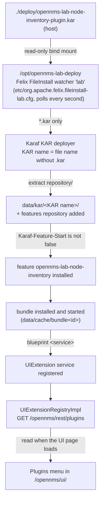
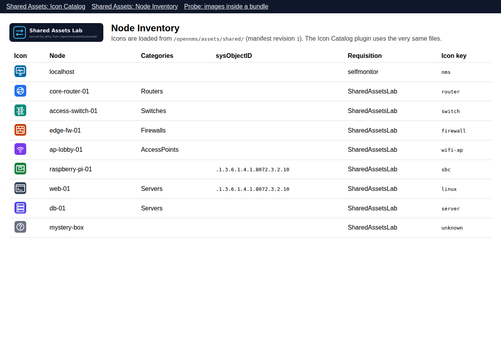

# Part 6 - Installing the plugins one by one

OpenNMS runs ([Part 0](00-install-opennms-and-postgresql.md)) and the shared folder is served. Now
the two demo plugins go in, one at a time, and at every step you look at each layer that has to
work for a plugin to appear in the UI. Then you update one, remove one, and apply the same method
to your own plugins.

The mechanism is the second host folder of the lab: `./deploy`. Karaf watches it while OpenNMS
runs, so installing a plugin is copying one file, and uninstalling it is deleting that file. No
restart, no `podman exec`, no copying into the container.

## 6.1 How a KAR in `./deploy` becomes a menu entry



The first box is the only one this lab adds. Karaf treats every file named
`etc/org.apache.felix.fileinstall-<name>.cfg` as one more deploy folder, next to its built-in
`$OPENNMS_HOME/deploy`. The container's entrypoint copies `etc-overlay/org.apache.felix.fileinstall-lab.cfg`
into `etc/` at every start, and `compose.yml` mounts `./deploy` at the directory that file names.
From the KAR deployer on, everything is standard Karaf and OpenNMS, exactly as for a KAR you would
copy into `$OPENNMS_HOME/deploy`.

| Layer | What happens | How to look at it |
|---|---|---|
| 1. file | the KAR appears in `./deploy` and, through the mount, in `/opt/opennms-lab-deploy` | `ls -l deploy/` |
| 2. watcher | FileInstall notices the new, changed or deleted file within a second and calls the KAR deployer | `karaf.log`: `Installing KAR file ...` |
| 3. KAR | extracted into `data/kar/<KAR name>/`; its features repository is added; its features are installed | `kar:list`, `feature:list -i` |
| 4. bundle | the plugin's bundle is installed and started; its blueprint container starts | `bundle:list`, `bundle:diag <id>` |
| 5. service | blueprint registers the plugin's `UIExtension` service | `service:list org.opennms.integration.api.v1.ui.UIExtension` |
| 6. REST | `UIExtensionRegistryImpl` tracks the service; the REST API lists it | `GET /opennms/rest/plugins` |
| 7. UI | the new UI reads the list when the page loads and adds a route and a menu entry | the **Plugins** menu, after reloading the page |

[Part 2](02-where-assets-live.md) follows a plugin file through layers 3 and 4, and
[Part 3](03-how-plugins-find-assets.md) explains layers 5 to 7.

## 6.2 Build the first plugin

```bash
scripts/build-plugins.sh node-inventory
```

This needs Node.js, a JDK and Maven with access to Maven Central. It runs the shared helper's unit
tests, builds the Vue module into `plugins/node-inventory/plugin/src/main/resources/node-inventory/`,
checks it with `scripts/check_plugins.py`, and runs `mvn package`, which produces
`plugins/node-inventory/assembly/kar/target/opennms-lab-node-inventory-plugin.kar`. Nothing is
deployed yet.

Look inside the KAR before you deploy it:

```bash
python3 scripts/kar_info.py plugins/node-inventory/assembly/kar/target/opennms-lab-node-inventory-plugin.kar
```

```text
plugins/node-inventory/assembly/kar/target/opennms-lab-node-inventory-plugin.kar
  KAR name (kar:list)   opennms-lab-node-inventory-plugin
  Karaf-Feature-Start   true: features are installed with the KAR
  feature               opennms-lab-node-inventory/1.0.0-SNAPSHOT
  bundle                mvn:org.example.opennms.lab/node-inventory-plugin/1.0.0-SNAPSHOT  ->  org.example.opennms.lab.node-inventory-plugin 1.0.0.SNAPSHOT
  UI extension          labNodeInventory  menu "Shared Assets: Node Inventory"
                        module node-inventory/nodeInventory.es.js (9460 bytes, sha256 40564643ee49...); style.css yes
                        UI route #/plugins/labNodeInventory/node-inventory/nodeInventory.es.js
```

Each line is something Karaf or the UI will use: the KAR name that `kar:list` will show (the file
name without `.kar`), whether installing the KAR also installs its features, the feature and the
bundle inside, and the UI extension the bundle's blueprint declares, with the module file the REST
API will serve for it. (Sizes and hashes depend on your build.)

## 6.3 Deploy it

```bash
scripts/deploy-plugin.sh node-inventory
```

```text
== opennms-lab-node-inventory-plugin.kar
  KAR name (kar:list)   opennms-lab-node-inventory-plugin
  ...
== Contract check
1 plugin(s): 7 PASS, 0 FAIL, 0 WARN

Copied to deploy/opennms-lab-node-inventory-plugin.kar: new install.
Waiting for OpenNMS to serve it (up to 180s) ...
Live after 4s:
  labNodeInventory  ->  http://localhost:8980/opennms/ui/#/plugins/labNodeInventory/node-inventory/nodeInventory.es.js
```

What the script did, in order:

1. **Checked the KAR** with `scripts/check_plugins.py`, the same rules as for the source tree
   ([Part 3](03-how-plugins-find-assets.md#34-loading-what-the-new-ui-does-at-start-up)), but on
   the bundle inside the KAR, which is what OpenNMS will load. A FAIL stops the deployment.
2. **Looked for duplicates**: another KAR in `./deploy` with the same feature or extension id would
   be installed too, and the two plugins would replace each other in the registry.
3. **Copied the KAR** under the temporary name `.opennms-lab-node-inventory-plugin.kar.part`, made
   it readable for uid 10001, and renamed it. The watcher only picks up names ending in `.kar`,
   so it never sees a half-copied file.
4. **Waited** until `/opennms/rest/plugins` lists `labNodeInventory` **and** the module OpenNMS
   serves has the same SHA-256 as the module inside the KAR. Only then is this build live.

Plain `cp` into `./deploy` works too; the script adds the checks and the wait.

## 6.4 Look at every layer

Do this once, so you know where to look when a plugin does not show up. The Karaf commands run in
the Karaf shell; `scripts/karaf.sh` opens it (or runs one command) with the admin account from
`.env`.

```bash
# 1. the file, seen from inside the container
podman exec onms-shared-assets-horizon ls -l /opt/opennms-lab-deploy

# 2. the watcher and the KAR deployer
podman exec onms-shared-assets-horizon tail -n 40 /usr/share/opennms/logs/karaf.log

# 3. the KAR and its feature
scripts/karaf.sh kar:list
scripts/karaf.sh 'feature:list -i | grep opennms-lab'

# 4. the bundle
scripts/karaf.sh 'bundle:list | grep -i "node inventory"'

# 5. the OSGi service
scripts/karaf.sh 'service:list org.opennms.integration.api.v1.ui.UIExtension'

# 6. the REST API
curl -s -u "admin:YOUR-PASSWORD" http://localhost:8980/opennms/rest/plugins | python3 -m json.tool
```

What you should see:

| Command | Expect |
|---|---|
| `ls -l /opt/opennms-lab-deploy` | the KAR with mode `-rw-r--r--` (readable by uid 10001), `README.md` next to it |
| `karaf.log` | `Found a .kar file to deploy.` and `Installing KAR file /opt/opennms-lab-deploy/opennms-lab-node-inventory-plugin.kar`, then the features service: `Adding features: opennms-lab-node-inventory/...`, `Changes to perform:`, `Installing bundles:`, `Starting bundles:`, `Done.` |
| `kar:list` | `opennms-lab-node-inventory-plugin`, next to the KARs the image ships in `$OPENNMS_HOME/deploy` |
| `feature:list -i` | `opennms-lab-node-inventory`, state `Started` |
| `bundle:list` | `Lab :: Shared Assets :: Node Inventory :: Plugin`, state `Active` |
| `service:list ...UIExtension` | one entry per installed UI plugin; this one "Provided by" the bundle `Lab :: Shared Assets :: Node Inventory :: Plugin` |
| `/rest/plugins` | an entry with `"extensionId": "labNodeInventory"`, `"menuEntry": "Shared Assets: Node Inventory"`, `"resourceRootPath": "node-inventory"`, `"moduleFileName": "nodeInventory.es.js"` |

If a layer is missing, the layer before it is where the problem is.
[Troubleshooting](09-troubleshooting.md#deploying-plugins) lists the usual causes per layer.

## 6.5 Open it, and give it nodes to show

Reload <http://localhost:8980/opennms/ui/> (the UI asks for the plugin list once, when the page
loads) and open **Plugins > Shared Assets: Node Inventory**. It lists the nodes OpenNMS knows,
each with the icon the rules in `shared-assets/manifest.json` pick for it. At first that is only
the self-monitoring node from Part 0, which gets the "monitoring server" icon through the rule
`{"icon": "nms", "match": {"foreignSources": ["selfmonitor"]}}`.

Give it more nodes:

```bash
scripts/provision-demo-nodes.sh
```

This creates the requisition `SharedAssetsLab` with seven nodes whose categories and labels
exercise the other rules: a router, a switch, a firewall, an access point, a Raspberry Pi by name,
a server, and one that matches nothing. Their addresses are documentation addresses
(`192.0.2.0/24`) and the requisition has no detectors, so OpenNMS never scans them. The `linux`
rule matches on sysObjectID, which only real SNMP nodes have. Reload the plugin page after a few
seconds.



*The Node Inventory plugin rendered by the lab's test harness, which emulates the OpenNMS plugin
host. In OpenNMS the same component appears inside the normal UI frame.*

## 6.6 The second plugin

```bash
scripts/build-plugins.sh icon-catalog
scripts/deploy-plugin.sh icon-catalog
```

Reload the UI: the **Plugins** menu now has both entries. The Icon Catalog shows every file in the
manifest with the `Content-Type` and `Cache-Control` Jetty sent for it. Open both plugins one
after the other with the browser's developer tools open (Network tab): the two modules come from
`/opennms/rest/plugins/ui-extension/module/...`, every image comes from
`/opennms/assets/shared/...?rev=1`, the same URLs for both plugins, and `manifest.json` is fetched
once per page load. Neither plugin contains a single image.

`scripts/lab-status.sh` now lists both KARs as registered.

## 6.7 Update a plugin

Change something visible, rebuild, and deploy the same file name again:

```bash
sed -i 's/Node Inventory/Node Inventory (v2)/' plugins/node-inventory/ui/src/NodeInventory.vue
scripts/build-plugins.sh node-inventory
scripts/deploy-plugin.sh node-inventory
```

This time the script reports `update`. A changed file in a watched folder is an update for
FileInstall; the KAR deployer logs `Karaf archive ... has been updated; redeploying.`, uninstalls the
old KAR (feature, bundle, service) and installs the new one. For a moment the plugin is not
registered at all, which is why the script waits for the new module's SHA-256 and not just for
the extension id. Reload the page to see the change: the module responses carry
`Cache-Control: no-store`, so the browser always fetches the new one.

(With GNU sed as shown; on macOS use `sed -i ''`. Undo the change with `git checkout
plugins/node-inventory/ui/src/NodeInventory.vue` and deploy again.)

## 6.8 Remove a plugin

```bash
scripts/undeploy-plugin.sh icon-catalog
```

The script deletes `deploy/opennms-lab-icon-catalog-plugin.kar` and waits until OpenNMS no longer
lists `labIconCatalog`. FileInstall sees the file gone; the KAR deployer uninstalls the features
of that KAR, removes its features repository and deletes `data/kar/opennms-lab-icon-catalog-plugin/`.
Reload the UI and the menu entry is gone. `scripts/deploy-plugin.sh icon-catalog` brings it back.

## 6.9 Restarts and re-created containers

| What happens | The plugins |
|---|---|
| `podman-compose restart horizon` | stay installed: `data/` is part of the container and survives a restart; Karaf finds its KARs installed already |
| `podman-compose down` then `up -d`, or a new image version | come back by themselves: the new container starts with an empty `data/`, and both deploy watchers install every KAR they find at start-up |
| OpenNMS not running when you deploy | `deploy-plugin.sh` copies the KAR and says so; Karaf installs it at the next start |

Anything you install by hand in the Karaf shell (`feature:install`, `kar:install`) lives only in
`data/`, so it survives a restart but not a re-created container. The next section shows how to
make such a feature permanent.

## 6.10 Your own plugins

`scripts/deploy-plugin.sh` takes any KAR:

```bash
scripts/deploy-plugin.sh ~/src/my-plugin/assembly/kar/target/my-plugin.kar
scripts/undeploy-plugin.sh my-plugin.kar
```

Three things to know about KARs that were not built by this lab:

**Keep one file name per plugin.** Karaf names a KAR after its file name, and a KAR whose name is
already installed is skipped. `my-plugin-1.0.1.kar` next to `my-plugin-1.0.0.kar` is a second KAR
with the same features and the same extension id. `deploy-plugin.sh` refuses that case, and
`--replace` undeploys the old file first. Better: give the KAR a fixed `finalName` in its POM, as
the demo plugins do (`opennms-lab-<name>-plugin`).

**Plugins that do not start their features.** The Integration API's `example-kar-plugin`
archetype, and plugins such as OpenNMS's VeloCloud plugin, build KARs with
`Karaf-Feature-Start: false`. Deploying such
a KAR adds its features repository but installs nothing; `kar_info.py` shows it, and
`deploy-plugin.sh` prints the command to run instead of waiting:

```bash
scripts/karaf.sh feature:install my-plugin-feature
```

That installation lives in `data/`, so a re-created container loses it. To make it permanent, list
the feature in a file under `etc/featuresBoot.d/`, which OpenNMS reads at every start. With this
lab, put the file in `etc-overlay/`, which the entrypoint copies into `etc/`:

```bash
mkdir -p etc-overlay/featuresBoot.d
echo 'my-plugin-feature wait-for-kar=my-plugin' > etc-overlay/featuresBoot.d/my-plugin.boot
podman-compose restart horizon
```

`wait-for-kar=` names the KAR (file name without `.kar`): OpenNMS's Karaf extender waits until that
KAR is installed, then installs the feature. Two cautions. While it waits, the extender reports
"Starting" to the health check, so an entry for a KAR that is no longer deployed keeps OpenNMS
from ever turning healthy. And deleting the file from `etc-overlay/` does not delete the copy in
`etc/` (the overlay is copied, never synchronised): remove it there too, with
`podman exec onms-shared-assets-horizon rm /usr/share/opennms/etc/featuresBoot.d/my-plugin.boot`.

**Features marked `install="manual"`** in `features.xml` are never installed automatically, with
or without `Karaf-Feature-Start`. `check_plugins.py` warns about both cases.

Other ways to install a KAR into the container, and why the lab does not use them, are compared in
[Part 5](05-design-decisions.md#56-deploying-plugins-a-second-deploy-folder).

Next: [Part 7 - Working with the shared folder](07-working-with-the-shared-folder.md).
