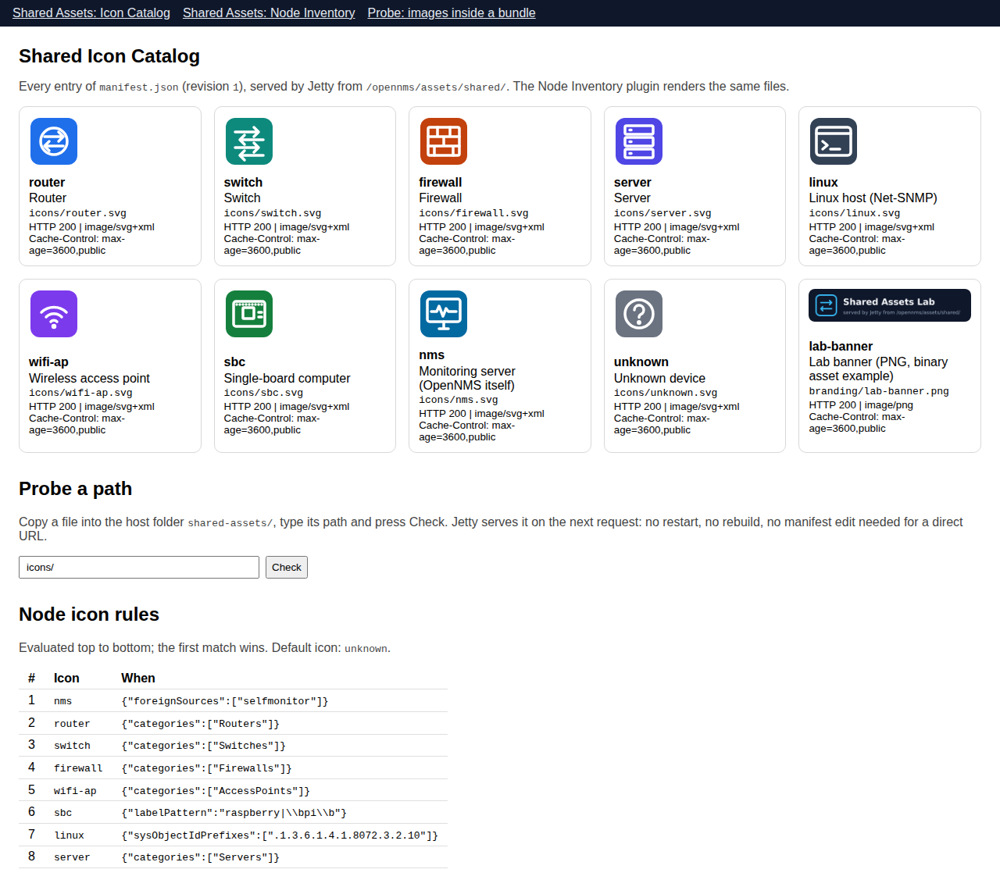

# Part 7 - Working with the shared folder while everything runs

OpenNMS runs ([Part 0](00-install-opennms-and-postgresql.md)) and both plugins are installed
([Part 6](06-installing-the-plugins.md)). This part is about requirement 2 of the lab: drop a file
into a folder on the host and the plugins find it, with no rebuild, no redeployment, no restart and
no `podman exec`. In the commands, `YOUR-PASSWORD` is the admin password from Part 0 (the
`ONMS_PASS` in `.env`).

## 7.1 Prove the folder is served

```bash
scripts/verify-assets.sh
```

Every entry of `manifest.json` should come back `200` with the right `Content-Type` and
`Cache-Control: max-age=3600,public`, the directory request should be refused, and the favicon
check shows the `no-store` policy that applies outside `/opennms/assets/`. Example output (from the
test harness):

```text
== Shared folder served by Jetty at http://localhost:8980/opennms/assets/shared/
PASS  manifest.json -> 200 without login (application/json)
PASS  icons/router.svg -> 200 image/svg+xml, Cache-Control: max-age=3600,public
...
PASS  branding/lab-banner.png -> 200 image/png, Cache-Control: max-age=3600,public
PASS  directory listing disabled (icons/ -> 403): plugins must use manifest.json to discover files
PASS  contrast: /opennms/favicon.ico (outside /assets/) -> Cache-Control: no-store (jetty.xml RewriteHandler rule)
```

Now the live test: the script writes a file into `./shared-assets` on the host, fetches it through
OpenNMS straight away, deletes it and checks for the `404`. `--plugins` adds the REST endpoints of
the installed plugins (it needs the login from `.env`).

```bash
scripts/verify-assets.sh --live-drop --plugins
```

Look at the mount from inside the container: the listing matches the host folder exactly, because
it *is* the host folder.

```bash
podman exec onms-shared-assets-horizon ls -l /usr/share/opennms/jetty-webapps/opennms/assets/shared/icons
```

## 7.2 What the plugins request

Open both plugins, one after the other, with the browser's developer tools open (Network tab):

* <http://localhost:8980/opennms/ui/#/plugins/labNodeInventory/node-inventory/nodeInventory.es.js>
* <http://localhost:8980/opennms/ui/#/plugins/labIconCatalog/icon-catalog/iconCatalog.es.js>

The plugin modules come from `/opennms/rest/plugins/ui-extension/module/...`; every image comes from
`/opennms/assets/shared/...?rev=1`; both plugins use the same URLs; and `manifest.json` is requested
once per page load, whichever plugin needs it first. The Icon Catalog shows, for each file, the
`Content-Type` and `Cache-Control` headers Jetty sent.



*The Icon Catalog in the test harness: each card shows the `Content-Type` and `Cache-Control` Jetty
returned for that file.*

## 7.3 Add an icon while everything runs

Create an icon (here: a recoloured copy of the router icon) and register it with a rule for a new
category:

```bash
sed 's/#1f6feb/#b45309/; s/>Router</>Load balancer</' shared-assets/icons/router.svg > /tmp/lb.svg
python3 scripts/assets.py add /tmp/lb.svg --key load-balancer --label "Load balancer" --category LoadBalancers
```

`assets.py add` copies the file into `shared-assets/icons/` under a temporary name and renames it,
makes it world-readable (the container reads it as uid 10001), adds it to `manifest.json` with a
rule for the category `LoadBalancers`, and bumps the manifest's `revision`.

Give a node that category:

```bash
curl -s -u "admin:YOUR-PASSWORD" -H 'Content-Type: application/xml' -X POST \
  http://localhost:8980/opennms/rest/requisitions/SharedAssetsLab/nodes --data-binary \
  '<node xmlns="http://xmlns.opennms.org/xsd/config/model-import" foreign-id="lb-01" node-label="lb-01"><interface ip-addr="192.0.2.8" status="1" snmp-primary="N"/><category name="LoadBalancers"/></node>'
curl -s -u "admin:YOUR-PASSWORD" -X PUT 'http://localhost:8980/opennms/rest/requisitions/SharedAssetsLab/import?rescanExisting=false'
```

Reload either plugin page. Both show the new icon, the Icon Catalog lists it, and every image URL
now ends in `?rev=2`. Nothing was rebuilt, redeployed or restarted.

The Icon Catalog's **Probe a path** box shows the plain-URL case: copy any image into
`shared-assets/icons/`, type `icons/<file name>` and press **Check**. Jetty serves it at once,
before any manifest edit; the manifest is only needed for plugins to *discover* files, because
directory listing is off.

## 7.4 Change an existing icon

Edit or replace `shared-assets/icons/server.svg`, then:

```bash
python3 scripts/assets.py bump
```

Reload: the new revision makes every URL new, so no browser keeps the old picture. Skip the bump
and a browser that loaded the page in the last hour may keep showing the old one, exactly as
described in [Part 4](04-how-jetty-serves-them.md#47-how-cache-control-is-decided).

## 7.5 Browser test

`tests/e2e` holds a Playwright test that logs in, opens both plugins in one page session, and
checks that every shared image decoded, that both plugins used the same files, that
`manifest.json` was fetched once, and that the Content-Security-Policy reported nothing. It reads
`ONMS_URL`, `ONMS_USER` and `ONMS_PASS` from `.env`, like the scripts.

```bash
cd tests/e2e
npm install
npm run install-browser
npm test
```

## 7.6 Where next

To move your own plugins to the shared folder, continue with [Part 8](08-migrating-your-plugins.md).
To remove the lab, see [Part 0, section 0.11](00-install-opennms-and-postgresql.md#011-day-2-stop-change-upgrade-back-up-remove).
