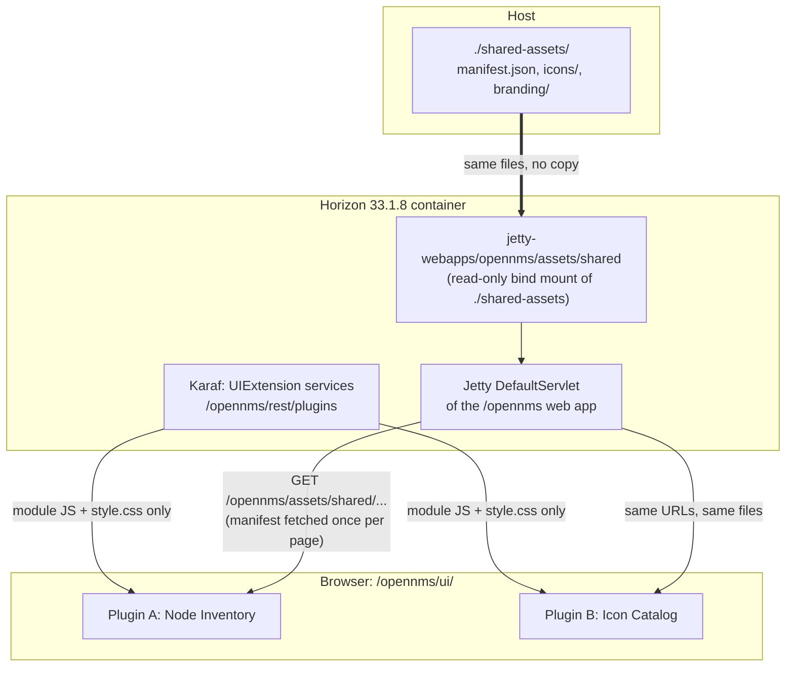

# Teaching guide: sharing UI assets between OpenNMS UI-extension plugins

This guide explains, for OpenNMS Horizon 33.1.8, where UI assets are stored, how plugins are found
and how they find the shared files, and how the embedded Jetty web server serves them. It is
written against the actual source of OpenNMS `opennms-33.1.8-1`, the Integration API `v1.6.1`,
Jetty `9.4.57.v20241219` and Karaf `4.3.10`, and the behaviour it describes was checked in a test
harness wherever that was possible.

| Part | Question it answers |
|---|---|
| [1. Why every plugin ends up with its own copy](01-why-assets-get-duplicated.md) | Why do images get duplicated, and what limits any fix? |
| [2. Where files live in an OpenNMS container](02-where-assets-live.md) | Where can a file be, and which place is live and served? |
| [3. How plugins are found, and how they find the shared files](03-how-plugins-find-assets.md) | How does OpenNMS discover and load a plugin, and how does a plugin locate shared files? |
| [4. How Jetty serves the shared folder](04-how-jetty-serves-them.md) | What happens, layer by layer, between the request and the bytes? |
| [5. Design decisions and the alternatives](05-design-decisions.md) | Why this design, and what else would work? |
| [6. Lab walkthrough](06-lab-walkthrough.md) | How do I run it and see it for myself? |
| [7. Moving your existing plugins](07-migrating-your-plugins.md) | What do I change in my own plugins? |
| [8. Troubleshooting](08-troubleshooting.md) | It does not work: where do I look? |
| [Reference: source trace](reference/source-trace.md) | Which file and line supports each claim? |
| [Reference: verification](reference/verification.md) | What was tested, how, and what was not? |

**Reading paths.** To understand the internals, read 1 to 4 in order. To get it running, read
Part 6 and come back to 3 and 4 when something surprises you. To convert your own plugins, read
Part 3's rules table and then Part 7.

## The answer in one picture

Each plugin ships only its code. Every image lives once, in a host folder that Jetty serves from
inside the `opennms` web application, so a file dropped on the host is available to every plugin
on the next request.
