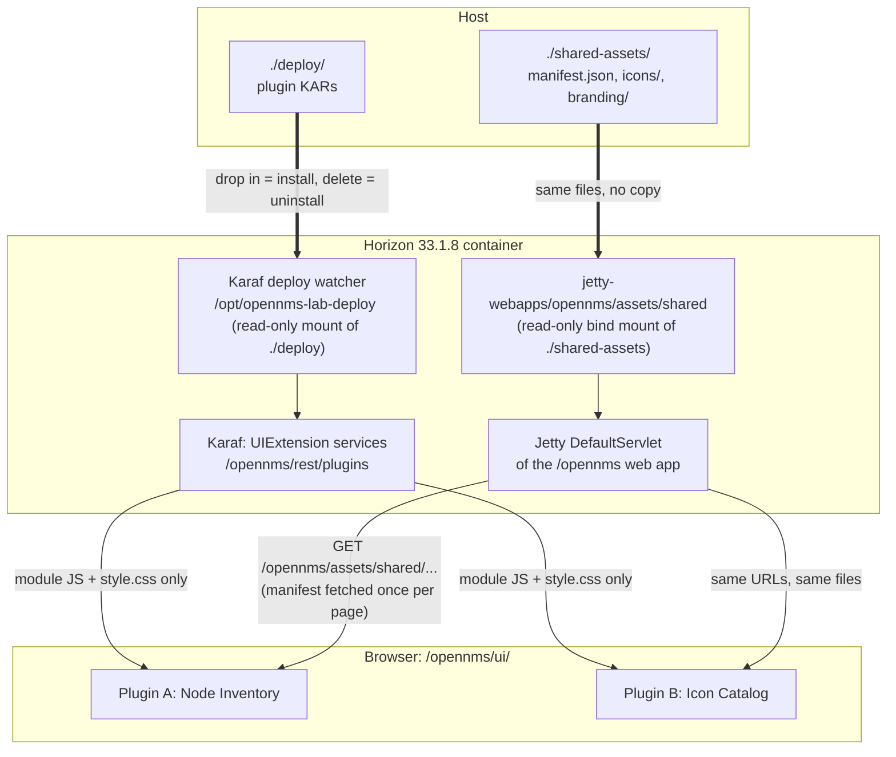

# Teaching guide: OpenNMS UI-extension plugins, their shared assets, and the containers they run in

This guide explains, for OpenNMS Horizon 33.1.8, how to install OpenNMS and PostgreSQL in
containers, how to install UI-extension plugins one by one, where UI assets are stored, how plugins
are found and how they find the shared files, and how the embedded Jetty web server serves them.
It is written against the actual source of OpenNMS `opennms-33.1.8-1`, the Integration API
`v1.6.1`, Jetty `9.4.57.v20241219`, Karaf `4.3.10` and Felix FileInstall `3.7.4`, and the behaviour
it describes was checked in test set-ups wherever that was possible
([verification](reference/verification.md)).

| Part | Question it answers |
|---|---|
| [0. Install OpenNMS and PostgreSQL](00-install-opennms-and-postgresql.md) | How do I get Horizon 33.1.8 and PostgreSQL running in containers, step by step? |
| [1. Why every plugin ends up with its own copy](01-why-assets-get-duplicated.md) | Why do images get duplicated, and what limits any fix? |
| [2. Where files live in an OpenNMS container](02-where-assets-live.md) | Where can a file be, and which place is live and served? |
| [3. How plugins are found, and how they find the shared files](03-how-plugins-find-assets.md) | How does OpenNMS discover and load a plugin, and how does a plugin locate shared files? |
| [4. How Jetty serves the shared folder](04-how-jetty-serves-them.md) | What happens, layer by layer, between the request and the bytes? |
| [5. Design decisions and the alternatives](05-design-decisions.md) | Why this design, what else would work, and why a second deploy folder for plugins? |
| [6. Installing the plugins one by one](06-installing-the-plugins.md) | How do I build, deploy, check, update and remove each plugin? |
| [7. Working with the shared folder](07-working-with-the-shared-folder.md) | How do I add and change assets while everything runs? |
| [8. Moving your existing plugins](08-migrating-your-plugins.md) | What do I change in my own plugins? |
| [9. Troubleshooting](09-troubleshooting.md) | It does not work: where do I look? |
| [Reference: source trace](reference/source-trace.md) | Which file and line supports each claim? |
| [Reference: verification](reference/verification.md) | What was tested, how, and what was not? |

**Reading paths.** To get it running, follow Parts 0, 6 and 7 in that order; they are a
step-by-step walkthrough from an empty machine to both plugins sharing one folder. To understand
the internals, read 1 to 4. To convert your own plugins, read Part 3's rules table and then Part 8.

## The answer in one picture

Each plugin ships only its code, and is installed by dropping its KAR into one host folder. Every
image lives once, in another host folder that Jetty serves from inside the `opennms` web
application, so a file dropped on the host is available to every plugin on the next request.
