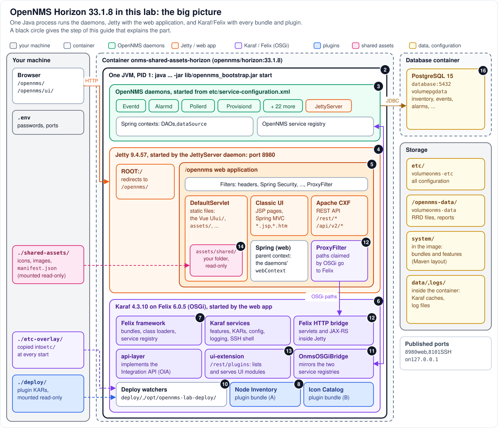

# Step 1 - The big picture

**In short:** OpenNMS is **one Java process**. Inside it run three kinds of machinery that are easy
to mistake for separate servers: the OpenNMS **daemons** (pollers, collectors, the event bus and
the rest), the **Jetty** web server with the `/opennms` **web application**, and **Karaf**, an OSGi
container on the **Felix** framework that holds every **bundle** and every **plugin**. In this lab
the only other process is PostgreSQL, in a container of its own.



A black circle in the picture gives the step of this guide that explains that part.

## 1.1 Reading the picture from the outside in

**Your machine** (left) runs the browser and holds the lab's files. Three folders reach into the
container, each in a different way:

| Host folder | Inside the container | How | Used by |
|---|---|---|---|
| `./shared-assets/` | `/usr/share/opennms/jetty-webapps/opennms/assets/shared/` | bind mount, read-only | Jetty serves the files (Step 14) |
| `./deploy/` | `/opt/opennms-lab-deploy/` | bind mount, read-only | a Karaf deploy watcher installs the KARs (Step 10) |
| `./etc-overlay/` | `/opt/opennms-etc-overlay/`, copied into `/usr/share/opennms/etc/` | bind mount, read-only; the entrypoint copies it at every start | creates that watcher (Step 6) |

**The Horizon container** (middle) is a filesystem, the `opennms/horizon:33.1.8` image plus two
volumes, with exactly one long-running process in it: Java, PID 1 (Step 2). Everything else in the
middle column is inside that one process.

**Inside the JVM**, from top to bottom:

* **The daemons** (Step 3). 27 services in 33.1.8, started in a fixed order from
  `etc/service-configuration.xml`. Each is a JMX MBean; most keep their objects in a Spring
  context. Their contexts hold the DAOs and the database pool, and they publish shared objects in the
  **OpenNMS service registry**. One of them, `JettyServer`, is the web server's starter.
* **Jetty** (Step 4). The web server, listening on port 8980. It hosts the web applications found in
  `jetty-webapps/`: `ROOT` at `/`, which only redirects, and `opennms` at `/opennms`.
* **The `/opennms` web application** (Step 5). Filters run first (security headers, Spring Security,
  and at the very end the `ProxyFilter`), then one servlet answers: the `DefaultServlet` for files
  (the Vue UI, `assets/`, the shared folder), JSP and Spring MVC for the classic UI, Apache CXF for
  the REST API. Its Spring context is a child of the daemons' `webContext`, so it uses the same
  DAOs and the same database pool as the daemons.
* **Karaf and Felix** (Steps 6 and 7). Started by a listener of the web application, not by a daemon.
  Felix is the OSGi framework (bundles, class loaders, the **OSGi service registry**); Karaf adds
  features, KARs, configuration files, logging and an SSH shell.
* **Bundles** (Step 8), among them: the Felix HTTP bridge, which runs servlets and REST resources
  from bundles inside Jetty (Step 12); the `api-layer`, which implements the OpenNMS Integration API;
  `ui-extension`, which serves plugin UIs at `/opennms/rest/plugins` (Step 13); the bridge between
  the two service registries (Step 11); the deploy watchers (Step 10); and the lab's two plugins,
  Node Inventory (A) and Icon Catalog (B).

**The database container** (right) runs PostgreSQL 15. The daemons' connection pool talks to it over
JDBC; the web application borrows the same pool.

**Storage.** `etc/` and `/opennms-data/` are volumes, so configuration and RRD files survive a
re-created container. `system/`, a Maven-layout repository of bundles, is part of the image.
`data/` (Karaf's caches) and `logs/` live in the container's own writable layer.

## 1.2 Three containers inside one process

"Container" means two things in this guide. The Horizon **container** is the Linux container. Inside
the one JVM there are three **component containers**, each with its own kind of component, its own
way of wiring them, and its own registry:

| | Daemons | Jetty + web application | Karaf / Felix |
|---|---|---|---|
| Components | services (MBeans) with Spring contexts | servlets, filters, listeners | bundles |
| Declared in | `etc/service-configuration.xml`, `beanRefContext.xml` files | `WEB-INF/web.xml` | features XML, `MANIFEST.MF`, Blueprint XML |
| Wiring | Spring, parent contexts | the servlet API, URL mappings | imports and exports, OSGi services |
| Registry | OpenNMS service registry | the servlet context | OSGi service registry |
| Started by | the controller (Step 3) | the `JettyServer` daemon (Step 4) | a web application listener (Step 6) |

Four small pieces of code join them, and most of this guide is about them: the `JettyServer` daemon
(daemons to Jetty), `WebAppListener` (web application to Karaf), the `ProxyFilter` (web requests to
OSGi), and `OnmsOSGiBridgeActivator` (one registry to the other). A fifth link is not code at all:
the OSGi framework shares the daemons' classes with the bundles (Steps 7 and 9).

## 1.3 See it in the lab

```bash
podman ps --format '{{.Names}}  {{.Image}}  {{.Status}}'
podman top onms-shared-assets-horizon pid user args
```

`podman ps` lists two containers, `onms-shared-assets-horizon` and the database. `podman top` shows
the processes of the Horizon container: a single long-running one, PID 1, whose command line ends in
`-jar .../lib/opennms_bootstrap.jar start`. Everything in the middle column of the picture is that
one line. (While the health check runs you may also see a short-lived `curl` or shell.)

```bash
podman exec onms-shared-assets-horizon ls /usr/share/opennms
```

The top-level folders are the ones in the picture: `bin`, `data`, `deploy`, `etc`, `jetty-webapps`,
`lib`, `logs`, `share`, `system` and a few more.

## Remember

* One process: one heap, one set of threads, one PID. Plugins and bundles are inside it (Step 9).
* Three component containers share that process: the daemons, Jetty with the web application, and
  Karaf on Felix. Four small bridges join them.
* The lab reaches into the container only through three folders and two ports (8980 and 8101).

---
[Guide overview](README.md) | Next: [Step 2 - One process](02-one-process.md)
