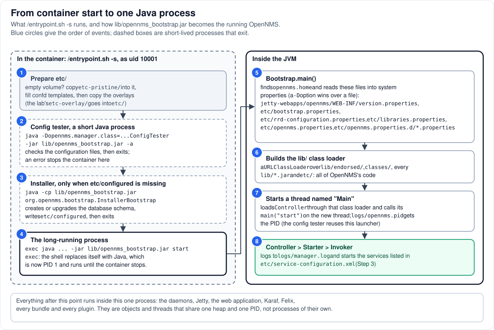

# Step 2 - One process: how the JVM loads OpenNMS

**In short:** yes, OpenNMS is a process, and a JVM runs it. The container's entrypoint prepares the
configuration, runs two short-lived Java programs (a configuration tester and, on the first start,
the installer), and then replaces itself with the real thing:
`java ... -jar lib/opennms_bootstrap.jar start`. That small launcher reads OpenNMS's properties,
builds one class loader over every JAR in `lib/`, and calls the OpenNMS controller on a thread
named `Main`. From then on everything, daemons, web server, OSGi and plugins, runs in that JVM.



## 2.1 What the container runs before Java (circles 1 to 3)

The Horizon image's entrypoint is `/entrypoint.sh`, and it runs as uid 10001. The lab starts it with
`-s` ("initialise or update, then start"; `compose.yml` sets `command: ["-s"]`). In that mode it:

1. **prepares `etc/`**: if the `onms-etc` volume is empty it copies the image's pristine
   configuration into it, fills in the confd templates (for example the database settings from the
   environment variables), and copies the overlay folders, which is how the lab's
   `etc-overlay/org.apache.felix.fileinstall-lab.cfg` reaches `etc/`;
2. **runs the configuration tester**, a Java program started through the same launcher JAR with a
   different main class (`-Dopennms.manager.class=...ConfigTester`). It parses the configuration
   files and exits; if one is broken, the container stops here;
3. **runs the installer**, but only when `etc/configured` does not exist (the first start, or after
   you delete that file for an upgrade). It creates or upgrades the database schema, writes
   `etc/configured` and exits.

Both Java programs are separate, short-lived processes. They are over before OpenNMS starts.

## 2.2 The long-running process (circle 4)

The entrypoint's last command is:

```bash
exec ${JAVA_HOME}/bin/java ${OPENNMS_JAVA_OPTS} ${JAVA_OPTS} -jar ${OPENNMS_HOME}/lib/opennms_bootstrap.jar start
```

`exec` means the shell does not start a child: it **becomes** Java. That is why Java has PID 1 in the
container and why `podman stop` sends its `SIGTERM` straight to OpenNMS. `OPENNMS_JAVA_OPTS` holds
fixed options such as `-Dopennms.home=/usr/share/opennms`, `-Dopennms.pidfile=.../logs/opennms.pid`
and `-Djava.io.tmpdir=.../data/tmp`. `JAVA_OPTS` is yours: the lab's `.env` sets
`-Xms1g -Xmx2g -XX:MaxMetaspaceSize=512m`. Those limits apply to **everything** in the next steps at
once, because there is only one heap.

## 2.3 What `opennms_bootstrap.jar` does (circles 5 to 7)

The launcher is a tiny JAR on the JVM's own class path; OpenNMS itself is not on that class path.
`Bootstrap.main()`:

**(5) It reads properties into system properties**, in this order:
`jetty-webapps/opennms/WEB-INF/version.properties`, `etc/bootstrap.properties`,
`etc/rrd-configuration.properties`, `etc/libraries.properties`, `etc/opennms.properties`, and every
`etc/opennms.properties.d/*.properties` file, sorted by name. A property already set with `-D` on
the command line is not overwritten. This is why settings such as the web port
(`org.opennms.netmgt.jetty.port`) can live in `opennms.properties` or in a file of your own in
`opennms.properties.d/`.

**(6) It builds the lib/ class loader**: a `URLClassLoader` over `lib/endorsed/`, `classes/`, every
JAR in `lib/` and the `etc/` folder. All of OpenNMS's own code, and the libraries it uses (Spring,
Hibernate, Jetty, Karaf's launcher), is found through this one loader. It is the root of everything
in Step 9.

**(7) It starts a thread named `Main`**: it writes the PID to `logs/opennms.pid`, loads the class
named by `opennms.manager.class` (by default `org.opennms.netmgt.vmmgr.Controller`) through the new
class loader, and calls its `main("start")` on the new thread, with that loader as the thread's
context class loader. The configuration tester of circle 2 is the same launcher with another class
name.

## 2.4 From the controller to the services (circle 8)

`Controller.main("start")` hands over to the `Starter`, which sets the log prefix `manager` (so its
lines go to `logs/manager.log`), takes the JVM's platform MBean server, reads
`etc/service-configuration.xml` and gives the list to the `Invoker`. What the invoker does with it is
[Step 3](03-daemons.md). When every service has started, the `Starter` returns and the thread `Main`
ends; the JVM keeps running on the threads that the daemons, Jetty and Felix have started meanwhile.

The same `Controller` class also understands `stop` and `status`, which it sends to an already
running OpenNMS over JMX. In a container you rarely need them: `podman stop` sends `SIGTERM` to
PID 1, which is the JVM itself (the lab's `stop_grace_period` gives it a minute before it is
killed).

## 2.5 What "one process" means in practice

* **One heap.** `-Xmx` is shared by the daemons, Jetty's requests, Karaf and every plugin. A plugin
  that leaks memory can starve the pollers.
* **One set of threads.** Nothing stops a slow plugin from occupying Jetty's request threads.
* **One life.** Restarting OpenNMS restarts everything; a crash of the JVM takes everything down.
  Karaf can stop and start single bundles without a restart (Step 10), but it cannot isolate them.
* **One PID, many log files.** OpenNMS's logging routes each line by a per-thread *prefix* to its
  own file (`manager.log`, `web.log`, `pollerd.log`, ...); Karaf's log goes to `karaf.log`
  (Step 16).

## 2.6 See it in the lab

```bash
podman top onms-shared-assets-horizon pid user args
podman exec onms-shared-assets-horizon cat /usr/share/opennms/logs/opennms.pid; echo
podman exec onms-shared-assets-horizon sh -c 'ls /usr/share/opennms/lib/*.jar | wc -l'
podman logs onms-shared-assets-horizon 2>&1 | grep -iE 'config tester|already configured|install command' | head -5
```

* `podman top`: PID 1, user `10001` (or `opennms`), and the full Java command line with the options
  of 2.2 and your `JAVA_OPTS`.
* `opennms.pid` contains `1`: the PID inside the container's own PID namespace.
* The JAR count is large (hundreds): that is the lib/ class loader's class path.
* The entrypoint's own lines: `Run config tester to validate existing configuration files.`, then
  either `Run OpenNMS install command ...` (first start) or `System is already configured. ...`
  (every later start). `podman logs` shows what the entrypoint and Java print to the console;
  OpenNMS's detailed logs are in `/usr/share/opennms/logs/`.

## Remember

* The entrypoint runs two helper Java processes, then `exec`s the real one: Java is PID 1.
* `opennms_bootstrap.jar` only builds a class loader over `lib/` and calls the controller on a
  thread called `Main`. Everything else is OpenNMS code loaded through that class loader.
* `JAVA_OPTS` sizes the one heap that everything shares, plugins included.

---
Previous: [Step 1 - The big picture](01-the-big-picture.md) | [Guide overview](README.md) |
Next: [Step 3 - The daemons](03-daemons.md)
