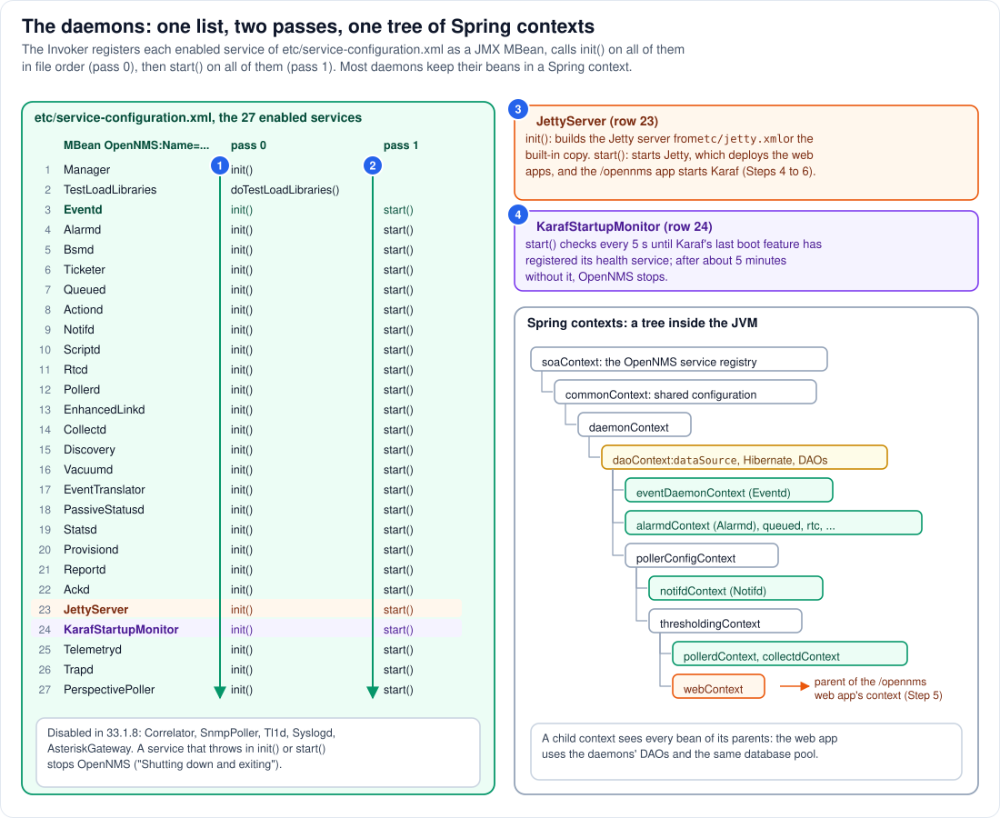

# Step 3 - The daemons: services, JMX and Spring

**In short:** OpenNMS's services (Eventd, Pollerd, Collectd, Provisiond and the rest, called
*daemons*) are listed in `etc/service-configuration.xml`. The invoker creates each enabled one,
registers it as a JMX MBean, then calls `init()` on all of them in file order and `start()` on all
of them in the same order. Most daemons keep their objects in a Spring context, and those contexts
form one tree, so all daemons, and the web application too, share the same DAOs and the same
database pool. Two entries near the end of the list matter for the rest of this guide:
`JettyServer` starts the web server, and `KarafStartupMonitor` waits for Karaf.



## 3.1 The service list

Each entry of `etc/service-configuration.xml` names an MBean, a Java class, and the methods to call
at which moment. Alarmd, for example:

```xml
<service>
  <name>OpenNMS:Name=Alarmd</name>
  <class-name>org.opennms.netmgt.daemon.SimpleSpringContextJmxServiceDaemon</class-name>
  <attribute><name>LoggingPrefix</name><value type="java.lang.String">alarmd</value></attribute>
  <attribute><name>SpringContext</name><value type="java.lang.String">alarmdContext</value></attribute>
  <invoke at="start" pass="0" method="init"/>
  <invoke at="start" pass="1" method="start"/>
  <invoke at="status" pass="0" method="status"/>
  <invoke at="stop" pass="0" method="stop"/>
</service>
```

In 33.1.8 the file lists 32 services. Five are switched off with `enabled="false"`: Correlator,
SnmpPoller, Tl1d, Syslogd and AsteriskGateway. The 27 others are started, in the order of the table
in the diagram. The first two are not daemons in the usual sense: `Manager` is the service that
manages the JVM (and ends it on `stop`), and `TestLoadLibraries` checks that ICMP works (it logs
`Using ICMP implementation: ...` to `manager.log`; the lab's `net.ipv4.ping_group_range` sysctl is
what makes it work under Podman) and that the host's own name resolves.

## 3.2 Two passes (circles 1 and 2)

The `Invoker` (called by the `Starter` of Step 2, on the thread `Main`) works in three moves:

1. **Instantiate and register.** For every enabled service it loads the class through the lib/ class
   loader, creates an instance, and registers it in the JVM's platform MBean server under its name,
   for example `OpenNMS:Name=Pollerd`. Attributes from the file (`LoggingPrefix`, `SpringContext`)
   are set on the MBean.
2. **Pass 0**: it calls every `pass="0"` start method, top to bottom: `init()` for the daemons,
   `doTestLoadLibraries()` for the library check. Each call is logged as
   `Invoking init on object OpenNMS:Name=...` and `Invocation init successful for MBean ...`.
3. **Pass 1**: it calls every `pass="1"` start method, `start()`, top to bottom, with the same kind
   of log lines.

So `init()` of the last daemon runs before `start()` of the first. If any call throws, the starter
logs `An error occurred while attempting to start the "<name>" service ... Shutting down and
exiting.` and stops the JVM: a broken daemon stops the whole of OpenNMS.

## 3.3 JettyServer and KarafStartupMonitor (circles 3 and 4)

**JettyServer** (row 23) is the web server's daemon. Its `init()` in pass 0 builds a Jetty server
from `etc/jetty.xml`, or from the copy built into OpenNMS when that file does not exist. Its
`start()` in pass 1 starts the server; starting the server deploys the web applications, and
starting the `/opennms` web application starts Karaf. All of that happens on the thread `Main`,
inside this one `start()` call (Steps 4 to 6).

**KarafStartupMonitor** (row 24) comes right after it. Its `start()` looks in the OpenNMS service
registry for a `KarafHealthService`, every 5 seconds. That service is registered by the very last
feature Karaf installs at boot (Step 6) and copied into the OpenNMS registry by the bridge
(Step 11). If it has not appeared after about 5 minutes (both limits are system properties,
`org.opennms.core.soa.lookup.*`), OpenNMS fails to start with a message that points to
`logs/karaf.log`. So by the time pass 1 reaches Telemetryd, Karaf's boot features are installed.

## 3.4 A daemon is an MBean, a Spring context and some threads

Most daemons extend `AbstractSpringContextJmxServiceDaemon`. Its `init()` loads the daemon's Spring
application context by name (`alarmdContext`, `pollerdContext`, ...); its `start()` takes the bean
called `daemon` from that context and starts it. Both run with the daemon's log prefix set, so what
the daemon logs lands in `logs/<prefix>.log`, for example `alarmd.log`.

The contexts are not defined in `service-configuration.xml` but in files called
`beanRefContext.xml`, one in many of the JARs in `lib/`. Spring reads all of them through the lib/
class loader. Each defines one or more named contexts and, as the second constructor argument, a
**parent** context:

```xml
<!-- opennms-dao.jar: beanRefContext.xml -->
<bean id="daoContext" class="org.springframework.context.support.ClassPathXmlApplicationContext">
  <constructor-arg>
    <list>
      <value>META-INF/opennms/applicationContext-dao.xml</value>
      <value>classpath*:/META-INF/opennms/component-dao.xml</value>
    </list>
  </constructor-arg>
  <constructor-arg ref="daemonContext" />
</bean>
```

A daemon's threads (its thread pools, schedulers and listeners) are created by its beans. They are
ordinary Java threads in the one JVM.

## 3.5 The tree of Spring contexts

The parents form the tree on the right of the diagram:

* `soaContext` holds the **OpenNMS service registry** (`<onmsgi:default-registry/>`), the directory
  where Spring beans can be published for others to find (Step 11);
* `commonContext` holds shared configuration objects;
* `daemonContext` holds shared daemon infrastructure;
* `daoContext` holds the **`dataSource`**, the database connection pool, plus Hibernate and every
  DAO (`NodeDao`, `AlarmDao`, ...). It also publishes the pool and the DAOs in the service registry;
* the daemons' own contexts hang below: `eventDaemonContext` and `alarmdContext` directly under
  `daoContext`, `pollerdContext` and `collectdContext` further down, below the contexts for poller
  and thresholding configuration;
* `webContext`, below `thresholdingContext`, holds nothing of its own. It exists to be the parent of
  the **web application's** Spring context (Step 5): `web.xml` names it in `parentContextKey`.

A child context sees every bean of its parents. That is why Pollerd, Alarmd and the web
application's REST API all use one `NodeDao` object and one connection pool: they are the same
objects, in the same heap, reached through the tree.

## 3.6 How daemons talk to each other

Daemons rarely call each other directly. They share state through the database (the DAOs), and they
signal each other through **events**: Eventd is the event bus inside the process. A daemon sends an
event (for example "node down"), Eventd stores it and hands it to every daemon that subscribed to
that kind of event (Alarmd turns it into an alarm, Notifd into a notification). Step 16 has more.

## 3.7 See it in the lab

```bash
podman logs onms-shared-assets-horizon 2>&1 | grep -E 'Invocation (init|start|doTestLoadLibraries) successful' | head -40
podman exec onms-shared-assets-horizon ls /usr/share/opennms/logs
podman exec onms-shared-assets-horizon grep -c 'Invocation start successful' /usr/share/opennms/logs/manager.log
```

* The invoker also writes its lines to the console, so `podman logs` shows them: first the `init`
  lines (and `doTestLoadLibraries`) in the order of the diagram, then the `start` lines in the same
  order. If you restarted the container, each start appears again.
* `logs/` holds one file per prefix: `manager.log`, `eventd.log`, `alarmd.log`, `pollerd.log`,
  `jetty-server.log`, `web.log`, `karaf.log` and many more.
* A clean start adds 25 `start` lines to `manager.log` (the 27 services minus Manager and
  TestLoadLibraries, which have no pass-1 method).

## Remember

* The start order is the order of `etc/service-configuration.xml`: all `init()` calls first, then
  all `start()` calls. One failure stops OpenNMS.
* Each daemon is an MBean, usually a Spring context, a log prefix and its own threads, all inside
  the one JVM.
* The Spring contexts form one tree; the web application hangs off `webContext` and therefore shares
  the daemons' DAOs and database pool.
* The web server and Karaf are started from inside this list: by `JettyServer`, waited for by
  `KarafStartupMonitor`.

---
Previous: [Step 2 - One process](02-one-process.md) | [Guide overview](README.md) |
Next: [Step 4 - Jetty](04-jetty.md)
