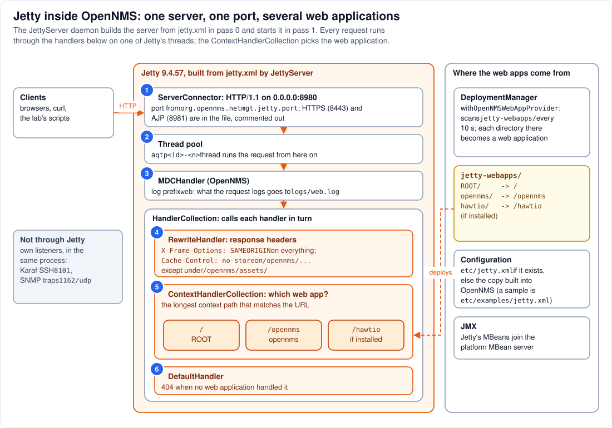

# Step 4 - Jetty: the web server inside the process

**In short:** Jetty is not a separate server next to OpenNMS; it is a library inside the same JVM.
The `JettyServer` daemon builds a Jetty `Server` object from `jetty.xml` in pass 0 and starts it in
pass 1. The server has one HTTP connector on port 8980, a short chain of handlers, and a deployment
manager that turns every directory in `$OPENNMS_HOME/jetty-webapps/` into a web application: `ROOT`
at `/` and `opennms` at `/opennms`. Every request from outside, whether it ends in a JSP, the REST
API, a static file or a plugin inside Karaf, enters here.



## 4.1 Who builds Jetty, and from what

`JettyServer` (log prefix `jetty-server`, so `logs/jetty-server.log`) does two things:

* **`init()`, pass 0:** creates an empty `org.eclipse.jetty.server.Server`, registers Jetty's own
  MBeans in the platform MBean server (so JMX tools see Jetty next to the daemons), and configures the
  server from XML: `$OPENNMS_HOME/etc/jetty.xml` if that file exists, otherwise the `jetty.xml` built
  into OpenNMS (the same file is shipped as `etc/examples/jetty.xml` for you to copy).
* **`start()`, pass 1:** calls `server.start()`.

Everything below comes from that one XML file. If you ever copy it to `etc/jetty.xml` (for HTTPS,
say), you own a full copy from then on, and must merge OpenNMS's changes at every upgrade.

## 4.2 The connector and the threads (circles 1 and 2)

1. **One `ServerConnector`** speaks HTTP/1.1 on port 8980 on all interfaces of the container. The
   port comes from the system property `org.opennms.netmgt.jetty.port` (default 8980), which you can
   set in `etc/opennms.properties` or a file in `etc/opennms.properties.d/` (Step 2). An HTTPS
   connector (port 8443) and an AJP connector (8981) are in the file, commented out. In the lab,
   `compose.yml` publishes the container's 8980 on `127.0.0.1:8980` of your machine.
2. **Jetty's thread pool.** `jetty.xml` does not configure one, so the server uses Jetty's default
   `QueuedThreadPool`, whose threads are named `qtp<number>-<id>`. One of them takes each request and
   carries it all the way through the handlers, the web application's filters and servlet, and,
   for OSGi paths, into Karaf and back (Step 9).

## 4.3 The handler chain (circles 3 to 6)

A Jetty *handler* is anything that can look at a request. OpenNMS's chain is short. First comes
OpenNMS's own **`MDCHandler`** (circle 3): it sets the log prefix `web` for the request's thread, so
whatever the request logs goes to `logs/web.log`, not to the log of the daemon whose code it happens
to call. Then a **`HandlerCollection`** calls **each** of its three children in turn:

| Circle | Handler | What it does |
|---|---|---|
| 4 | `RewriteHandler` | only sets response headers: `X-Frame-Options: SAMEORIGIN` on everything, and `Cache-Control: no-store` plus `Pragma: no-cache` on everything under `/opennms/` **except** `/opennms/assets/`. That exception is what makes the shared assets cacheable (Step 14). |
| 5 | `ContextHandlerCollection` | chooses the web application: the one whose context path is the longest match for the URL. `/opennms/...` goes to the `opennms` web application, `/hawtio/...` to `hawtio` if it is installed, anything else to `ROOT`, whose only page redirects to `/opennms/`. |
| 6 | `DefaultHandler` | a safety net that answers `404` when no web application handled the request. Because `ROOT` takes `/`, some web application always matches, and `ROOT` answers unknown paths itself. |

## 4.4 Where the web applications come from

The `DeploymentManager` with OpenNMS's `OpenNMSWebAppProvider` watches
`$OPENNMS_HOME/jetty-webapps/`, checking every 10 seconds. Each **directory** there is deployed as
an exploded web application whose context path is the directory's name (`ROOT` means `/`):

| Directory | Context path | What it is |
|---|---|---|
| `jetty-webapps/ROOT/` | `/` | one JSP that redirects to `/opennms/` |
| `jetty-webapps/opennms/` | `/opennms` | OpenNMS's web application (Step 5): the classic UI, the Vue UI in `ui/`, the REST API, and the gateway into Karaf |
| `jetty-webapps/hawtio/` | `/hawtio` | a JMX console, if your installation ships it |

The lab's shared folder is mounted **inside** `jetty-webapps/opennms/` (at `assets/shared`), not next
to it, so it is part of the `opennms` web application rather than a web application of its own.
[Part 5](../05-design-decisions.md#d-a-directory-in-jetty-webapps) explains why a directory next to
it would behave worse.

## 4.5 The start-up order, and why port 8980 answers late

`server.start()` first starts the handlers and the deployment manager, which deploys and starts the
web applications, and **only then** opens the connector. Starting the `opennms` web application
runs its listeners (Step 5), and one of them launches Karaf (Step 6). So by the time port 8980
accepts connections, the web application and its Spring context are up and Karaf has been
launched, although Karaf may still be installing features in the background. All of this happens
inside `JettyServer.start()`, on the thread `Main`, in pass 1 of Step 3.

## 4.6 Inside and outside

Jetty is the **only** way in over HTTP. Browsers, `curl`, the lab's scripts and a plugin's JavaScript
all come through port 8980. Karaf does not run a web server of its own in OpenNMS; its OSGi servlets
are reached through Jetty (Step 12). A few other listeners in the same process are not HTTP and do
not touch Jetty: Karaf's SSH shell on 8101 and Trapd's SNMP trap receiver on 1162/udp.

## 4.7 See it in the lab

```bash
curl -sI http://localhost:8980/ | head -5
curl -s -o /dev/null -w '%{http_code}\n' http://localhost:8980/nothing-here
curl -sI http://localhost:8980/opennms/login.jsp | grep -iE 'x-frame|cache-control|pragma'
curl -sI http://localhost:8980/opennms/assets/shared/manifest.json | grep -iE 'cache-control|content-type'
podman exec onms-shared-assets-horizon ls /usr/share/opennms/jetty-webapps
```

* `/` answers with a redirect to `/opennms/`: that is `ROOT`'s only page.
* `/nothing-here` answers `404`: the path belongs to `ROOT` (the longest match is `/`), which has
  no such file.
* The login page carries `X-Frame-Options: SAMEORIGIN` and the `no-store` headers of the
  `RewriteHandler`.
* The manifest under `/opennms/assets/` carries `Cache-Control: max-age=3600,public` instead
  (Step 14).
* `jetty-webapps` lists the web applications Jetty deployed.

## Remember

* Jetty is a library in the OpenNMS JVM, built by the `JettyServer` daemon from `jetty.xml`.
* One port (8980), one thread pool, one short handler chain; the context path chooses the web
  application.
* The port opens only after the web applications (and Karaf's launch) have started.
* Everything HTTP, including every plugin UI, enters through here.

---
Previous: [Step 3 - The daemons](03-daemons.md) | [Guide overview](README.md) |
Next: [Step 5 - The web application](05-the-web-application.md)
