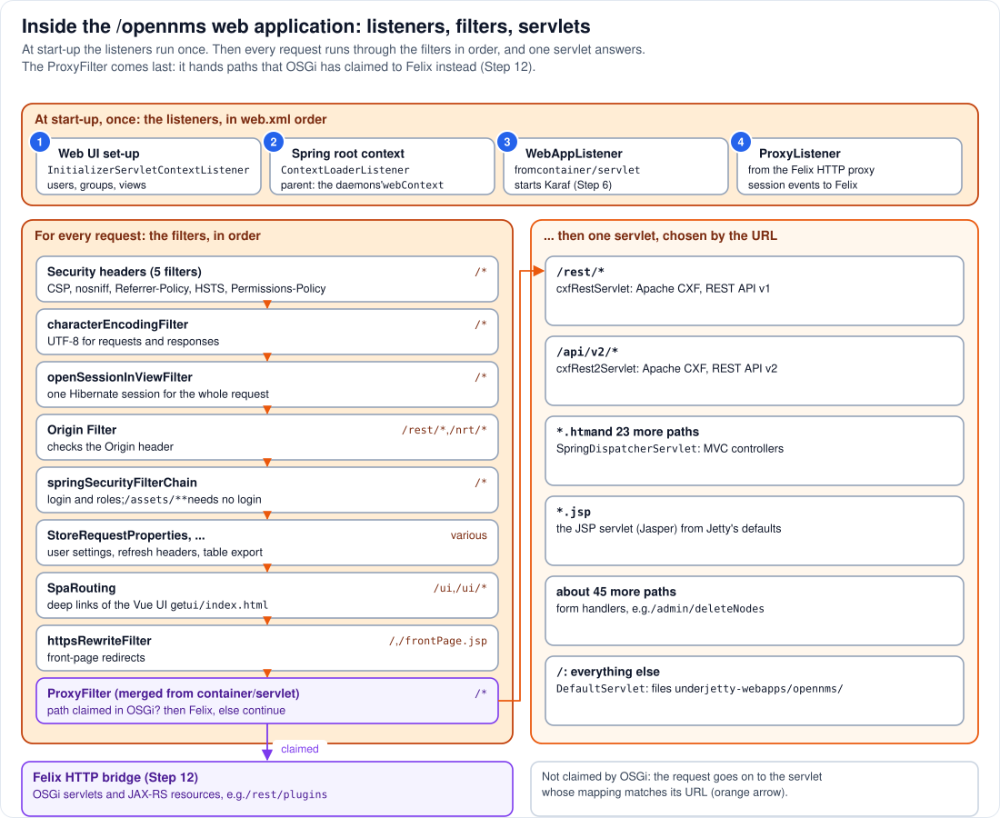

# Step 5 - The web application: listeners, filters, servlets

**In short:** `/opennms` is a standard Java web application in `jetty-webapps/opennms/`, described
by `WEB-INF/web.xml`. When Jetty starts it, four *listeners* run once: they set up the web UI, build
the web application's Spring context (a child of the daemons' `webContext`), start Karaf, and
connect Felix's HTTP support. After that, every request runs through a chain of *filters* in a fixed
order and is answered by one *servlet*, chosen by its URL. The last filter, the `ProxyFilter`, is
the door into OSGi: if a bundle has claimed the path, the request goes to Felix instead of a
servlet.



## 5.1 What is in the folder

`jetty-webapps/opennms/` is an *exploded* web application: a folder, not a WAR file. It holds the
JSP pages and static files of the classic UI, the Vue UI in `ui/`, OpenNMS's JavaScript and style
sheets in `assets/` (and, in the lab, the shared folder in `assets/shared/`), and `WEB-INF/` with
`web.xml`, Spring XML files, and `WEB-INF/lib/` with a few JARs of its own. Most of the code it runs
is **not** in `WEB-INF/lib`: OpenNMS's own classes are "provided", found through the lib/ class
loader of Step 2, which is the parent of the web application's class loader (Step 9).

`web.xml` itself is assembled at build time: the main web application's file, merged with the
servlet declarations of the REST module and with a small fragment from OpenNMS's
`container/servlet` module that adds `WebAppListener`, `ProxyListener` and the `ProxyFilter`.

## 5.2 At start-up: the listeners (circles 1 to 4)

The servlet container calls each listener's `contextInitialized()` once, in `web.xml` order, when
the web application starts, which is during `JettyServer.start()` on the thread `Main`:

1. **`InitializerServletContextListener`** sets up the web UI's factories for users, groups and
   views, and starts a timer for RTC category updates.
2. **Spring's `ContextLoaderListener`** builds the web application's root Spring context from the
   XML files in `WEB-INF/`. Its parent is `webContext` (`parentContextKey` in `web.xml`), the node of
   the daemons' context tree from Step 3. So the REST API and the JSPs get the daemons' DAOs, the same
   objects, not copies.
3. **`WebAppListener`** launches Karaf (Step 6), puts Felix's `BundleContext` into the servlet
   context, and starts the bridge between the service registries (Step 11).
4. **`ProxyListener`** from the Felix HTTP proxy forwards servlet-container events, such as HTTP
   sessions ending, to the servlets that run inside OSGi.

If Karaf fails to start, `WebAppListener` only logs the error; the web application still starts
without OSGi, and `KarafStartupMonitor` (Step 3) then stops OpenNMS.

## 5.3 For every request: the filters, in order

A filter can look at the request, change it, answer it, or pass it on with `chain.doFilter()`. The
web application's filters, in the order they run:

| Filter | Mapped to | What it does |
|---|---|---|
| Content-Security-Policy, X-Content-Type-Options, Referrer-Policy, Strict-Transport-Security, Permissions-Policy | `/*` | add security headers to every response |
| `characterEncodingFilter` | `/*` | UTF-8 for requests and responses |
| `openSessionInViewFilter` | `/*` | keeps one Hibernate session open for the whole request |
| `Origin Filter` | `/rest/*`, `/nrt/*` | checks the `Origin` header of REST requests |
| `springSecurityFilterChain` | `/*` | login (form, session cookie, basic auth) and role checks; `/assets/**` and a few paths, such as the health probe, need no login |
| `StoreRequestProperties`, `userSettingsFilter`, `AddRefreshHeader-*`, `eXtremeExport` | various | small helpers for the classic UI |
| `SpaRouting` | `/ui`, `/ui/*` | the Vue UI's deep links: any `/ui/...` path outside `ui/assets/` (and not an `.svg`) is answered with `ui/index.html` |
| `httpsRewriteFilter` | `/`, `/frontPage.jsp` | front-page redirects |
| `ProxyFilter` | `/*` | **last**: if OSGi has claimed the path, hand the request to the Felix HTTP bridge (Step 12); otherwise `chain.doFilter()` |

Two consequences matter for plugins. Everything that reaches OSGi has already passed Spring
Security, so a plugin's REST endpoint needs no login code of its own: the user's session applies.
And every response, from a JSP or from a bundle, gets the same security headers.

## 5.4 ... then one servlet

When the chain ends, the servlet whose `url-pattern` best matches the path answers:

| Mapping | Servlet | Serves |
|---|---|---|
| `/rest/*` | `cxfRestServlet` (Apache CXF) | the REST API v1, e.g. `/opennms/rest/info`, `/opennms/rest/nodes` |
| `/api/v2/*` | `cxfRest2Servlet` (Apache CXF) | the REST API v2, e.g. `/opennms/api/v2/nodes` |
| `*.htm` and 23 more paths | Spring's `DispatcherServlet` | the classic UI's MVC controllers |
| `*.jsp` | the JSP servlet (Jasper), from Jetty's defaults | the classic UI's pages |
| about 45 more paths | OpenNMS's form handlers | e.g. `/admin/deleteNodes` |
| `/` (everything else) | `DefaultServlet` | files under `jetty-webapps/opennms/`: `ui/`, `assets/`, the shared folder |

Note that `/rest/*` belongs to CXF **and** is where OSGi publishes its REST resources. The
`ProxyFilter` settles it per request: `/opennms/rest/plugins` and `/opennms/rest/health` are claimed
by OSGi and never reach CXF; `/opennms/rest/info` is not claimed and goes to CXF.

## 5.5 See it in the lab

```bash
podman exec onms-shared-assets-horizon ls /usr/share/opennms/jetty-webapps/opennms
curl -s -u "admin:YOUR-PASSWORD" -o /dev/null -w 'rest/info: %{http_code}\n' http://localhost:8980/opennms/rest/info
curl -s -u "admin:YOUR-PASSWORD" -o /dev/null -w 'rest/plugins: %{http_code}\n' http://localhost:8980/opennms/rest/plugins
curl -s -o /dev/null -w 'rest/info without login: %{http_code}\n' http://localhost:8980/opennms/rest/info
curl -s -u "admin:YOUR-PASSWORD" -o /dev/null -w 'ui deep link: %{http_code} %{content_type}\n' http://localhost:8980/opennms/ui/any/deep/link
```

`YOUR-PASSWORD` is the admin password you set at the first login ([Part 0](../00-install-opennms-and-postgresql.md)).

* The folder shows `WEB-INF`, `ui`, `assets`, `js`, JSP folders and more.
* Both REST calls answer `200`, one from CXF and one from OSGi; you cannot tell from the outside,
  which is the point.
* Without a login, `rest/info` answers `401`: Spring Security stops it before any servlet runs.
* The deep link answers `200 text/html`: a path that does not exist as a file, answered with the Vue
  UI's `index.html` thanks to `SpaRouting`.

## Remember

* The listeners run once, in order: web UI set-up, the Spring context (child of the daemons'
  `webContext`), Karaf, the Felix proxy listener.
* Every request runs through the same filters, Spring Security included, before anything answers
  it, including a plugin in OSGi.
* The `ProxyFilter` is the last filter and the only door from the web application into OSGi.
* Four kinds of answer: static files, classic UI (JSP, MVC), REST (CXF), or OSGi.

---
Previous: [Step 4 - Jetty](04-jetty.md) | [Guide overview](README.md) |
Next: [Step 6 - Karaf](06-karaf.md)
