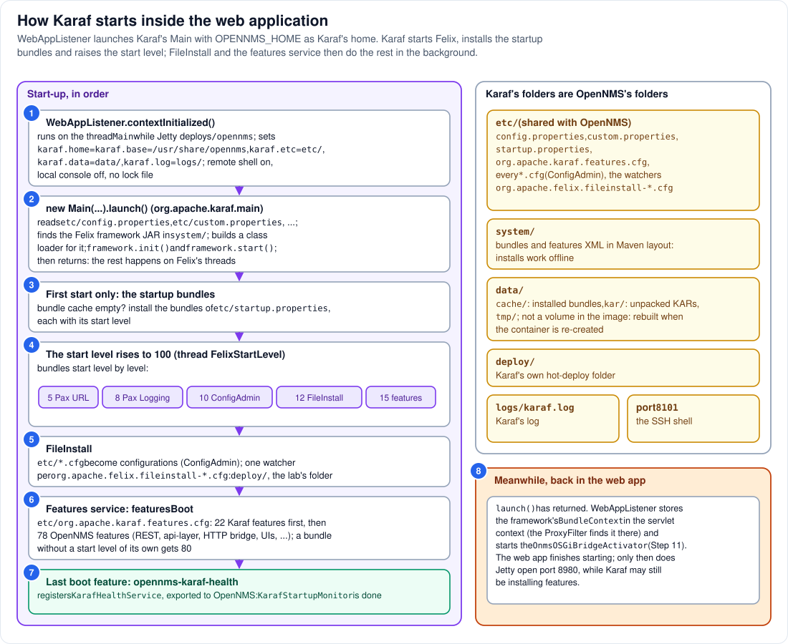

# Step 6 - Karaf: the OSGi container, started by the web application

**In short:** Apache Karaf 4.3.10 is an OSGi *container*: it adds features and KARs, deploy
folders, configuration files, logging and an SSH shell to an OSGi *framework* (Felix, Step 7). In
OpenNMS it is not a separate program. A listener of the `/opennms` web application,
`WebAppListener`, starts it inside the same JVM, with `$OPENNMS_HOME` as Karaf's home: Karaf's
`etc/` is OpenNMS's `etc/`. Karaf starts Felix, installs a handful of startup bundles on the first
run, and raises the start level; then FileInstall reads the configuration files and the features
service installs 100 boot features, in the background, while OpenNMS carries on starting.



## 6.1 Who starts Karaf (circle 1)

When Jetty starts the `/opennms` web application (Step 4), its third listener,
`org.opennms.container.web.WebAppListener`, runs on the thread `Main` and sets Karaf's system
properties:

| Property | Value | Meaning |
|---|---|---|
| `karaf.home`, `karaf.base` | `$OPENNMS_HOME` (`/usr/share/opennms`) | Karaf's installation is OpenNMS's |
| `karaf.etc` | `$OPENNMS_HOME/etc` | Karaf's configuration files live next to OpenNMS's |
| `karaf.data` | `$OPENNMS_HOME/data` | caches: installed bundles, unpacked KARs |
| `karaf.log` | `$OPENNMS_HOME/logs` | where `karaf.log` goes |
| `karaf.startRemoteShell` | `true` | the SSH shell on port 8101 |
| `karaf.startLocalConsole` | `false` | no console on the process's terminal |
| `karaf.lock` | `false` | no lock file: one Karaf per OpenNMS |

Then it creates Karaf's launcher, `new org.apache.karaf.main.Main(...)`, and calls `launch()`.

## 6.2 `Main.launch()`: Felix starts (circle 2)

Karaf's launcher:

1. reads `etc/config.properties` and `etc/custom.properties` (and the files they include). Among
   many settings, `karaf.framework=felix` picks the framework, and
   `karaf.framework.felix=mvn:org.apache.felix/org.apache.felix.framework/6.0.5` names its JAR;
2. finds that JAR in `system/`, the Maven-layout repository inside the image, so no network is
   needed;
3. creates a class loader for the framework (Step 9) and asks it for a Felix instance, passing all
   the properties, then calls `framework.init()` and `framework.start()`;
4. registers a few services, starts Karaf's own activators, sets the start level, and **returns**.

`launch()` does not wait for the bundles. From here on, Felix works on its own threads.

## 6.3 First start only: the startup bundles (circle 3)

If the bundle cache in `data/cache/` is empty (only the framework itself is installed), Karaf
installs the bundles listed in `etc/startup.properties`, each with a *start level*. In OpenNMS
33.1.8 they are the minimum needed to install everything else:

| Start level | Bundles |
|---|---|
| 1 | Karaf's features extension |
| 5 | JNA, Felix Metatype, Pax URL (resolves `mvn:` URLs from `system/`), Karaf's Event Admin |
| 8 | Pax Logging (log4j2 behind the OSGi log API: `karaf.log`), Jansi |
| 9 | OSGi utilities, Felix Coordinator and Converter, an OpenNMS ConfigAdmin helper |
| 10 | Felix ConfigAdmin, Apache MINA |
| 11 | Felix Configurator and its JSON support, the ConfigAdmin interpolation plugin |
| 12 | Felix FileInstall |
| 15 | Karaf's features service |
| 16 | JLine |

On later starts, Felix restarts whatever is in its cache instead. Because `data/` is not a volume in
the Horizon image, a **re-created** container always starts from an empty cache and goes through
this step again; a restarted one does not.

## 6.4 The start level rises (circle 4)

The framework's target level is 100 (`org.osgi.framework.startlevel.beginning`). A Felix thread
named `FelixStartLevel` walks up from 1, starting the bundles of each level before moving on. So
Pax Logging runs before ConfigAdmin, ConfigAdmin before FileInstall, FileInstall before the
features service.

## 6.5 FileInstall: configuration files and deploy folders (circle 5)

Felix FileInstall watches folders. Karaf configures it to watch `etc/`: every `*.cfg` file there
(and `*.config`, `*.json`) becomes a **configuration** in ConfigAdmin, which bundles read their
settings from; edit the file and the bundle is told. A file named
`org.apache.felix.fileinstall-<name>.cfg` is special: it is the configuration of one more watched
folder. Karaf ships `org.apache.felix.fileinstall-deploy.cfg` (the folder `deploy/`); the lab adds
`org.apache.felix.fileinstall-lab.cfg` (the folder `/opt/opennms-lab-deploy/`). Every `.kar` file a
watcher finds goes to Karaf's KAR deployer (Step 10).

## 6.6 The features service: 100 boot features (circles 6 and 7)

Karaf's features service reads `etc/org.apache.karaf.features.cfg`:

* `featuresRepositories`: the features XML files to know about (Karaf's standard features,
  OpenNMS's own features, and a few more);
* `featuresBoot`: what to install at boot. In 33.1.8 it lists 100 features, in two stages: first 22
  of Karaf's (the shell, SSH, the deployers, `kar`, `config`, ...), then 78 of OpenNMS's, among
  them `opennms-http-whiteboard` (the Felix HTTP bridge), `opennms-osgi-core-rest` (the JAX-RS
  connector), `opennms-api-layer` (the Integration API and `ui-extension`), `opennms-health-rest`,
  the Vaadin UIs and the Karaf shell commands.

Installing a feature means: resolve it (find every bundle it needs, in `system/`), install those
bundles into Felix, and start them. A bundle without a start level of its own gets
`karaf.startlevel.bundle`, 80.

The **last** boot feature is `opennms-karaf-health` (a comment in the file insists on it). Its bundle
registers a `KarafHealthService` with the property `registration.export=true`; the bridge copies it
into the OpenNMS service registry (Step 11), and `KarafStartupMonitor`, which has been waiting for
exactly that (Step 3), lets OpenNMS's start-up finish.

OpenNMS adds one more mechanism of its own, the *Karaf extender*: every file in
`etc/featuresBoot.d/` can name more features to install at boot, optionally waiting for a KAR
([Part 6.10](../06-installing-the-plugins.md#610-your-own-plugins) uses it).

## 6.7 Meanwhile, in the web application (circle 8)

`launch()` has already returned (6.2). `WebAppListener` stores the framework's `BundleContext` in the
servlet context under the name `org.osgi.framework.BundleContext`, where the `ProxyFilter` will find
it (Step 12), and starts `OnmsOSGiBridgeActivator` (Step 11). The web application finishes starting,
Jetty opens port 8980 (Step 4), and pass 1 of the daemons continues with `KarafStartupMonitor`. That
is why the web UI can answer while Karaf is still installing features, and why a plugin's menu
entry can appear a little after the UI itself.

## 6.8 Karaf's folders are OpenNMS's folders

| Folder | Karaf uses it for | In the lab |
|---|---|---|
| `etc/` | `config.properties`, `custom.properties`, `startup.properties`, `org.apache.karaf.features.cfg`, every `*.cfg` | volume `onms-etc` |
| `system/` | bundles and features XML, Maven layout: every install is offline | in the image |
| `data/` | `cache/` (installed bundles), `kar/` (unpacked KARs), `tmp/` | container layer: lost when the container is re-created |
| `deploy/` | Karaf's own hot-deploy folder; the image ships KARs there | container layer |
| `logs/karaf.log` | Karaf's log (Pax Logging) | container layer |
| port `8101` | the SSH shell; logins are OpenNMS's admin users | published on `127.0.0.1` |

## 6.9 See it in the lab

```bash
scripts/karaf.sh system:start-level
scripts/karaf.sh 'bundle:list -t 0' | head -30
scripts/karaf.sh 'feature:list -i' | grep -c Started
scripts/karaf.sh 'config:list "(felix.fileinstall.dir=*)"' | grep felix.fileinstall.dir
podman exec onms-shared-assets-horizon grep -A3 '^featuresBoot' /usr/share/opennms/etc/org.apache.karaf.features.cfg
```

* `system:start-level` prints `Level 100`.
* `bundle:list -t 0` includes the low start levels: the framework (ID 0), Pax Logging, ConfigAdmin,
  FileInstall, the features service. Without `-t 0`, Karaf hides bundles below level 50 (OpenNMS sets
  `karaf.systemBundlesStartLevel=50`).
* `feature:list -i` lists the installed features; the count is well over the 100 boot features,
  because features pull in other features.
* The `config:list` line shows both watched folders: `.../deploy` and `/opt/opennms-lab-deploy`.
* `featuresBoot` starts with the parenthesised stage of Karaf features.

## Remember

* Karaf lives inside the web application's start-up, inside the one JVM; its home is
  `$OPENNMS_HOME`, so its `etc/` is OpenNMS's `etc/`.
* `launch()` starts Felix and returns; bundles start in the background, level by level.
* FileInstall turns `etc/*.cfg` into configuration and watches the deploy folders.
* The features service installs 100 boot features; the last one tells OpenNMS that Karaf is ready.

---
Previous: [Step 5 - The web application](05-the-web-application.md) | [Guide overview](README.md) |
Next: [Step 7 - Felix](07-felix.md)
