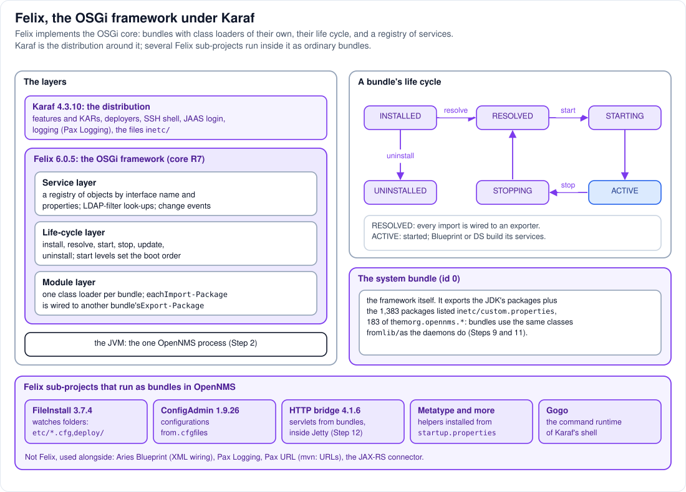

# Step 7 - Felix: the OSGi framework under Karaf

**In short:** Apache Felix 6.0.5 is the *framework*, the engine that implements the OSGi core
specification. It does three jobs: it loads each bundle with a class loader of its own and wires
bundles together through their imported and exported packages; it runs each bundle's life cycle
(install, resolve, start, stop, update, uninstall); and it keeps the **OSGi service registry**, where
bundles publish objects for each other. Karaf is the distribution around the engine. Felix is also
the name of an Apache project whose other pieces, FileInstall, ConfigAdmin and the HTTP bridge among
them, run inside OpenNMS as ordinary bundles.



## 7.1 Karaf and Felix: who does what

| | Felix (the framework) | Karaf (the container) |
|---|---|---|
| Is | one JAR, `org.apache.felix.framework-6.0.5.jar`, in `system/` | the launcher in `lib/` plus many bundles |
| Knows about | bundles, packages, services, start levels | features, KARs, repositories, `.cfg` files, users |
| Gives you | class loading and wiring, life cycle, the service registry | installing by name (`feature:install`), deploy folders, the shell, logging, JAAS |
| Chosen by | `karaf.framework=felix` in `etc/config.properties` | OpenNMS's `WebAppListener` (Step 6) |

Karaf could also run on Eclipse Equinox; OpenNMS runs it on Felix. When you type `bundle:list` in
the Karaf shell, Karaf asks Felix. When you type `feature:install`, Karaf works out the bundles and
then asks Felix to install and start them.

## 7.2 The module layer: a class loader per bundle

A bundle is a JAR with extra headers in its manifest (Step 8). Felix gives every installed bundle
its own class loader, and only lets it see:

* its own classes and resources (and those of its fragments);
* the packages it **imports** (`Import-Package`), each served by exactly one bundle that
  **exports** that package (`Export-Package`), chosen when the bundle is *resolved*;
* the JDK's `java.*` packages (and a few others the configuration always takes from the JDK).

Everything else is invisible to it, even when the classes exist elsewhere in the JVM. That is the
isolation OSGi offers: not separate processes (Step 9), but separate class spaces with explicit,
versioned connections between them.

## 7.3 The life-cycle layer

A bundle moves between six states (top right of the diagram):

| State | Meaning |
|---|---|
| `INSTALLED` | Felix has the JAR (copied into `data/cache/`), nothing is wired yet |
| `RESOLVED` | every mandatory import is wired to an exporter: the classes can be loaded |
| `STARTING` | the bundle is starting: its activator, if it has one, runs |
| `ACTIVE` | started; extenders such as Blueprint and DS now create its objects and register its services |
| `STOPPING` | on the way back to `RESOLVED`; its services are unregistered |
| `UNINSTALLED` | gone; the class loader is released once nothing uses it |

A bundle that cannot be resolved (a missing package, a wrong version range) stays `INSTALLED`, which
is the most common reason a plugin "does nothing". `bundle:diag <id>` in the Karaf shell says which
import is missing.

**Start levels** order the start-up (Step 6): each bundle has a level, and the framework starts all
bundles of level *n* before those of level *n+1*, on its `FelixStartLevel` thread.

## 7.4 The service layer: the OSGi service registry

Any bundle can register an object under one or more interface names, with properties:
"here is a `UIExtension`, `extensionId=labNodeInventory`". Any bundle can look services up by
interface and by an LDAP-style filter on the properties, or be told when matching services come and
go. Service events are delivered at once, on the thread that registers or unregisters the service;
bundle and framework events go through Felix's `FelixDispatchQueue` thread.

This is how bundles cooperate without knowing each other: a plugin registers a `UIExtension`,
OpenNMS's `api-layer` tracks all `UIExtension` services, and neither has the other's code (Steps 10
and 11). Most bundles do not call the registry by hand; Blueprint XML files declare `<service>` and
`<reference>` elements, and an *extender* bundle (Apache Aries Blueprint) does the calls.

## 7.5 The system bundle: how bundles see OpenNMS's classes

The framework itself is bundle number 0, the *system bundle*. It exports the JDK's packages, plus
whatever `org.osgi.framework.system.packages.extra` lists. OpenNMS's `etc/custom.properties` lists
1,383 packages there, 183 of them `org.opennms.*`, for example `org.opennms.netmgt.dao.api`.

Those classes are not inside any bundle. The system bundle hands class requests for them to the
framework's class loader, whose parent is the lib/ class loader of Step 2. So when the `api-layer`
bundle imports `org.opennms.netmgt.dao.api`, it gets **the same** `NodeDao` interface, the same
`Class` object, that the daemons use, and an object created by the daemons' Spring context can be
handed to it (Step 11). Without this list, OSGi's isolation would make the daemons' objects
unusable in bundles.

## 7.6 Felix sub-projects inside OpenNMS

Several parts of the Apache Felix project run in OpenNMS as ordinary bundles:

| Bundle | Version in 33.1.8 | What it does here |
|---|---|---|
| FileInstall | 3.7.4 | watches `etc/` for `.cfg` files and the deploy folders for KARs (Steps 6 and 10) |
| ConfigAdmin | 1.9.26 | holds the configurations bundles read their settings from |
| HTTP bridge | 4.1.6 | runs servlets and JAX-RS resources of bundles inside Jetty (Step 12) |
| Metatype, Coordinator, Converter, Configurator | see `startup.properties` | helpers for configuration |
| Gogo | inside Karaf's shell | the command runtime behind `bundle:list` and friends |

Around them run bundles from other projects: Apache Aries Blueprint (the XML wiring), OPS4J Pax
Logging (logging) and Pax URL (the `mvn:` URLs), and EclipseSource's OSGi JAX-RS connector (REST
resources as OSGi services).

## 7.7 See it in the lab

```bash
scripts/karaf.sh 'bundle:list -t 0' | head -5
scripts/karaf.sh 'package:exports -b 0 -p org.opennms.netmgt.dao'
scripts/karaf.sh bundle:list | grep -i 'node inventory'
scripts/karaf.sh 'bundle:headers <id>'
scripts/karaf.sh 'bundle:diag <id>'
```

* The first bundle that `bundle:list -t 0` lists, after its headings, is ID 0: the system bundle,
  that is, the Felix framework itself.
* `package:exports -b 0 -p org.opennms.netmgt.dao` lists the DAO packages exported by the system
  bundle, that is, served from `lib/`.
* Take the ID of the Node Inventory bundle from the third command, then look at its manifest
  (`Import-Package` shows `org.opennms.integration.api.v1.ui`) and at its diagnosis (nothing
  missing when it is `Active`).

## Remember

* Felix is the OSGi framework: class loaders and wiring, life cycle, service registry. Karaf is the
  distribution on top.
* A bundle sees only what it imports; the system bundle exports OpenNMS's own packages from `lib/`
  so bundles can share the daemons' classes and objects.
* A plugin stuck in `INSTALLED` has an import nobody exports: `bundle:diag` tells you which.

---
Previous: [Step 6 - Karaf](06-karaf.md) | [Guide overview](README.md) |
Next: [Step 8 - JARs, bundles, features, KARs](08-jars-bundles-features-kars.md)
