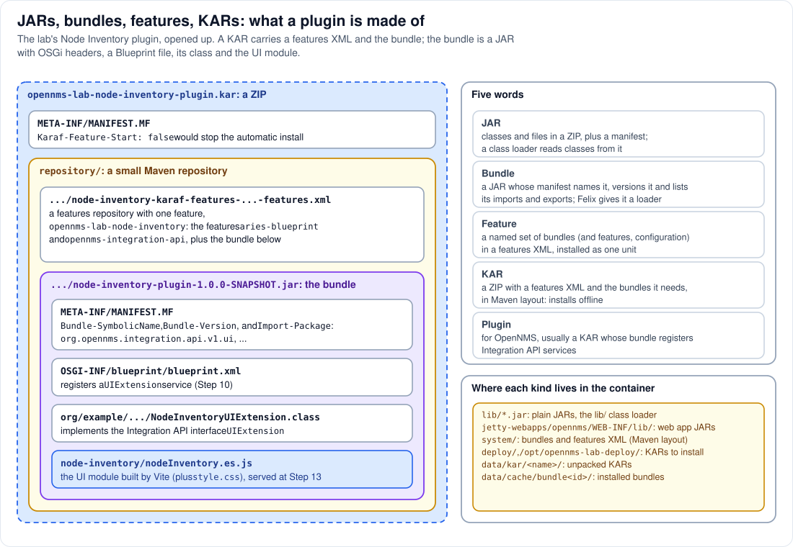

# Step 8 - JARs, bundles, features, KARs: what a plugin is made of

**In short:** they nest. A **JAR** is a ZIP of classes and files. A **bundle** is a JAR whose
manifest carries OSGi headers: a name, a version, the packages it imports and exports. A
**feature** is a named set of bundles (and other features), written down in a features XML file. A
**KAR** is one ZIP that carries a features XML and every bundle it needs, so that it installs
without a network. An OpenNMS **plugin**, in practice, is a KAR whose bundle registers Integration
API services, such as a `UIExtension` for a UI plugin.



## 8.1 JAR

A JAR is a ZIP file with classes (`.class`), resources (any other file) and
`META-INF/MANIFEST.MF`, a text file of `Name: value` headers. A class loader reads classes from JARs
on its list. OpenNMS's `lib/` holds hundreds of plain JARs, read by the lib/ class loader of Step 2.
For them, being in `lib/` is all it takes to be visible to every daemon.

## 8.2 Bundle

A bundle is a JAR that Felix can manage, because its manifest says who it is and what it needs. The
lab's Node Inventory bundle, built by the `maven-bundle-plugin`, has headers like these:

```text
Bundle-SymbolicName: org.example.opennms.lab.node-inventory-plugin
Bundle-Version: 1.0.0.SNAPSHOT
Bundle-Name: Lab :: Shared Assets :: Node Inventory :: Plugin
Import-Package: org.opennms.integration.api.v1.ui;version="[1.6,2)", ...
```

`Import-Package` is computed from the code: the class `NodeInventoryUIExtension` implements
`org.opennms.integration.api.v1.ui.UIExtension`, so the bundle imports that package, and Felix will
only resolve the bundle when some bundle exports it (the Integration API bundle does). Nothing is
exported: `<Export-Package/>` in the POM keeps the class private. Besides the class, the JAR carries:

* `OSGI-INF/blueprint/blueprint.xml`: the Blueprint extender reads it when the bundle starts, creates
  the `NodeInventoryUIExtension` object with four properties and registers it as a `UIExtension`
  service (Step 10);
* `node-inventory/nodeInventory.es.js` and `node-inventory/style.css`: the UI module built by Vite,
  plain files inside the JAR that `ui-extension` reads and serves (Step 13).

Most of Karaf and of OpenNMS's OSGi side are bundles too; they live, in Maven layout, in `system/`.

## 8.3 Feature

A feature is Karaf's unit of installation: a name, a version, and a list of bundles, other features,
configuration and conditions. Features are written in a *features XML* file, also called a features
repository. The lab's plugin has one feature:

```xml
<feature name="opennms-lab-node-inventory" version="${project.version}">
    <feature dependency="true">aries-blueprint</feature>
    <feature version="${opennms.api.version}" dependency="true">opennms-integration-api</feature>
    <bundle>mvn:org.example.opennms.lab/node-inventory-plugin/${project.version}</bundle>
</feature>
```

`feature:install opennms-lab-node-inventory` would make Karaf find the bundle through its `mvn:`
URL, check that Blueprint and the Integration API are there (they are, because OpenNMS installs them
at boot), install the bundle and start it. The `dependency="true"` flags tell Karaf to reuse what is
already installed rather than install another copy.

## 8.4 KAR

A KAR (Karaf ARchive) is a ZIP with:

* `repository/`: a small Maven repository holding the features XML and every bundle it references;
* `META-INF/MANIFEST.MF`, where `Karaf-Feature-Start: false` would tell Karaf to add the features
  without installing them. The lab's KARs leave it out, so dropping one in installs it.

The lab's build produces `opennms-lab-node-inventory-plugin.kar`; its KAR name inside Karaf is the
file name without `.kar`. Because everything is inside, installing a KAR needs no network and no
Maven repository: Karaf unpacks it into `data/kar/<name>/` and treats that folder as one more
repository (Step 10). `scripts/kar_info.py` prints what is inside any KAR.

## 8.5 Plugin

"Plugin" is not an OSGi word. For OpenNMS it means an extension built against the **OpenNMS
Integration API** (OIA): a small, versioned set of Java interfaces (`UIExtension`, `NodeDao`,
`EventForwarder`, ...) that OpenNMS implements in its `api-layer` bundle. A plugin bundle registers
implementations of the extension interfaces and references the services it needs; because it only
imports `org.opennms.integration.api.*` packages, it keeps working across OpenNMS versions that
provide the same API. It is almost always shipped as a KAR.

## 8.6 Where each kind of file lives in the container

| Path | What | Read by |
|---|---|---|
| `lib/*.jar` | plain JARs: OpenNMS, Spring, Hibernate, Jetty, Karaf's launcher | the lib/ class loader (Step 2) |
| `jetty-webapps/opennms/WEB-INF/lib/` | a few JARs of the web application | the web application's class loader |
| `system/` | bundles and features XML in Maven layout | Karaf's features service |
| `deploy/`, `/opt/opennms-lab-deploy/` | KARs waiting to be installed | FileInstall and the KAR deployer |
| `data/kar/<name>/` | unpacked KARs | the features service |
| `data/cache/bundle<id>/` | the copy of each installed bundle | Felix, one class loader per bundle |

## 8.7 See it in the lab

```bash
python3 scripts/kar_info.py deploy/opennms-lab-node-inventory-plugin.kar
unzip -l deploy/opennms-lab-node-inventory-plugin.kar
scripts/karaf.sh 'feature:info opennms-lab-node-inventory'
scripts/karaf.sh kar:list
podman exec onms-shared-assets-horizon ls /usr/share/opennms/data/kar
```

* `kar_info.py` prints the KAR's name, whether its features start, its features and bundles, and the
  UI extensions declared in the bundle's Blueprint file.
* `unzip -l` shows the Maven layout under `repository/`.
* `feature:info` shows the feature's bundle and its two feature dependencies.
* `kar:list` and `data/kar` both show `opennms-lab-node-inventory-plugin`, next to the KARs that ship
  with the image.

## Remember

* JAR, bundle, feature, KAR: each wraps the one before.
* A bundle's manifest says what it imports; Felix will not resolve it until someone exports that.
* A KAR carries everything it needs, so installing it is a local file operation.
* An OpenNMS plugin is a bundle (in a KAR) that talks to OpenNMS only through the Integration API.

---
Previous: [Step 7 - Felix](07-felix.md) | [Guide overview](README.md) |
Next: [Step 9 - Class loaders and threads](09-class-loaders-and-threads.md)
