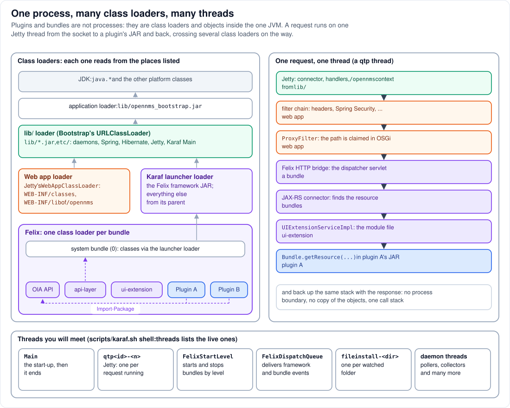

# Step 9 - One process, many class loaders, many threads

**In short:** no, a plugin or a bundle is **not** a separate process. Everything runs in the one JVM
of Step 2, in one heap, on threads of that JVM. What separates a bundle from the rest is its
**class loader**: Felix gives each bundle its own, and a class loader decides which classes the
bundle can see. Threads are not owned by bundles at all: the Jetty thread that takes a request runs
the filters, the Felix HTTP bridge, a REST resource in one bundle and a file lookup in another, in
one call stack, and returns.



## 9.1 Why class loaders, not processes

In Java a class is identified by its name **and** the class loader that defined it. Two bundles can
therefore contain classes with the same name without a clash, and a bundle can be uninstalled by
dropping its class loader. That is how OSGi gives modularity inside one JVM: isolation of names and
versions, explicit connections (imports, exports, services), and a life cycle, but no separate
memory, CPU or failure boundary. A bundle can use all the heap, start threads, or call
`System.exit()`, and the whole of OpenNMS feels it.

## 9.2 The class loaders, from the bottom up

| Class loader | Reads classes from | Parent | Who uses it |
|---|---|---|---|
| JDK boot and platform loaders | the Java runtime | none | everyone, for `java.*` |
| application loader | the JVM's class path: `lib/opennms_bootstrap.jar` | platform | only the launcher (Step 2) |
| **lib/ loader** | `lib/endorsed/`, `classes/`, every `lib/*.jar`, `etc/` | application | the daemons, Spring, Hibernate, Jetty, Karaf's launcher (Step 2) |
| web application loader | `WEB-INF/classes/`, `WEB-INF/lib/` of `/opennms` | lib/ loader | servlets, filters, JSPs (Step 5) |
| Karaf launcher loader | the Felix framework JAR | lib/ loader | the framework and the system bundle (Step 6) |
| **one loader per bundle** | that bundle's JAR, plus the packages it imports | none in the usual sense: Felix delegates | each bundle's classes (Step 7) |

The first four follow the usual Java rule: ask the parent first, then look yourself (Jetty's web
application loader looks in `WEB-INF/` first, as the servlet specification asks, but OpenNMS's own
classes are not there, so they come from the parent). A bundle's loader is different. It does not
simply ask a parent; it follows the bundle's **wiring**:

1. `java.*` comes from the JDK;
2. an imported package comes from the bundle that exports it, chosen when the bundle was resolved:
   for the plugins, `org.opennms.integration.api.v1.ui` comes from the Integration API bundle;
3. a package exported by the system bundle comes through the Karaf launcher loader, and so from the
   lib/ loader: `org.opennms.netmgt.dao.api`, for example, used by the `api-layer`;
4. anything else comes from the bundle's own JAR.

## 9.3 Why the shared class space matters

Point 3 is what makes OpenNMS's OSGi side work. The daemons' `NodeDao` object was created by
Spring in the lib/ class space (Step 3). When the bridge hands it to the `api-layer` bundle
(Step 11), the bundle sees it through **the same** `org.opennms.netmgt.dao.api.NodeDao` class,
because the system bundle exports that package from `lib/`. Had the bundle carried its own copy of
the interface, it would be a different class, and the cast would fail with a `ClassCastException`
that names the same class twice.

The same trap exists for plugins: a plugin that embeds its own copy of the Integration API instead
of importing it cannot talk to OpenNMS. Build against the API version your OpenNMS provides, and
let `Import-Package` do the rest (Step 8; [Part 9](../09-troubleshooting.md#deploying-plugins) lists
the symptoms when it goes wrong).

## 9.4 One request, one thread, one call stack

Follow `GET /opennms/rest/plugins/ui-extension/module/labNodeInventory?path=...` on the right of the
diagram. One Jetty thread, `qtp<number>-<id>`, runs all of it:

| Frame | Code | Loaded by |
|---|---|---|
| connector, `MDCHandler`, `RewriteHandler`, `ContextHandlerCollection` | Jetty | lib/ loader |
| filter chain, `springSecurityFilterChain`, ..., `ProxyFilter` | the web application | web application loader (and its parent) |
| the Felix HTTP bridge's dispatcher servlet | a bundle | that bundle's loader |
| the JAX-RS connector: finds the resource for the path | bundles | their loaders |
| `UIExtensionServiceImpl`: looks up `labNodeInventory` | the `ui-extension` bundle | its loader |
| `bundle.getResource("node-inventory/nodeInventory.es.js")` | Felix, reading plugin A's JAR | plugin A's loader |

Then the call stack unwinds and the same thread writes the response. There is no message between
processes, no copying of objects, no second server: method calls, as in any Java program. The same
is true of a service call from a plugin into OpenNMS (Step 11).

## 9.5 The threads you will meet

| Thread name | Created by | Does |
|---|---|---|
| `Main` | the launcher (Step 2) | the whole start-up: the daemons' `init()` and `start()`, Jetty's start-up, Karaf's launch; it ends when the start-up is complete |
| `qtp<number>-<id>` | Jetty's thread pool | one request at a time, from the socket to the response |
| `FelixStartLevel` | Felix | starts and stops bundles when the start level changes |
| `FelixDispatchQueue` | Felix | delivers bundle and framework events |
| `fileinstall-<folder>` | Felix FileInstall | one per watched folder, for example `fileinstall-/opt/opennms-lab-deploy` |
| many more | the daemons and bundles | poller and collector pools, event processing, schedulers, the SSH server, ... |

A bundle's code runs on whichever thread calls it: a Jetty thread for a request, the
`FelixStartLevel` thread while it starts, a daemon's thread when a daemon calls a service. Code that
blocks one of those threads blocks that part of OpenNMS.

## 9.6 Memory: one heap, and metaspace for classes

All objects of all bundles live in the one heap sized by `-Xmx` (2 GB in the lab's `JAVA_OPTS`).
Classes live in *metaspace* (`-XX:MaxMetaspaceSize=512m` in the lab). Each time you update a plugin,
Felix creates a new class loader for the new version; the old loader and its classes are freed only
when nothing refers to them any more. A plugin that leaves a thread running, or a listener
registered, after it stops keeps its old classes alive: frequent redeploys of such a plugin slowly
fill metaspace.

## 9.7 See it in the lab

```bash
podman top onms-shared-assets-horizon pid args
scripts/karaf.sh 'shell:threads --list' | grep -E 'qtp|FelixStartLevel|FelixDispatchQueue|fileinstall' | head -20
scripts/karaf.sh 'bundle:find-class NodeInventoryUIExtension'
scripts/karaf.sh 'bundle:tree-show <id of the Node Inventory bundle>'
```

* Still one process, even with both plugins deployed.
* `shell:threads` lists the JVM's threads, bundles or not: the `qtp` threads, Felix's two threads
  and the FileInstall watchers (`fileinstall-/opt/opennms-lab-deploy` among them) are all in the same
  list. `Main` is not: it ended when the start-up was complete.
* `bundle:find-class` finds which bundle holds the class: only the Node Inventory bundle.
* `bundle:tree-show` shows the plugin's wiring: the bundles its imports are wired to, among them the
  Integration API bundle.

## Remember

* A bundle is a class loader plus objects in the one JVM, not a process.
* Class loaders give isolation of names and versions, not of memory, CPU or failures.
* The system bundle shares OpenNMS's own classes from `lib/` with the bundles; that is why objects
  can cross from the daemons into bundles.
* A request is one thread and one call stack from Jetty to a plugin's JAR and back.

---
Previous: [Step 8 - JARs, bundles, features, KARs](08-jars-bundles-features-kars.md) |
[Guide overview](README.md) | Next: [Step 10 - Deploying a plugin](10-deploying-a-plugin.md)
