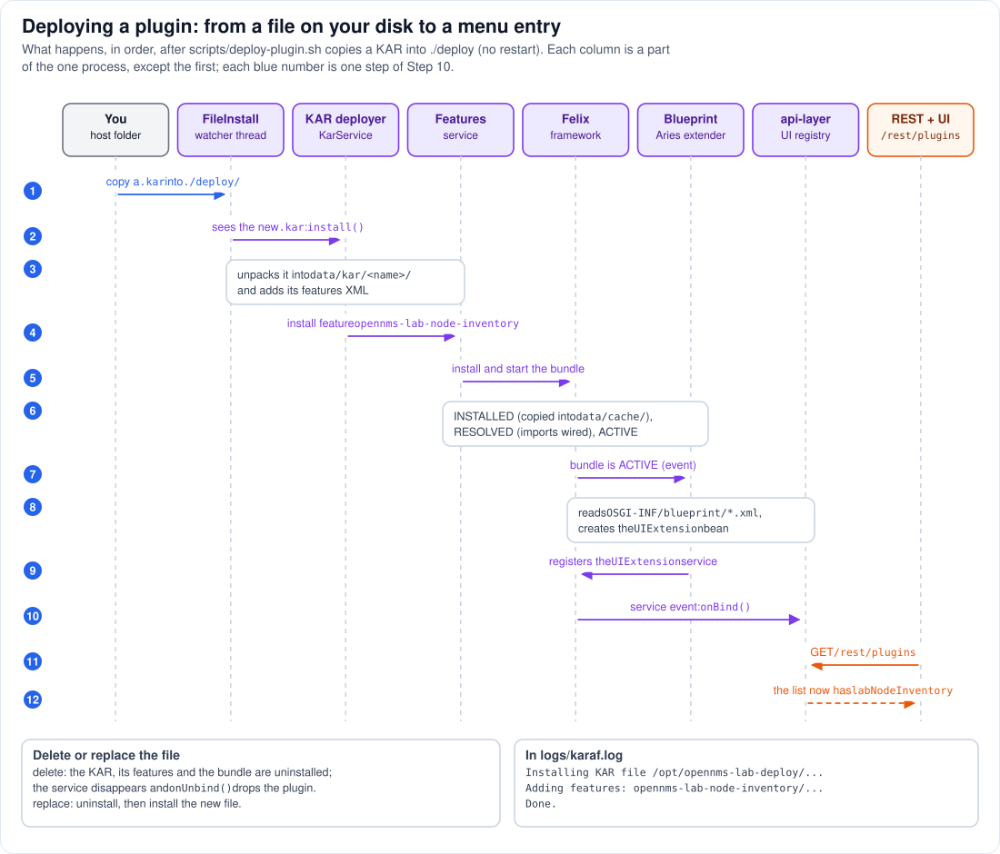

# Step 10 - Deploying a plugin: from a file to a menu entry

**In short:** nothing in OpenNMS searches for plugins. A folder watcher notices a new KAR file; Karaf
unpacks it and installs the feature inside; Felix installs, wires and starts the bundle; the
Blueprint extender creates the plugin's objects and registers its `UIExtension` service; and
OpenNMS's `api-layer`, which listens for every `UIExtension` service, adds it to the registry that
the REST API and the UI read. Each part only reacts to the one before it, and it all happens while
OpenNMS runs, without a restart.



The numbers below are the blue numbers of the diagram. The example is
`scripts/deploy-plugin.sh node-inventory`, which copies `opennms-lab-node-inventory-plugin.kar`
into `./deploy/` (under a temporary name, then renamed, so no half-written file is ever seen).

## 10.1 The file arrives (1)

`./deploy/` on your machine is bind-mounted read-only at `/opt/opennms-lab-deploy/` in the
container, so the file is there as soon as the copy finishes. Nothing has happened in OpenNMS yet.

## 10.2 FileInstall sees it (2)

The lab's `etc/org.apache.felix.fileinstall-lab.cfg` (Step 6) created a FileInstall watcher for that
folder, running on its own thread, `fileinstall-/opt/opennms-lab-deploy`. Every second it compares
the folder with what it saw before; the filter in the `.cfg` makes it consider `*.kar` files only.
For a new KAR it calls the artifact installer that claims `.kar` files: Karaf's
`KarArtifactInstaller`, which logs `Installing KAR file /opt/opennms-lab-deploy/...` to `karaf.log`.
(A changed file means uninstall, then install; a deleted file means uninstall.)

## 10.3 Karaf unpacks the KAR (3)

The KAR deployer takes the KAR's name from the file name (`opennms-lab-node-inventory-plugin`) and
skips the file if a KAR of that name is already installed. Otherwise Karaf's KAR service unpacks it
into `data/kar/opennms-lab-node-inventory-plugin/`. It registers the features XML found in the unpacked
`repository/` as a features repository, so Karaf now knows the feature `opennms-lab-node-inventory`
and where its bundle is.

## 10.4 The feature is installed (4)

Unless the KAR's manifest says `Karaf-Feature-Start: false`, the KAR service installs every feature
of that repository whose install mode is `auto` (the default). The features service logs
`Adding features: opennms-lab-node-inventory/...` and computes what must change: the feature needs
`aries-blueprint` and `opennms-integration-api`, which OpenNMS installed at boot, and one new
bundle.

## 10.5 Felix installs, wires and starts the bundle (5, 6)

The features service hands the bundle to Felix:

* **install**: Felix copies the JAR into its cache, `data/cache/bundle<id>/`, and gives it the next
  bundle ID. State `INSTALLED`.
* **resolve**: Felix wires every `Import-Package` to an exporter; for the plugin,
  `org.opennms.integration.api.v1.ui` is wired to the Integration API bundle. State `RESOLVED`. If
  an import cannot be wired, the bundle stays `INSTALLED` and `karaf.log` says why.
* **start**: the bundle has no activator of its own; it goes `STARTING`, then `ACTIVE`.

The features service logs `Done.` when the change is complete.

## 10.6 Blueprint creates the objects (7, 8, 9)

Starting the bundle fires a bundle event. The Blueprint extender (Apache Aries), itself a bundle
that listens for such events, looks inside the new bundle for `OSGI-INF/blueprint/*.xml`, finds
`blueprint.xml`, and:

* creates a `NodeInventoryUIExtension` object, loading the class through the plugin's class loader,
  and sets its four properties (`extensionId`, `menuEntry`, `resourceRootPath`, `moduleFileName`);
* registers that object in the OSGi service registry under the interface
  `org.opennms.integration.api.v1.ui.UIExtension`.

The plugin's own code has done nothing but hold four strings.

## 10.7 OpenNMS picks it up (10)

The `api-layer` bundle declares, in its own Blueprint file, a `reference-list` of every
`UIExtension` service, with a listener. When the plugin's service appears, Felix tells the listener
(the service event is delivered on the thread that registered the service), and
`UIExtensionRegistryImpl.onBind()` stores the extension under its `extensionId`. If another plugin
already used the same id, the newer one replaces it.

## 10.8 The UI sees it (11, 12)

`GET /opennms/rest/plugins` (Step 12) now returns `labNodeInventory` along with every other
registered extension. The Vue UI asks that URL when it loads, so the **Plugins** menu shows the new
entry after the next page load. The lab's `deploy-plugin.sh` waits for exactly this moment: it polls
`/opennms/rest/plugins` until the extension is listed and its module can be downloaded.

## 10.9 Removing and updating

Deleting the file reverses the chain. FileInstall notices, the KAR deployer uninstalls the KAR and
its features, Felix stops the bundle (Blueprint unregisters the service, `onUnbind()` drops the
extension) and uninstalls it. Replacing the file with a new version is an uninstall followed by an
install. `scripts/undeploy-plugin.sh` and a second `deploy-plugin.sh` do exactly that.

Two more ways into the same chain, compared in [Part 5.6](../05-design-decisions.md#56-deploying-plugins-a-second-deploy-folder):
`kar:install` in the Karaf shell starts at circle 3, and `feature:install` at circle 4 (for a
feature from a repository Karaf already knows).

## 10.10 After a restart, or a new container

On a restart, Felix restarts the installed bundles from its cache in `data/`, and the plugin is back
without the watcher doing anything. On a **re-created** container `data/` is empty: Karaf starts
from scratch (Step 6), and the watcher finds the KAR in `./deploy` again and installs it anew. That
is why the lab keeps plugins in a host folder instead of installing them by hand.

## 10.11 See it in the lab

```bash
scripts/deploy-plugin.sh node-inventory
podman exec onms-shared-assets-horizon grep -E 'Installing KAR file|Adding features|Done\.' /usr/share/opennms/logs/karaf.log | tail -5
scripts/karaf.sh kar:list
scripts/karaf.sh bundle:list | grep -i 'node inventory'
scripts/karaf.sh 'service:list org.opennms.integration.api.v1.ui.UIExtension'
```

* `karaf.log` shows the three lines of 10.2, 10.4 and 10.5 within a few seconds of the copy.
* `kar:list` shows `opennms-lab-node-inventory-plugin`; `bundle:list` shows the bundle `Active`.
* `service:list` shows one `UIExtension` service per deployed plugin, each provided by its plugin
  bundle. The four values are fields of the object, not service properties, so they do not show
  here; `/opennms/rest/plugins` shows them (Step 13).

[Part 6](../06-installing-the-plugins.md) walks through the same deployment from the operator's
side, with every check.

## Remember

* A plugin is found because a folder watcher sees a file, not because OpenNMS scans for plugins.
* KAR, then feature, then bundle, then Blueprint, then a service: each step reacts to the one
  before.
* OpenNMS's `api-layer` tracks `UIExtension` services; registering one is all a UI plugin has to do.
* Delete the file and the same chain runs backwards.

---
Previous: [Step 9 - Class loaders and threads](09-class-loaders-and-threads.md) |
[Guide overview](README.md) | Next: [Step 11 - Services and the bridge](11-services-and-the-bridge.md)
