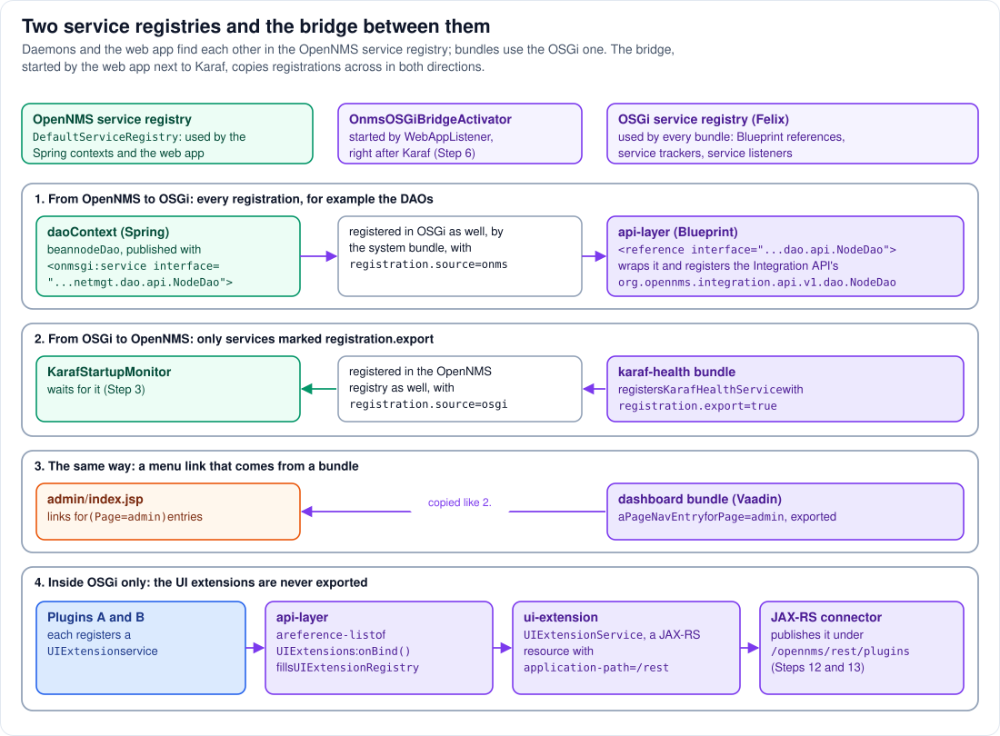

# Step 11 - Services and the bridge: how the parts find each other

**In short:** the parts of OpenNMS find each other through **service registries**, directories of
shared objects looked up by interface name. There are two. The daemons and the web application use
the **OpenNMS service registry**; bundles use the **OSGi service registry** of Felix. A small bridge,
`OnmsOSGiBridgeActivator`, started by the web application next to Karaf, copies registrations
across: every OpenNMS registration appears in OSGi, and every OSGi service marked
`registration.export` appears in OpenNMS. Because both sides share OpenNMS's classes (Step 7), the
copied object is the very same Java object.



## 11.1 The two registries

| | OpenNMS service registry | OSGi service registry |
|---|---|---|
| Implementation | `DefaultServiceRegistry.INSTANCE`, a singleton in the lib/ class space; `soaContext` makes it a Spring bean (`<onmsgi:default-registry/>`, Step 3) | part of the Felix framework (Step 7) |
| Register with | `<onmsgi:service interface="..." ref="..."/>` in a Spring file | Blueprint `<service>`, DS, or `BundleContext.registerService` |
| Look up with | `<onmsgi:reference>`, `<onmsgi:list>`, or a lookup in code | Blueprint `<reference>`, `<reference-list>`, service trackers |
| Used by | daemons, the web application | bundles |

## 11.2 From OpenNMS to OSGi: everything (row 1)

When the bridge starts, it adds itself as a *registration hook* to the OpenNMS registry. From then
on, every registration there, past and future, is registered in OSGi too, through the framework's
own `BundleContext`, so in OSGi it shows up as a service of the system bundle, with the property
`registration.source=onms`.

The DAOs are the important example. `applicationContext-dao.xml`, loaded into `daoContext` (Step 3),
publishes the connection pool, and `applicationContext-shared.xml`, which it imports, publishes every
DAO next to its definition:

```xml
<!-- applicationContext-dao.xml -->
<onmsgi:service interface="javax.sql.DataSource" ref="dataSource"/>
<!-- applicationContext-shared.xml -->
<bean id="nodeDao" class="org.opennms.netmgt.dao.hibernate.NodeDaoHibernate"> ... </bean>
<onmsgi:service interface="org.opennms.netmgt.dao.api.NodeDao" ref="nodeDao" />
```

The `api-layer` bundle's Blueprint file then simply references it:

```xml
<reference id="nodeDao" interface="org.opennms.netmgt.dao.api.NodeDao" availability="mandatory"/>
<bean id="nodeDaoImpl" class="org.opennms.features.apilayer.dao.NodeDaoImpl">
    <argument ref="nodeDao"/>
    <argument ref="sessionUtils"/>
</bean>
<service interface="org.opennms.integration.api.v1.dao.NodeDao" ref="nodeDaoImpl"/>
```

It wraps the internal `NodeDao` into the Integration API's `NodeDao`, the stable interface a plugin
can use. A plugin that needs node data in Java references `org.opennms.integration.api.v1.dao.NodeDao`
and never sees OpenNMS internals. (The lab's plugins get their node data in the browser, from the
REST API, instead; Step 15.)

## 11.3 From OSGi to OpenNMS: only what is exported (rows 2 and 3)

The other direction is opt-in. The bridge listens for OSGi services that carry a
`registration.export` property and registers each of them in the OpenNMS registry, with
`registration.source=osgi` (so it will not copy it back). Two examples from Steps 3 and 13:

* the `karaf-health` bundle registers `KarafHealthService` with `registration.export=true`; the
  `KarafStartupMonitor` daemon waits for it in the OpenNMS registry;
* the wallboard bundle (Vaadin) registers a `PageNavEntry` with `Page=admin` and
  `registration.export=true`; the classic UI's `admin/index.jsp` asks the OpenNMS registry for every
  `PageNavEntry` matching `(Page=admin)` and draws a link for each, which is how a bundle adds a link
  to a JSP page.

## 11.4 Inside OSGi only: the UI extensions (row 4)

Plugins' `UIExtension` services are **not** exported, because nothing outside OSGi needs them. The
chain stays among bundles:

1. each plugin bundle registers a `UIExtension` (Step 10);
2. the `api-layer` tracks them all with a `reference-list` and keeps them in `UIExtensionRegistry`,
   which it registers as a service;
3. the `ui-extension` bundle references that registry and registers `UIExtensionService`, a JAX-RS
   resource, with the property `application-path=/rest`;
4. the JAX-RS connector notices a service with that property and publishes it as REST under
   `/opennms/rest/plugins` (Steps 12 and 13).

## 11.5 The other ways parts talk

Service registries are not the only channel. For completeness:

| Channel | Between | Example |
|---|---|---|
| Spring parent contexts | daemons, web application | the web application's REST API uses the daemons' DAOs (Step 3) |
| OpenNMS service registry + bridge | daemons, web application, bundles | the DAOs reach the `api-layer` (this step) |
| OSGi service registry | bundles | plugins' `UIExtension`s reach `ui-extension` (this step) |
| shared classes (system bundle) | lib/ class space, bundles | the same `NodeDao` interface on both sides (Steps 7 and 9) |
| events (Eventd) | daemons, bundles through the Integration API | a node-down event becomes an alarm (Step 16) |
| the database | everything that uses DAOs | the daemons write, the web UI reads |
| HTTP through Jetty | the browser, plugins' JavaScript, scripts | the plugin UI asks `/opennms/api/v2/nodes` (Step 15) |
| the servlet context | web application, `ProxyFilter` | the `BundleContext` handed from `WebAppListener` (Step 12) |

## 11.6 See it in the lab

```bash
scripts/karaf.sh 'service:list org.opennms.netmgt.dao.api.NodeDao' | head -20
scripts/karaf.sh 'service:list org.opennms.integration.api.v1.dao.NodeDao' | head -20
scripts/karaf.sh 'service:list org.opennms.features.karaf.health.service.KarafHealthService' | head -20
scripts/karaf.sh 'service:list org.opennms.integration.api.v1.ui.UIExtension'
```

* The internal `NodeDao` carries `registration.source = onms` and is provided by the system
  bundle (ID 0): it came over the bridge.
* The Integration API `NodeDao` is provided by the `api-layer` bundle.
* `KarafHealthService` carries `registration.export = true`: it went the other way.
* The `UIExtension` services carry no export property: they stay in OSGi.

## Remember

* Two registries: OpenNMS's for the daemons and the web application, Felix's for bundles.
* The bridge copies everything from OpenNMS to OSGi, and only `registration.export` services back.
* The objects are not copied, only registered twice; both sides share the classes.
* Plugins talk to OpenNMS through Integration API services that the `api-layer` builds on top of the
  bridged internals.

---
Previous: [Step 10 - Deploying a plugin](10-deploying-a-plugin.md) | [Guide overview](README.md) |
Next: [Step 12 - Jetty and Felix](12-jetty-and-felix.md)
