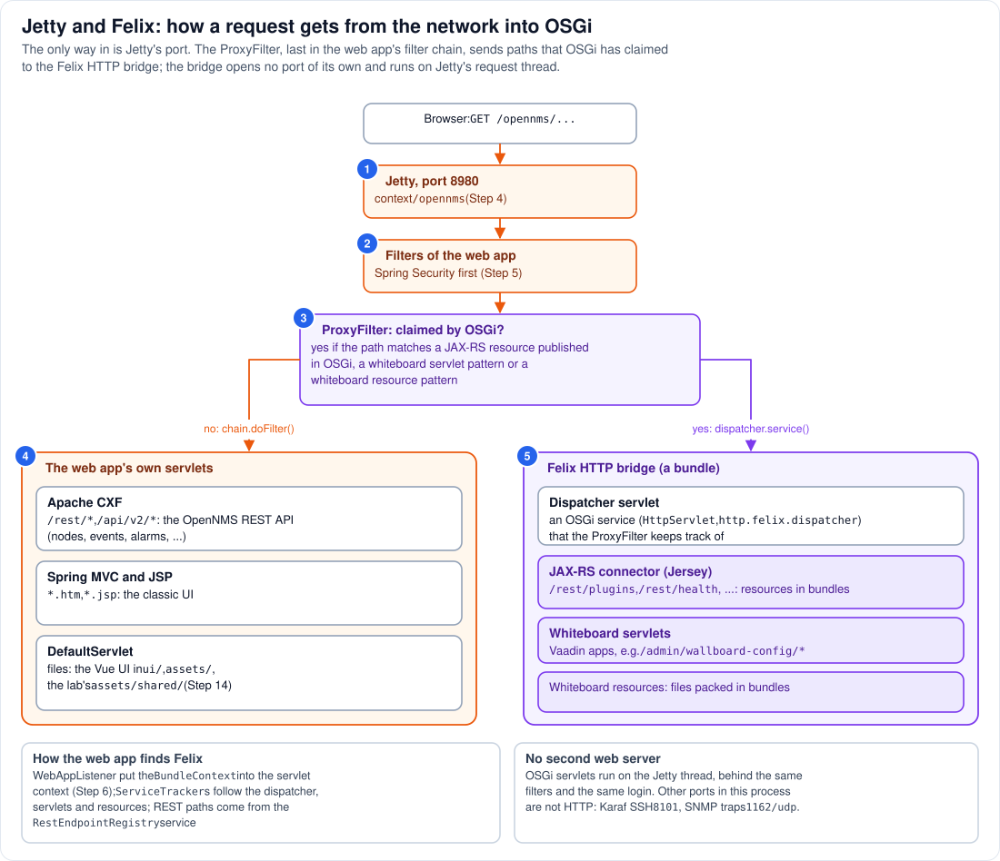

# Step 12 - Jetty and Felix: from the network into OSGi

**In short:** Felix has no network port of its own in OpenNMS. Every HTTP request, from a user or a
script, enters through Jetty's port 8980 and the `/opennms` web application. The web application's
last filter, the `ProxyFilter`, asks one question: has OSGi claimed this path? If yes, it hands the
request to the **Felix HTTP bridge**, a bundle whose dispatcher servlet runs the OSGi servlet or REST
resource for that path, on the same Jetty thread. If no, the request continues to the web
application's own servlets. So Jetty is the outside face of everything, and the `ProxyFilter` is the
only door between Jetty and Felix.



## 12.1 Outside: the user's side (circles 1 and 2)

A browser, `curl` or a plugin's JavaScript sends `GET /opennms/...` to port 8980. Jetty picks the
`/opennms` web application (Step 4), and the request runs through its filters (Step 5): security
headers, Spring Security, and the rest. By the time anything in OSGi sees the request, the user is
logged in (or the path is one that needs no login) and the response already carries OpenNMS's
security headers.

## 12.2 The ProxyFilter's question (circle 3)

The `ProxyFilter` comes from OpenNMS's `container/bridge/proxy` module and was merged into
`web.xml` at build time, mapped to `/*` and placed after every other filter. When it starts, it:

* takes Felix's `BundleContext` from the servlet context, where `WebAppListener` put it (Step 6);
* opens OSGi service trackers: one for the HTTP bridge's dispatcher servlet (an OSGi service
  registered as `javax.servlet.http.HttpServlet` with the property `http.felix.dispatcher`), one for
  *whiteboard servlets* (`javax.servlet.Servlet` services with an
  `osgi.http.whiteboard.servlet.pattern`), one for *whiteboard resources* (services with
  `osgi.http.whiteboard.resource.pattern` and `osgi.http.whiteboard.resource.prefix`);
* adds a REST handler that asks the `RestEndpointRegistry` service for the paths of the JAX-RS
  resources published in OSGi.

For each request it takes the path inside the web application (for example `/rest/plugins/...`) and
asks its handlers whether one of them claims it: a published REST path that the request's path
starts with, a whiteboard servlet pattern, or a whiteboard resource pattern. If one does, and the dispatcher is
there, it calls `dispatcher.service(request, response)`. Otherwise it calls `chain.doFilter()`.

## 12.3 Not claimed: the web application's servlets (circle 4)

The request goes on to the servlet its URL maps to (Step 5): Apache CXF for `/rest/*` and
`/api/v2/*`, Spring MVC or a JSP for the classic UI, the `DefaultServlet` for files, among them the
Vue UI in `ui/` and the lab's shared folder in `assets/shared/`. Nothing in OSGi is involved.

## 12.4 Claimed: the Felix HTTP bridge (circle 5)

The Felix HTTP bridge (bundle `org.apache.felix.http.bridge` 4.1.6, installed by the boot feature
`opennms-http-whiteboard`) implements the OSGi HTTP service and the HTTP whiteboard **without a
server of its own**: its dispatcher servlet is handed requests by a servlet container it does not
own, here Jetty through the `ProxyFilter`. The dispatcher finds the OSGi servlet registered for the
path and calls it. In OpenNMS those are mainly:

| Registered in OSGi as | Example paths | Registered by |
|---|---|---|
| JAX-RS resources with `application-path=/rest`, published by the JAX-RS connector (Jersey) | `/opennms/rest/plugins/...`, `/opennms/rest/health`, other REST APIs of bundles | `ui-extension`, `opennms-health-rest`, ... |
| whiteboard servlets (`osgi.http.whiteboard.servlet.pattern`) | `/opennms/admin/wallboard-config/*`, `/opennms/vaadin-wallboard/*` | the Vaadin applications |
| whiteboard resources | files packed inside a bundle | any bundle that wants to |

For the plugins, the first row is the one that matters: `ui-extension` registers
`UIExtensionService` with `application-path=/rest` (Step 11), the JAX-RS connector publishes it, its
`@Path("/plugins")` makes it answer `/opennms/rest/plugins/...`, and the `ProxyFilter` routes those
paths to it (Step 13).

## 12.5 Inside: why there is no second web server

* **One port.** Karaf's usual web server (Pax Web) is not used; the bridge borrows Jetty, so
  OSGi servlets are reached through port 8980 like everything else.
* **One thread.** The dispatcher runs the OSGi servlet on the Jetty request thread that called the
  `ProxyFilter` (Step 9).
* **One security model.** Spring Security has already run, so an OSGi REST resource is protected
  like the web application's own (Step 5). A path that the web application's security rules let
  through without login, such as `/opennms/rest/health/probe`, is open for the OSGi resource too.
* **One set of headers.** CSP, `nosniff` and the `RewriteHandler`'s cache headers apply to OSGi
  responses as well.

The listeners in the process that are **not** HTTP never touch Jetty: Karaf's SSH shell on 8101
(logins checked against OpenNMS's users), Trapd on 1162/udp.

## 12.6 See it in the lab

```bash
curl -s -u "admin:YOUR-PASSWORD" http://localhost:8980/opennms/rest/plugins | python3 -m json.tool | head -20
curl -s http://localhost:8980/opennms/rest/health/probe; echo
curl -s -u "admin:YOUR-PASSWORD" http://localhost:8980/opennms/rest/info; echo
scripts/karaf.sh 'service:list javax.servlet.http.HttpServlet' | grep -E 'http.felix.dispatcher'
scripts/karaf.sh 'service:list javax.servlet.Servlet' | grep -E 'osgi.http.whiteboard.servlet.pattern'
```

`YOUR-PASSWORD` is the admin password you set at the first login ([Part 0](../00-install-opennms-and-postgresql.md)).

* `rest/plugins` (OSGi: `ui-extension`) and `rest/info` (CXF, in the web application) live under the
  same `/rest/` prefix but are answered by different worlds; `rest/health/probe` (OSGi: the health
  bundle) answers `Everything is awesome` without a login once OpenNMS is up.
* The two `service:list` commands show the dispatcher servlet the `ProxyFilter` tracks, and the
  servlets registered with whiteboard patterns (the Vaadin applications among them).

## Remember

* The only way into OSGi over HTTP is Jetty's port and the `ProxyFilter`, the web application's last
  filter.
* The `ProxyFilter` claims a path for OSGi if a published JAX-RS resource, a whiteboard servlet or a
  whiteboard resource matches it.
* The Felix HTTP bridge has no server of its own: OSGi servlets run inside Jetty, on Jetty's thread,
  behind the web application's security.

---
Previous: [Step 11 - Services and the bridge](11-services-and-the-bridge.md) |
[Guide overview](README.md) | Next: [Step 13 - Plugin A and plugin B](13-plugin-uis.md)
