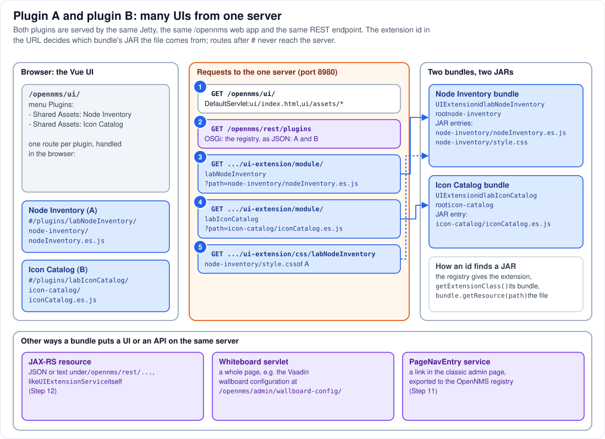

# Step 13 - Plugin A and plugin B: many UIs from one server

**In short:** Jetty does not get a new URL, context or port per plugin. Both plugins are served by
the same Jetty, the same `/opennms` web application and the same REST resource,
`/opennms/rest/plugins/ui-extension/module/<extensionId>`. The **extension id** in that URL picks
the plugin; the plugin's registered `UIExtension` object leads to its bundle; and the file is read
from that bundle's JAR. The URL you see in the browser for each plugin, such as
`/opennms/ui/#/plugins/labNodeInventory/...`, is a route inside the Vue UI, after the `#`: the
server never sees it.



## 13.1 What each plugin registered

From Step 10, each plugin's Blueprint file registered one `UIExtension` with four values:

| | Plugin A: Node Inventory | Plugin B: Icon Catalog |
|---|---|---|
| `extensionId` | `labNodeInventory` | `labIconCatalog` |
| `menuEntry` | `Shared Assets: Node Inventory` | `Shared Assets: Icon Catalog` |
| `resourceRootPath` | `node-inventory` (a folder in its JAR) | `icon-catalog` |
| `moduleFileName` | `nodeInventory.es.js` | `iconCatalog.es.js` |

The `api-layer` keeps both in `UIExtensionRegistry`, keyed by `extensionId` (Step 11).

## 13.2 The requests, one by one (circles 1 to 5)

1. **`GET /opennms/ui/`**: the Vue UI itself, plain files served by the web application's
   `DefaultServlet` from `jetty-webapps/opennms/ui/` (Step 5). Nothing from any plugin yet.
2. **`GET /opennms/rest/plugins`**: the UI asks for the list of UI extensions before it mounts. The
   `ProxyFilter` claims the path, the Felix HTTP bridge and the JAX-RS connector call
   `UIExtensionServiceImpl`, which returns the registry as JSON: both entries of 13.1 (Step 12).
3. **`GET /opennms/rest/plugins/ui-extension/module/labNodeInventory?path=node-inventory/nodeInventory.es.js`**:
   for each entry the UI adds a route and loads the module with a `<script type="module">` tag.
   `UIExtensionServiceImpl`:
   * looks up `labNodeInventory` in the registry and gets plugin A's `UIExtension` object;
   * calls its `getExtensionClass()`, which returns a class **of plugin A's bundle**, and asks Felix
     `FrameworkUtil.getBundle(thatClass)`: plugin A's bundle;
   * calls `bundle.getResource("node-inventory/nodeInventory.es.js")`: the file inside plugin A's
     JAR, found through plugin A's class loader;
   * answers with its content as `application/javascript`.
   The module runs in the browser and puts its Vue component on `window.labNodeInventory`.
4. **The same for `labIconCatalog`**, which leads to plugin B's bundle and plugin B's JAR.
5. **`GET /opennms/rest/plugins/ui-extension/css/labNodeInventory`**: when you open the plugin's
   route, the UI adds the plugin's style sheet, `<resourceRootPath>/style.css` from the same JAR,
   served as `text/css`.

So the server-side "URL of plugin A's UI" is really a parameter: the same code, the same servlet,
the same thread pool, and a different `extensionId` leading to a different JAR. Adding plugin C
changes nothing in Jetty or in the web application; one more service appears in a registry.

## 13.3 The routes in the browser

The Plugins menu links to `ui/#/plugins/<extensionId>/<resourceRootPath>/<moduleFileName>`. The part
after `#` is handled by the Vue router in the browser: it shows the component the module put on
`window`. Reloading such a URL sends only `GET /opennms/ui/` to the server (the fragment is never
sent). That is why the `resourceRootPath` must be one path segment and the module file name must
contain `.es`: the UI parses them out of its own routes and URLs ([Part 3.4](../03-how-plugins-find-assets.md#34-loading-what-the-new-ui-does-at-start-up)
has the full rules).

## 13.4 What the module endpoint does not do

The module endpoint serves **only** the file named in `?path=`, always as `application/javascript`,
and the CSS endpoint only `<resourceRootPath>/style.css`. A plugin's images or fonts inside its JAR
cannot be fetched with the right content type through them. That is the reason the lab keeps images
in a shared folder that Jetty serves as plain files (Step 14), and the reason each plugin's module
contains only code.

## 13.5 Other ways a bundle can put a UI on the same server

The UI-extension mechanism is one of several. All of them go through the same Jetty and the same
`ProxyFilter` (Step 12):

| Mechanism | What it gives | Example in OpenNMS | How it is found |
|---|---|---|---|
| `UIExtension` service | a Vue component inside the new UI | the lab's plugins | `/rest/plugins` and the module endpoint (this step) |
| JAX-RS resource with `application-path=/rest` | a REST API under `/opennms/rest/...` | `ui-extension` itself, the health API | the JAX-RS connector (Step 12) |
| whiteboard servlet | a whole page or application under its own path | the Vaadin wallboard configuration at `/opennms/admin/wallboard-config/` | `osgi.http.whiteboard.servlet.pattern` (Step 12) |
| `PageNavEntry` service, exported | a link in the classic UI's admin page | the link to that wallboard configuration | the OpenNMS service registry (Step 11) |

## 13.6 See it in the lab

```bash
curl -s -u "admin:YOUR-PASSWORD" http://localhost:8980/opennms/rest/plugins | python3 -m json.tool
curl -s -u "admin:YOUR-PASSWORD" -D - -o /dev/null \
  'http://localhost:8980/opennms/rest/plugins/ui-extension/module/labNodeInventory?path=node-inventory/nodeInventory.es.js' | grep -i content-type
curl -s -u "admin:YOUR-PASSWORD" -o /dev/null -w '%{http_code}\n' \
  'http://localhost:8980/opennms/rest/plugins/ui-extension/module/labIconCatalog?path=node-inventory/nodeInventory.es.js'
```

`YOUR-PASSWORD` is the admin password you set at the first login ([Part 0](../00-install-opennms-and-postgresql.md)).

* The list has both extensions, with the values of 13.1 and the class name of each extension.
* The module comes back as `application/javascript`.
* The third request asks plugin **B** for plugin **A**'s file. Plugin B's JAR has no such file, so the
  answer is `204` (no content): the id decides which JAR is searched.

## Remember

* One server, one web application, one REST resource for every plugin UI; the extension id selects
  the plugin.
* The id leads to the registered object, the object's class to the bundle, the bundle to the file in
  its JAR.
* The per-plugin URLs you see are browser routes after `#`.
* Plugins can also add REST APIs, whole pages (whiteboard servlets) and classic-UI links, all
  through the same Jetty.

---
Previous: [Step 12 - Jetty and Felix](12-jetty-and-felix.md) | [Guide overview](README.md) |
Next: [Step 14 - Shared assets](14-shared-assets.md)
