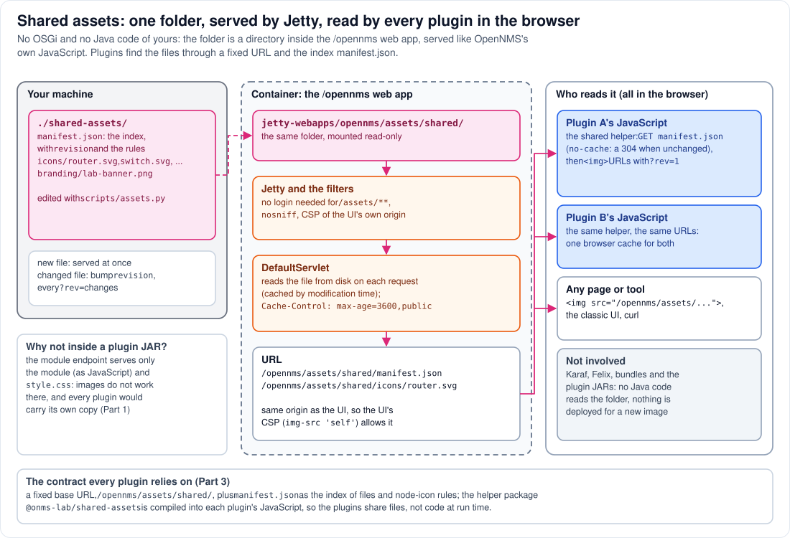

# Step 14 - Shared assets: one folder, many readers

**In short:** the shared assets are plain files, not part of any bundle. The host folder
`./shared-assets/` is mounted read-only **inside** the `/opennms` web application, at
`jetty-webapps/opennms/assets/shared/`, so the web application's `DefaultServlet` serves it at
`/opennms/assets/shared/`, exactly like OpenNMS's own JavaScript. Karaf, Felix and the plugins' JARs
are not involved at all. The readers are all in the browser: each plugin's JavaScript finds the
files through that fixed URL and the index file `manifest.json`, with a small helper compiled into
every plugin; any other page or tool can use the same URLs.



## 14.1 Where the files are

| Where | Path | Who writes it |
|---|---|---|
| your machine | `./shared-assets/` (`manifest.json`, `icons/*.svg`, `branding/...`) | you, or `scripts/assets.py` |
| the container | `/usr/share/opennms/jetty-webapps/opennms/assets/shared/` | nobody: a read-only bind mount of the same folder |
| the URL | `http://<host>:8980/opennms/assets/shared/...` | served by Jetty |

Because it is a bind mount, there is one copy of each file: the one on your disk. A file you add is
in the container at once.

## 14.2 How a request for a shared file is served

`GET /opennms/assets/shared/icons/router.svg?rev=1` takes the path of Steps 4 and 5, and nothing
else:

1. **Jetty**: the `RewriteHandler` adds `X-Frame-Options`, and, because the path is under
   `/opennms/assets/`, does **not** add `no-store`; the `/opennms` web application takes it.
2. **Filters**: the security headers (CSP, `nosniff`, ...) are added; Spring Security lets
   `/assets/**` through without a login; the `ProxyFilter` finds no OSGi claim and passes it on.
3. **`DefaultServlet`**: no other servlet mapping matches, so the default one reads the file from
   disk, sets `Content-Type` from the file name (`image/svg+xml`) and
   `Cache-Control: max-age=3600,public`. It keeps a small cache, but checks the file's modification
   time and size on every request, so a changed file is served changed.

No OpenNMS code of yours, no bundle, no REST resource: the same path as `/opennms/assets/...` files
that ship with OpenNMS.

## 14.3 Who reads the files, and how they find them

**Plugin A and plugin B.** Their JavaScript runs in the browser, on the page `/opennms/ui/`. Each one
contains the lab's helper package `@onms-lab/shared-assets`, compiled in at build time. The helper
knows one thing: the base URL `/opennms/assets/shared/`. From there:

1. it fetches `manifest.json` with `cache: 'no-cache'` (the browser revalidates it and gets a `304`
   when nothing changed): the list of icons and images, the rules that pick an icon for a node, and a
   `revision` number;
2. it builds each file's URL as base + path + `?rev=<revision>`, and the plugin puts it in an ``.

Both plugins build the same URLs, so the browser downloads each image once and caches it for both.

**Anything else.** A JSP of the classic UI, a browser tab, `curl`, a page elsewhere: the files are
ordinary URLs (a page on another origin needs its own Content-Security-Policy to allow them).

**Not the Java side.** No daemon, no bundle, no plugin JAR reads the folder. If Java code ever needed
a shared file, it could fetch it over HTTP like the browser, or be given the path in the container;
the lab does not need either.

## 14.4 Why this location works

| Requirement | Why `/opennms/assets/shared/` meets it |
|---|---|
| the UI's Content-Security-Policy allows the images | same origin as the UI: `img-src 'self'` |
| a plugin's page can read them | Spring Security permits `/assets/**` without a login |
| they are cached | the `RewriteHandler`'s `no-store` skips `/opennms/assets/`; the `DefaultServlet` sends `max-age=3600` |
| a new file is live at once | the `DefaultServlet` reads the disk; the mount shows host changes immediately |
| a changed file is seen | bump `revision` in `manifest.json`: every URL's `?rev=` changes |

A plugin's own JAR could not do this job: its module endpoint serves only JavaScript and one CSS
file (Step 13), and each plugin would carry its own copy. [Part 1](../01-why-assets-get-duplicated.md)
starts from that problem and [Part 5](../05-design-decisions.md) compares the alternatives.

## 14.5 See it in the lab

```bash
curl -sI http://localhost:8980/opennms/assets/shared/manifest.json | grep -iE 'HTTP/|cache-control|content-type|last-modified'
curl -s http://localhost:8980/opennms/assets/shared/manifest.json | python3 -c 'import json,sys; m=json.load(sys.stdin); print("revision", m["revision"], "icons", len(m["icons"]))'
cp shared-assets/icons/router.svg shared-assets/icons/router-copy.svg
curl -s -o /dev/null -w '%{http_code} %{content_type}\n' http://localhost:8980/opennms/assets/shared/icons/router-copy.svg
rm shared-assets/icons/router-copy.svg
```

* No login needed; `Cache-Control: max-age=3600,public` and a `Last-Modified` header.
* The manifest's revision and number of icons match the file on your disk.
* The copied file is served (`200 image/svg+xml`) as soon as it exists, with no restart and no
  `podman exec`.

[Part 7](../07-working-with-the-shared-folder.md) is the full walkthrough: adding icons, changing
them, bumping the revision, and what the plugins show.

## Remember

* The shared assets are files in the `/opennms` web application, served by its `DefaultServlet`:
  no OSGi, no Java code of yours.
* The plugins find them in the browser, by a fixed base URL and `manifest.json`, with a helper
  compiled into each plugin.
* One copy on disk, one URL per file, one browser cache for every plugin.

---
Previous: [Step 13 - Plugin A and plugin B](13-plugin-uis.md) | [Guide overview](README.md) |
Next: [Step 15 - One page load](15-one-page-load.md)
