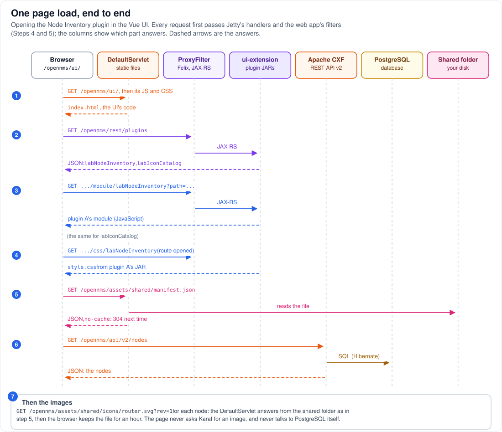

# Step 15 - One page load, end to end

**In short:** opening the Node Inventory plugin in the Vue UI takes a handful of HTTP requests, and
each is answered by a different part of the architecture: the `DefaultServlet` for the UI's own
files and the shared assets, the Felix HTTP bridge and `ui-extension` for the plugin list and the
plugin's code, Apache CXF with the daemons' DAOs for the node data, and PostgreSQL behind that. All
of them enter through the same port, the same handlers and the same filters (Steps 4 and 5). This
step puts Steps 1 to 14 in motion.

The blue numbers match the paragraphs. You are logged in, so every request carries the session
cookie `JSESSIONID` and passes Spring Security.

## 15.1 The UI itself (1)

`GET /opennms/ui/` reaches the `/opennms` web application. `SpaRouting` makes any `/ui/...` path
that is not an asset answer with `ui/index.html`, and the `DefaultServlet` serves it, then the UI's
JavaScript and CSS from `ui/assets/`. Before it mounts, the UI puts its own Vue, Pinia and router on
`window`, so plugins can use them instead of bringing their own.

## 15.2 The plugin list (2)

`GET /opennms/rest/plugins`: the `ProxyFilter` sees a path claimed by a JAX-RS resource in OSGi and
hands the request to the Felix HTTP bridge; the JAX-RS connector calls `UIExtensionServiceImpl`,
which reads `UIExtensionRegistry`, filled by the `api-layer` from every `UIExtension` service
(Steps 10 to 12). The answer is JSON: `labNodeInventory` and `labIconCatalog`.

## 15.3 The plugins' code (3)

For each entry, the UI adds a route and loads the module:
`GET .../ui-extension/module/labNodeInventory?path=node-inventory/nodeInventory.es.js` takes the same
way into OSGi, and `UIExtensionServiceImpl` reads the file out of plugin A's JAR (Step 13). The same
happens for `labIconCatalog` and plugin B's JAR. Each module registers its component on `window`.
Only now does the UI mount, with a **Plugins** menu that lists both.

## 15.4 The plugin's style sheet (4)

You open **Plugins > Shared Assets: Node Inventory**. The router (in the browser) shows the
component, and the UI adds `GET .../ui-extension/css/labNodeInventory`: `node-inventory/style.css`
from plugin A's JAR.

## 15.5 The shared manifest (5)

The plugin's code, through the shared helper, asks for `GET /opennms/assets/shared/manifest.json`
with `cache: 'no-cache'`. No OSGi here: the `DefaultServlet` reads the file from the folder mounted
from your disk (Step 14). The next page load gets a `304 Not Modified` if the file has not changed.

## 15.6 The data (6)

`GET /opennms/api/v2/nodes?limit=500&offset=0&orderBy=label`: not claimed by OSGi, so it goes to
`cxfRest2Servlet`, Apache CXF's REST API v2 inside the web application. Its service uses the
web application's Spring context, whose parent chain reaches `daoContext` (Step 3): the same
`NodeDao` the daemons use runs a Hibernate query over the same connection pool against PostgreSQL,
and CXF writes the nodes as JSON.

## 15.7 The images (7)

For each node the plugin picks an icon with the manifest's rules and renders
``. The `DefaultServlet` serves each file
once; the browser keeps it for an hour (`max-age=3600`), and Icon Catalog, which asks for the same
URLs, gets them from the browser's cache.

## 15.8 What the page never did

* It never talked to Karaf for an image or to PostgreSQL directly.
* No plugin opened a port or a connection of its own; no request left the one JVM except the
  database query.
* Nothing was deployed or restarted to show a new icon: a file on your disk became a URL.

## 15.9 See it yourself

Open the browser's developer tools on the Network tab, load
<http://localhost:8980/opennms/ui/#/plugins/labNodeInventory/node-inventory/nodeInventory.es.js>
(the URL of [Part 7](../07-working-with-the-shared-folder.md)) and filter by `opennms`. You will see
the requests of 15.1 to 15.7 in that order, with their content types: `text/html` and JavaScript for
the UI, JSON for `rest/plugins` and `api/v2/nodes`, `application/javascript` for the modules,
`text/css` for the style sheet, `image/svg+xml` for the icons (from the memory cache on a second
load). The lab's Playwright test, `tests/e2e`, checks part of it automatically: both plugins load,
they show the same image URLs, the manifest is fetched once per page, and no CSP error occurs.

## Remember

* Four kinds of answer on one page: static files, OSGi through the `ProxyFilter`, CXF with the
  daemons' DAOs, and plain shared files.
* Every request enters through Jetty's one port and the web application's filters, on one Jetty
  thread each.
* The plugins' code comes from their JARs; their images come from the shared folder; their data
  comes from the REST API.

---
Previous: [Step 14 - Shared assets](14-shared-assets.md) | [Guide overview](README.md) |
Next: [Step 16 - Around the core](16-around-the-core.md)
