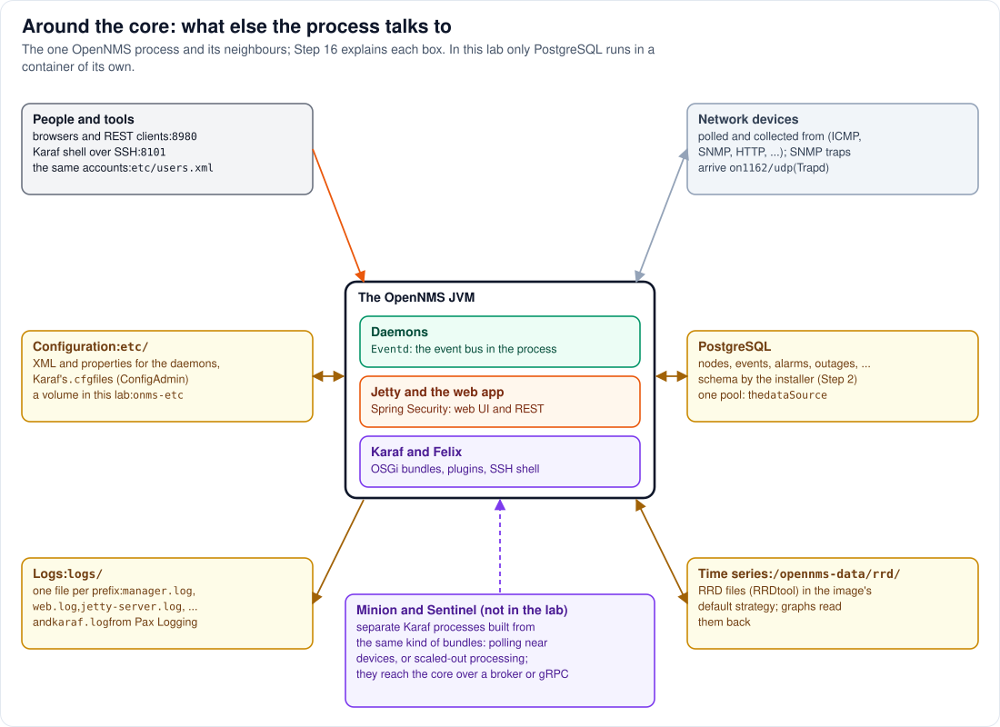

# Step 16 - Around the core: what else the process talks to

**In short:** Steps 1 to 15 opened up the parts that the lab's plugins touch. The one OpenNMS process
also has neighbours and inner services that the lab leaves closed: the PostgreSQL database, the
event bus, the configuration files, the log files, the time-series store, the security set-up, the
network it monitors, and, in larger installations, Minion and Sentinel processes. This step gives
each of them its place in the picture, so you know where to look next.

## 16.1 PostgreSQL

The database holds OpenNMS's state: the inventory (nodes, interfaces, services, assets), events,
alarms, outages, notifications, and more. The installer creates and upgrades the schema before
OpenNMS starts (Step 2). The daemons reach it through one connection pool, the `dataSource` bean in
`daoContext`, configured by `etc/opennms-datasources.xml`, which the image's confd templates write
from the container's environment variables at every start (the lab sets them in `compose.yml` from
`.env`). The web application uses the same pool through the context tree (Step 3); bundles reach
data through the Integration API's DAOs (Step 11). In the lab, PostgreSQL runs in its own container
and is not published to your machine.

## 16.2 Events: the bus inside the process

OpenNMS's daemons coordinate through **events**. An event has a UEI, a name such as
`uei.opennms.org/nodes/nodeDown`, plus parameters. A daemon sends it to **Eventd** (the third service
of Step 3), which stores it in the database and hands it to every daemon that subscribed to that UEI:
Alarmd turns events into alarms, Notifd into notifications, Pollerd reacts to node changes, and so
on. Configuration reloads are events too (`uei.opennms.org/internal/reloadDaemonConfig`). Plugins
take part through the Integration API's `EventForwarder` (send) and `EventSubscriptionService`
(listen), and the REST API can post events.

## 16.3 Configuration: `etc/`

Everything is configured by files in `$OPENNMS_HOME/etc/`: XML files for the daemons
(`poller-configuration.xml`, `collectd-configuration.xml`, ...), properties
(`opennms.properties`, your own files in `opennms.properties.d/`), Karaf's files (Step 6) including
the `.cfg` files bundles read through ConfigAdmin, and `jetty.xml` if you create one. In the
container, `etc/` is the volume `onms-etc`: it survives new images, which is why an upgrade needs the
installer to run again (Part 0). The entrypoint's configuration tester checks the files at every
start (Step 2), and the lab's `etc-overlay/` is copied over them at every start.

## 16.4 Logs: `logs/`

OpenNMS logs through log4j2 with one trick: every thread carries a *prefix* (set by the daemon, by
the `MDCHandler` for web requests, by the `Starter` for start-up), and `etc/log4j2.xml` routes each
line to `logs/<prefix>.log`. So there is `manager.log` (start-up and shutdown), `web.log` (web
requests), `jetty-server.log`, `eventd.log`, `alarmd.log`, `pollerd.log`, `provisiond.log` and many
more, and a per-prefix log level in `log4j2.xml`. Karaf logs separately, through Pax Logging
configured by `etc/org.ops4j.pax.logging.cfg`, into `logs/karaf.log`: the place to look for anything
about bundles, features and plugins. The invoker's start-up lines also go to the console, so
`podman logs` shows them.

## 16.5 Time series

Collectd (performance data) and Pollerd (response times) write measurements through a time-series
strategy. In the Horizon image the default is `rrd`, with RRDtool through a native library: RRD
files under `share/rrd/`, which the image links to `/opennms-data/rrd/`, part of the lab's
`onms-data` volume. The graphs and the measurements REST API read them back. Other strategies
exist: Newts on Cassandra, or a time-series plugin written against the Integration API's
`TimeSeriesStorage` (the image ships one for Cortex in `deploy/`).

## 16.6 Security

* **Web UI and REST:** Spring Security in the web application (Step 5). Users and groups are in
  `etc/users.xml` and `etc/groups.xml`; roles such as `ROLE_ADMIN` and `ROLE_REST` decide who may do
  what. A few paths are open (`/assets/**`, the login page, the health probe). OSGi resources are
  behind the same filter (Step 12).
* **Karaf shell:** SSH on port 8101. OpenNMS replaces Karaf's login realm with its own users, and
  only admins may log in; that is why `scripts/karaf.sh` uses the web UI's admin account.
* **In the container:** the process runs as uid 10001; the lab publishes the ports on `127.0.0.1`
  only, and mounts its folders read-only.

## 16.7 The network being monitored

This is OpenNMS's actual job, and it runs in the daemons of Step 3: **Provisiond** imports nodes from
requisitions (the lab's `scripts/provision-demo-nodes.sh` creates one) and scans them; **Discovery**
finds new ones by pinging; **Pollerd** checks services (ICMP, SNMP, HTTP, ...) and reports outages;
**Collectd** collects performance data (SNMP, JMX, HTTP, ...); **Trapd** receives SNMP traps on
`1162/udp` in the container; **Telemetryd** receives flows and streaming telemetry once configured;
**EnhancedLinkd** discovers topology. All of them are outbound connections or listeners of the same
process; none goes through Jetty.

## 16.8 Minion and Sentinel

Larger installations add processes of their own, each typically in its own container:

* a **Minion** runs at a remote location, close to the devices: it polls, collects and receives traps,
  syslog and flows there, and forwards the results to the core;
* a **Sentinel** takes processing load off the core, for flows and telemetry for example.

Both are Karaf containers built from the same kind of bundles and features as the OSGi side of the
core, so the architecture of Steps 6 to 10 applies to them too, including Integration API plugins
built for them. They talk to the core through a message broker (Kafka or ActiveMQ) or gRPC. The lab
does not run them.

## 16.9 Management and health

Every daemon is a JMX MBean (Step 3), next to Jetty's MBeans and the JVM's own, so JMX tools can
inspect a running OpenNMS when remote JMX is set up (the lab does not). The health API,
`/opennms/rest/health`, runs as a bundle; the lab's container health check and
`scripts/wait-for-opennms.sh` ask its probe, `/opennms/rest/health/probe`, which answers
`Everything is awesome` when all checks pass.

## Where to go from here

* To see these parts in your own installation, start from `logs/` and `etc/`, and from `bundle:list`,
  `feature:list` and `service:list` in the Karaf shell.
* To build on the architecture, write plugins against the Integration API, the only interface that
  stays stable between OpenNMS versions ([Part 8](../08-migrating-your-plugins.md) for UI plugins).
* The [source trace](../reference/source-trace.md#architecture-guide-process-and-daemons) links every
  claim in this guide to its source line.

## Remember

* PostgreSQL holds the state; Eventd moves events between daemons; `etc/` holds all configuration;
  `logs/` has one file per prefix plus `karaf.log`.
* Metrics go to RRD files by default, in `/opennms-data/rrd/`.
* Security is Spring Security for everything HTTP and OpenNMS's own users for the Karaf shell.
* Minion and Sentinel are separate Karaf processes built the same way, connected through a broker or
  gRPC.

---
Previous: [Step 15 - One page load](15-one-page-load.md) | [Guide overview](README.md)
